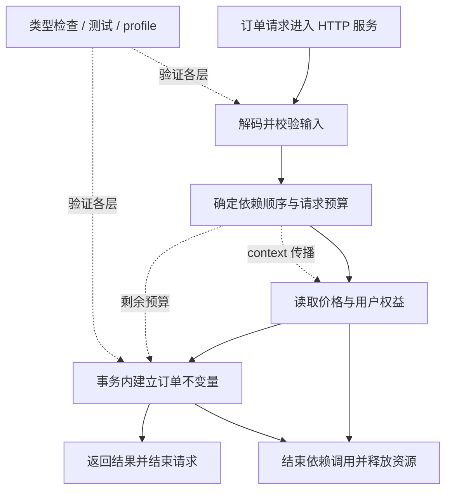

# 001 为什么 Go 适合后端？它为简单性付出了什么代价？

> 难度：基础 · 分类：语言设计

## 简短回答

Go 把静态类型、垃圾回收、并发支持与较统一的工具链放在一起，适合需要长期维护的网络服务。价值不只是运行速度，还包括代码容易交接、部署产物容易管理和问题容易定位。代价是语言表达方式相对克制，开发者仍需显式处理错误、资源生命周期和并发协调。

## 详细解析

### 图解：语言能力落在请求链路的什么位置

沿实线看一次请求的业务路径，沿虚线看预算与验证如何贯穿。Go 提供实现这些步骤的工具，但价格是否允许缓存、订单何时算成功仍须由业务定义；选语言时不能把框架能力误当成业务保证。

### 从一个订单接口看设计取舍

收到订单请求后，服务要解析参数、访问数据库、调用库存服务并返回响应。静态检查能在上线前发现部分类型错误；标准库提供 HTTP、编码和测试工具；goroutine 让多个等待网络的请求可以交错推进。垃圾回收降低对象释放的心智负担，但数据库连接和响应体仍必须按约定释放。

这些能力并不意味着所有请求都应该再开一个 goroutine。HTTP 服务已经并发执行处理器，额外并发应来自可以独立执行的工作，例如同时读取价格和用户权益，并且需要限制数量与等待时间。

| 选择 | 工程收益 | 必须承担的成本 |
| --- | --- | --- |
| 静态类型与编译 | 尽早发现接口不匹配 | 修改公共类型会影响调用者 |
| GC | 减少手动释放对象错误 | 分配速率影响 CPU 与内存 |
| 隐式接口 | 实现与使用方解耦 | 接口过大仍然造成耦合 |
| 统一格式化 | 降低风格争论成本 | 团队要接受工具的格式决定 |

### 怎样做技术选型

假设团队维护几十个以网络等待为主的服务，可以优先评估 Go：搭建同等功能的接口，在固定 CPU、连接数和数据规模下测吞吐、尾延迟、内存与故障恢复时间。若核心工作是依赖特定生态的科学计算，则生态适配成本可能比语言运行开销更重要。这里的判断是工程建议，不是语言规范对性能的承诺。

可独立部署的二进制也不代表永远没有外部依赖。启用 cgo、使用动态库、加载时区或证书时，都要核对目标环境。上线前应在实际目标镜像中验证，而不能仅凭开发机编译成功推断可部署。

### 为什么“简单”会转化为维护收益

简单性首先体现在团队能否对同一段代码形成一致理解。显式错误返回让调用者看见失败分支，固定格式化减少无关风格差异，小接口让依赖关系可以从签名读出来。这些收益依赖写法：把错误全部忽略、把依赖藏在包级变量里，仍然能写出难以维护的 Go 服务。

再看运行机制。goroutine 让等待网络的工作可以交错进行，但只要下游连接数有限，请求仍会在连接池或队列中等待。GC 管理 Go 对象的可达性，不负责及时归还数据库连接、解除业务锁或取消远程请求。因此“语言帮忙做了什么”与“应用仍需负责什么”应成对说明。

例如处理器内同时查价格和会员权益，只有二者独立且收益超过协调成本时才值得并发。如果后一步必须使用前一步生成的订单号，强行并发不会消除依赖，只会引入等待与额外状态。合格的设计应先画数据依赖，再决定 goroutine 数量。

### 带着约束做一次选型推演

假设团队要接手一个峰值 3000 请求每秒的订单查询服务，主要时间花在两个远程接口上，要求新成员两周内能定位常见故障。这个场景的选型目标至少包含三项：依赖慢时是否能限制资源增长，是否能快速定位延迟来源，以及团队是否熟悉部署与调试工具。峰值数字是示例假设，不是对 Go 性能的测量。

对候选语言实现同样的超时、连接复用和响应结构，然后分别测试健康依赖、慢依赖和依赖失败。只比较健康状态的 QPS，会漏掉故障时无限排队的实现。还应比较二进制与镜像的构建过程、服务启动失败的可诊断性、线上 profile 获取的权限边界。一次结果不足以宣布某语言普遍优越，但能排除不适合当前约束的方案。

| 现象 | 可采取的动作 | 为什么不是语言本身的结论 |
| --- | --- | --- |
| CPU 低、尾延迟高 | 先检查下游等待与连接池 | 可能受 I/O 限制，改语言未必有效 |
| CPU 与分配率一起升高 | 采集 profile 并定位热点 | 数据布局和序列化策略仍可调整 |
| 迭代慢、变更牵连大 | 检查模块边界与契约 | 换成 Go 不会自动消除架构耦合 |

### 自测：怎样给出有依据的面试回答

如果面试官问“为什么订单服务选 Go”，只说高并发属于结论标签。更完整的回答是：业务以网络调用为主，团队希望使用统一工具链并通过 context 管理请求生命周期；同时会为下游设置并发上限，用压测验证尾延迟，并接受显式错误处理与 GC 成本。进一步能解释什么条件下不选 Go，例如关键依赖只提供其他语言的成熟实现，才说明真正理解了取舍。

## 常见误区 / 面试追问

- **Go 一定比其他语言快吗？** 不能仅凭语言名称判断。算法、数据布局、依赖延迟与负载形态都可能主导结果，必须比较相同工作量。
- **语法少是否意味着系统简单？** 语法只减少表达层复杂度；幂等、事务和故障恢复仍是业务设计责任。
- **为什么不从第一天就拆微服务？** 先建立模块边界，只有独立发布、扩容或组织协作的收益超过分布式成本时才拆分。参见 [071](../08-microservices/071-boundaries.md)。

## 参考资料

- [Go 官方 FAQ：语言设计与实现](https://go.dev/doc/faq)
- [Go 官方文档入口](https://go.dev/doc/)

[返回目录](../README.md) · [下一题](002-zero-values.md)
