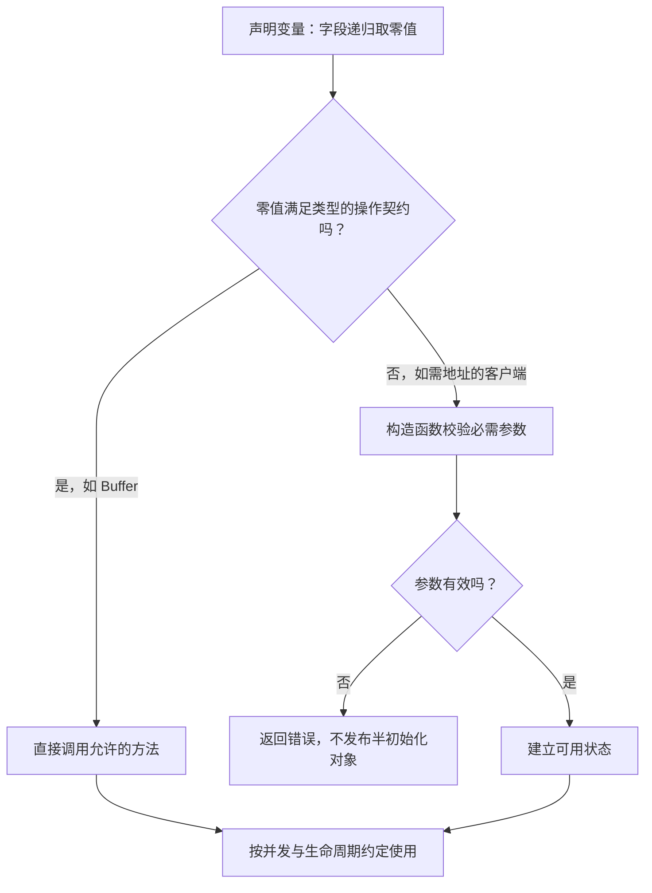

# 002 零值为什么重要？如何设计零值可用的类型？

> 难度：基础 · 分类：语言设计

## 简短回答

变量没有显式初始化时，会得到其类型的零值。零值可用意味着调用者声明变量后就能完成合理操作，不必记住额外初始化步骤。但零值不一定满足业务约束：没有地址的数据库配置就不应该被解释为一个可用连接。

## 详细解析

### 图解：从零值到可用状态



这里的“可用”针对具体操作，不是给整个类型贴一个永远有效的标签。例如 nil map 查询有定义，但写入不允许；类型设计要把允许的状态和转换写清楚。

### 先区分类型状态与业务状态

整数零值为零，布尔值为假，字符串为空，指针、切片、map、channel 和接口的零值为 nil。结构体的字段递归得到零值。nil 切片可以 append，nil map 可以查询但不能写入，nil channel 的收发会阻塞；因此不能把「有确定零值」等同于「所有操作都可执行」。

下例用标准库 Buffer 展示零值可用，随后对比切片与 map。程序没有需要读者补齐的初始化代码。

```go
package main

import (
    "bytes"
    "fmt"
)

func main() {
    var b bytes.Buffer
    b.WriteString("Go")
    var ids []int
    ids = append(ids, 7)
    var counts map[string]int
    fmt.Println(b.String(), len(ids), counts["missing"], counts == nil)
}
```
```output
Go 1 0 true
```

### 设计自己的类型

若设计计数器，零值可以自然代表计数为零；内含互斥锁也可以直接使用。若设计连接客户端，服务地址和凭据是必需条件，应通过构造函数验证并返回错误，而不是在第一次请求时才暴露无效状态。可选超时能有明确默认值，必需凭据不应靠默认字符串掩盖缺失。

对需要延迟初始化 map 的并发类型，要在同一把锁保护下完成「判断是否为空—创建—写入」。只锁写操作而在锁外判断初始化，会使两个调用者同时创建不同容器。构造函数与零值可用不是互斥概念：构造函数可以提供定制选项，零值仍提供一个清晰、受限的行为。

还要考虑序列化语义。nil 切片和长度为零的非 nil 切片都可以遍历，但默认 JSON 编码分别可能表达 null 和空数组。如果 API 契约要求数组，应在响应边界统一表示，不能让内部实现偶然决定客户端看到的协议。

### 把零值可用写成可以检查的契约

设计类型前先列出零值上的操作矩阵，而不是先决定要不要 New 函数。假设一个进程内计数器包含 map 和互斥锁，可以规定：未写过的键读为零，第一次递增时创建 map，读取和递增均由同一把锁保护。这样构造函数不是必需的，调用者也无需知道内部是否已经分配容器。

| 操作 | 零值计数器的约定 | 实现需要保证的条件 |
| --- | --- | --- |
| 查询不存在的键 | 返回零 | 不把“没有记录”误当成初始化错误 |
| 第一次递增 | 创建 map 后写入 | 判断、分配与写入都在锁内 |
| 并发递增 | 每次更新都被计入 | 不在锁外做读改写 |
| 复制计数器 | 首次使用后禁止复制 | 文档和 API 均避免值复制 |

注意最后一行：零值锁能直接使用，不代表带锁的对象使用后可以复制。把此类对象放进按值返回的方法、按值接收者或会复制元素的容器操作时，都应重新检查生命周期。方便初始化只是契约的一部分。

对客户端则可以有另一套约定。必需地址、证书或依赖缺失时，构造函数直接返回错误；构造成功以后，调用者可以依赖这些条件成立。若把错误推迟到首个业务请求，就会把部署配置错误变成线上请求失败，定位成本更高。不要为了追求零值可用而悄悄连到某个默认生产地址。

### 零值与“没有提供”是两个问题

考虑更新库存阈值接口：用户传入零可能表示关闭预警，未传入则表示保持原值。如果请求结构直接使用 int，普通解码之后两种输入都可能得到零，业务无法再恢复用户意图。解决办法是在协议边界保留存在性，例如使用指针字段或显式的值与存在标志；进入业务层之后再转换成明确的更新操作。

反过来，也不要给每个字段都套指针。若创建接口明确规定省略重试次数等于零，那么 int 已经完整表达契约；指针只会增加 nil 分支。判断依据是协议是否真的需要区分状态，而不是“指针更灵活”。

### 演练：配置重载后为什么默认值变了

设旧配置的超时为 3 秒，新配置文件没有该字段。若把新内容解码进旧对象，缺省字段可能保留旧值；若每次先创建零值对象再解码，缺省字段会从零开始。这两种流程的输入文件相同，结果却不同。正确做法是先定义缺省语义，再选择“完整替换”还是“局部更新”，显式应用默认值并校验，最后发布新配置。不能让对象是否复用偶然决定服务行为。

自测时依次回答：零值能做哪些操作，哪些参数必须在构造时验证，使用后能否复制，以及序列化会不会丢失存在性。能把这四个问题讲清楚，比仅列出 nil、零和空字符串更接近类型设计能力。

## 常见误区 / 面试追问

- **nil map 为什么能读不能写？** 读操作有定义好的缺省结果，写入则需要已初始化的映射存储。用 `make` 或映射字面量初始化。
- **零值可用就能并发使用吗？** 不能。Buffer 零值可用并不提供并发修改保证，这两种契约必须分开描述。
- **如何表达“未填写”和“填写零”？** 在边界使用指针或明确的存在标志，参见 [045](../05-backend-api/045-json.md)。

## 参考资料

- [Go 规范：零值](https://go.dev/ref/spec#The_zero_value)
- [bytes.Buffer 文档](https://pkg.go.dev/bytes#Buffer)

[返回目录](../README.md) · [上一题](001-go-design.md) · [下一题](003-value-semantics.md)
