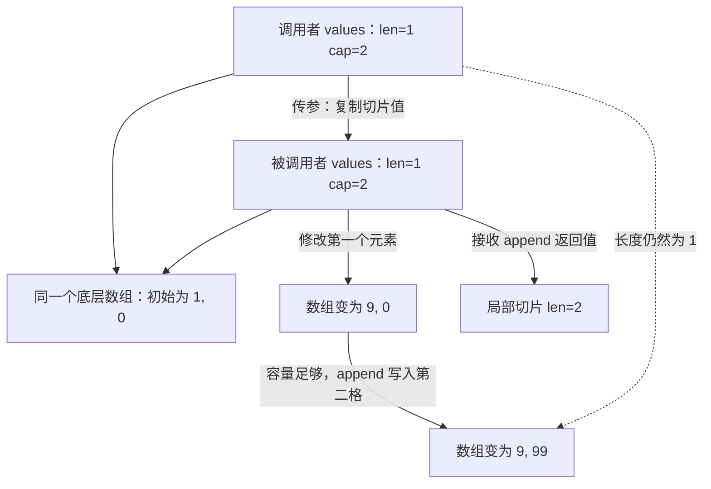

# 003 Go 只有值传递，为什么修改切片却会影响调用者？

> 难度：基础 · 分类：语言设计

## 简短回答

传参和赋值复制的是值。切片值描述一段底层数组，复制切片后仍可能访问同一块元素存储；指针值复制后仍指向同一个对象。因此「参数本身被复制」与「参数间接访问的对象共享」可以同时成立。

## 详细解析

### 图解：复制的是切片值，共享的是元素



这是语义上的引用关系图，不依赖切片在某个版本中的具体机器字布局。图中的关键分界是变量本身与变量能访问的存储：前者被复制，后者可能共享。

### 分清三种修改

修改参数变量、修改它指向的对象、修改对象的引用关系，是三个不同动作。对整数参数重新赋值不会修改调用者的整数；对切片元素赋值可能修改共享数组；append 返回的新切片需要传回调用者，才能改变调用者持有的长度或数组引用。

```go
package main

import "fmt"

func change(n int, values []int) {
    n = 99
    values[0] = 9
    values = append(values, n)
    fmt.Println("inside", n, values)
}

func main() {
    n := 1
    values := make([]int, 1, 2)
    values[0] = 1
    change(n, values)
    fmt.Println("outside", n, values, values[:2])
}
```
```output
inside 99 [9 99]
outside 1 [9] [9 99]
```

调用者的 n 没变，切片长度也没变，但底层数组的前两个位置被改了。示例预留容量，因此 append 可以使用原数组；如果容量不足，它会使用新的底层数组，此后新元素的修改不再落在旧数组上。代码不应依赖扩容倍率判断是否共享。

### API 如何表达所有权

读取型函数应说明是否保留输入。若解析函数把输入字节切片保存到长期对象中，调用者复用缓冲区会导致数据改变；若返回内部切片，调用者也可能绕过类型方法修改内部状态。需要隔离时显式复制，例如 `slices.Clone`，并说明它只是元素层面的浅复制。

数组作为参数会复制整个数组的值。结构体复制同样是字段值复制：其中的切片、map 或指针仍可能共享目标。为避免大对象复制而改用指针时，也引入了共享修改、nil 和生命周期问题，所以不能只根据「指针更快」选择 API。

### 逐句推演示例，而不是记忆“切片是引用类型”

进入 change 前，调用者的整数为 1，切片长度为 1、容量为 2。传参创建了两个新的参数变量。执行 n = 99 时，只更新参数 n；执行 values[0] = 9 时，则沿参数切片访问了共享数组。因此这两个赋值虽然写在同一函数里，对调用者的影响完全不同。

随后 append 的长度需求为 2，没有超过容量。它可以把 99 放入现有数组的第二格，并返回长度为 2 的切片。赋给局部 values 只改变局部视图，调用者仍持有长度为 1 的视图。调用者通过 values[:2] 扩展到容量范围时，才看到已写入的第二格。这解释了为什么“外部长度没变”与“外部能看到新元素”可以同时成立。

把初始化改成长度和容量都为 1，再推演一次：第一次元素赋值仍影响旧数组；append 为容纳第二个元素必须取得足够大的新数组，复制现有元素并追加。之后对新数组的修改不再影响旧数组。不能用这个现象推出“append 永远复制”或“append 永远共享”，分界条件是容量能否容纳结果。

### 三种隔离手段解决不同问题

| 手段 | 隔离了什么 | 没有隔离什么 |
| --- | --- | --- |
| 复制切片变量 | 变量后续重新赋值 | 底层元素存储 |
| 三下标切片限制容量 | 通过该视图 append 时复用后续容量的机会 | 对已有元素的修改 |
| 复制元素到新切片 | 外层数组中的元素槽位 | 元素含有的指针、切片或 map 目标 |

例如传出 items[:len(items):len(items)] 可以限制调用者沿该视图追加时占用内部预留容量，但调用者仍可执行 items[0] = other。若返回的是 []*Item，即使复制了外层切片，调用者也可能通过指针修改 Item。需要深层隔离时，应按业务结构复制相应可变对象；不能仅凭函数名包含 Clone 就假定递归复制。

### 从内存关系走到 API 约定

考虑解析网络报文后保存用户名字。如果名字只是原始缓冲区的一段切片，而网络层随后把缓冲区交回池中，下一次读包可能覆盖已保存的数据。函数已经返回并不意味着这段存储归结果对象所有。可选方案是复制需要长期保存的字段，或把整个缓冲区的所有权转交给结果，并规定何时归还。

对应的评审问题是：“返回值是否借用输入？调用结束后能否改输入？调用者能否改返回值？”这三个问题应在 API 文档中得到一致答案。若共享对象被多个 goroutine 使用，还要另行建立同步关系；传参发生值复制并不自动建立对共享对象的独占访问。

练习时可以把示例的容量依次改为 1 和 2，先写下每一步的长度、容量与共享关系，再运行核对。优秀回答应能解释输出为何变化，并区分变量复制、浅复制和业务所有权，而不只是背诵“Go 都是值传递”。

## 常见误区 / 面试追问

- **map 是引用传递吗？** 仍是值传递；复制的映射值访问同一映射。函数内把参数改为新 map，不会替换调用者变量。
- **传切片指针才可以修改元素吗？** 不需要。只有要修改调用者的切片变量本身时才涉及返回新切片或传指针，前者通常更清楚。
- **复制切片能避免数据竞争吗？** 只复制切片值不能；即使复制元素，元素里的指针目标也可能共享。参见 [012](../02-types-memory/012-slice-retention.md)。

## 参考资料

- [Go 规范：赋值](https://go.dev/ref/spec#Assignments)
- [Go 规范：函数调用](https://go.dev/ref/spec#Calls)

[返回目录](../README.md) · [上一题](002-zero-values.md) · [下一题](004-composition.md)
