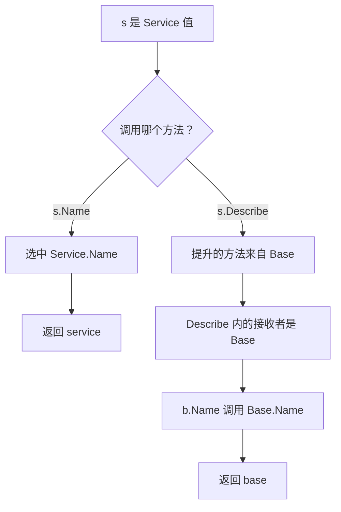

# 004 组合与嵌入如何替代继承？

> 难度：基础 · 分类：语言设计

## 简短回答

Go 使用字段组合复用状态，用方法与接口表达行为。嵌入可以提升内部类型的字段和方法，减少转发代码，但不会建立传统类继承关系，也不提供“基类方法动态调用子类覆盖”的语义。

## 详细解析

### 图解：接收者决定内部方法调用



这张图跟踪下面程序的两条调用路径。提升省去了显式写出 s.Base 的步骤，却没有把 Describe 中的接收者替换为外层 Service。

### 方法提升不等于虚方法覆盖

设想业务服务嵌入一个公共组件，再在外层声明同名方法。外层调用可以选中外层方法，但公共组件内部调用自己的方法时，接收者仍是公共组件。理解这个边界才能避免把其他语言的继承模型直接移植过来。

```go
package main

import "fmt"

type Base struct{}
func (Base) Name() string { return "base" }
func (b Base) Describe() string { return b.Name() }

type Service struct { Base }
func (Service) Name() string { return "service" }

func main() {
    s := Service{}
    fmt.Println(s.Name(), s.Describe())
}
```
```output
service base
```

若希望 Describe 使用可替换的行为，应显式依赖一个具有 Name 方法的接口，并把实现传进去。这样可替换性来自依赖关系，而不是隐藏的覆盖规则。

### 什么时候用命名字段

订单服务包含仓储和通知器，优先使用命名字段来表达「使用仓储」。若直接嵌入数据库客户端，它的大量方法可能被提升为服务的公共方法，让调用者绕过业务校验直接操作数据库。组件升级增加方法时，外层 API 甚至可能无意中扩大。

| 表达方式 | 适合的情况 | 评审关注点 |
| --- | --- | --- |
| 命名字段 | 明确内部协作者 | 只公开业务需要的操作 |
| 嵌入字段 | 有意提升一组行为 | 是否意外暴露方法或发生重名 |
| 接口字段 | 需要替换的行为 | 接口是否由实际调用需要驱动 |

嵌入指针还能引入 nil 状态：外层结构体有零值，不代表嵌入对象存在。涉及锁的类型也不能因为嵌入方便就随意按值复制。组合帮助减少继承层次，却不会自动保证初始化、线程安全或合理边界。

### 为什么业务组合更适合从协作者出发

设订单服务要完成查库存、创建订单和通知三个动作。如果把数据库客户端嵌入 OrderService，方法提升可能让外部代码直接调用数据库查询。调用者绕过库存检查后，业务不变量就无法集中维护。这里的问题不在嵌入语法，而在外层类型无意中承诺了过大的公共能力。

用命名字段保存仓储时，外层只暴露 CreateOrder，内部再调用 repo 的必要方法。这样替换仓储不会自动改变订单服务的 API。还可以把通知器替换为测试实现，验证只有事务成功后才触发通知，而无需建立“数据库服务的子类”。

如果确实想公开内层完整行为，例如为 io.Reader 增加字节计数，应先确认哪些方法需要拦截。仅重写 Read 并不保证其他被提升的方法也经过计数路径；调用者可能通过额外接口走到另一个快速路径。包装器的正确性要覆盖它实际暴露的方法集，不能只看最常调用的入口。

### 方法提升的边界如何判定

从选择器 s.X 出发，先检查外层是否直接声明 X，再逐层寻找嵌入字段中可提升的 X。同一最浅深度有多个候选时会产生歧义；更深的候选不会因为声明在前面而获胜。显式写 s.Left.X 能表达具体选择，但如果外层想把它作为公共行为，应自己定义转发方法，把意图固定下来。

嵌入值与嵌入指针还会改变方法集。对结构体 S 嵌入 T 的情形，S 的提升方法集包含接收者为 T 的方法，*S 还包含接收者为 *T 的方法；嵌入 *T 时，两种接收者的方法都可能被提升到 S 与 *S。具体规则见 [016](../02-types-memory/016-method-sets.md)。这描述能否满足接口，不等于零值调用一定安全：嵌入指针可能仍为 nil。

### 设计练习：审查一个“公共基础服务”

假设多个服务都嵌入 BaseService，里面放日志器、数据库连接、重试配置和当前用户。先分辨哪些是长期依赖、哪些是请求数据。日志器与连接可能由应用统一持有；当前用户必须属于一次请求，放进共享服务会让并发请求互相覆盖。重试也未必是所有业务共同的行为：查询可以重试，非幂等写入不能照搬。

合理的拆分不是把 BaseService 换个名字，而是让长期协作者成为显式字段，让请求信息随 context 或参数传递，让重试规则位于知道操作语义的边界。只有确实需要公开的行为才考虑嵌入。

面试回答达到合格，应能预测示例输出并解释没有虚方法覆盖；达到更好水平，还应指出方法提升对 API 的影响、nil 嵌入的风险，以及接口替换为什么比模拟继承更适合这个场景。

## 常见误区 / 面试追问

- **嵌入后可以把外层值当作内层值传递吗？** 不可以，二者是不同类型。必要时显式访问嵌入字段，或接受共同满足的接口。
- **两个嵌入类型都有同名方法怎么办？** 在相同选择深度上会产生歧义，应限定字段或显式定义外层方法，不能假设按声明顺序选择。
- **为什么组合适合测试？** 可以把外部副作用放在小接口后，通过构造函数注入替身；参见 [005](005-interfaces.md)。

## 参考资料

- [Go 规范：结构体与嵌入字段](https://go.dev/ref/spec#Struct_types)
- [Go 规范：选择器](https://go.dev/ref/spec#Selectors)

[返回目录](../README.md) · [上一题](003-value-semantics.md) · [下一题](005-interfaces.md)
