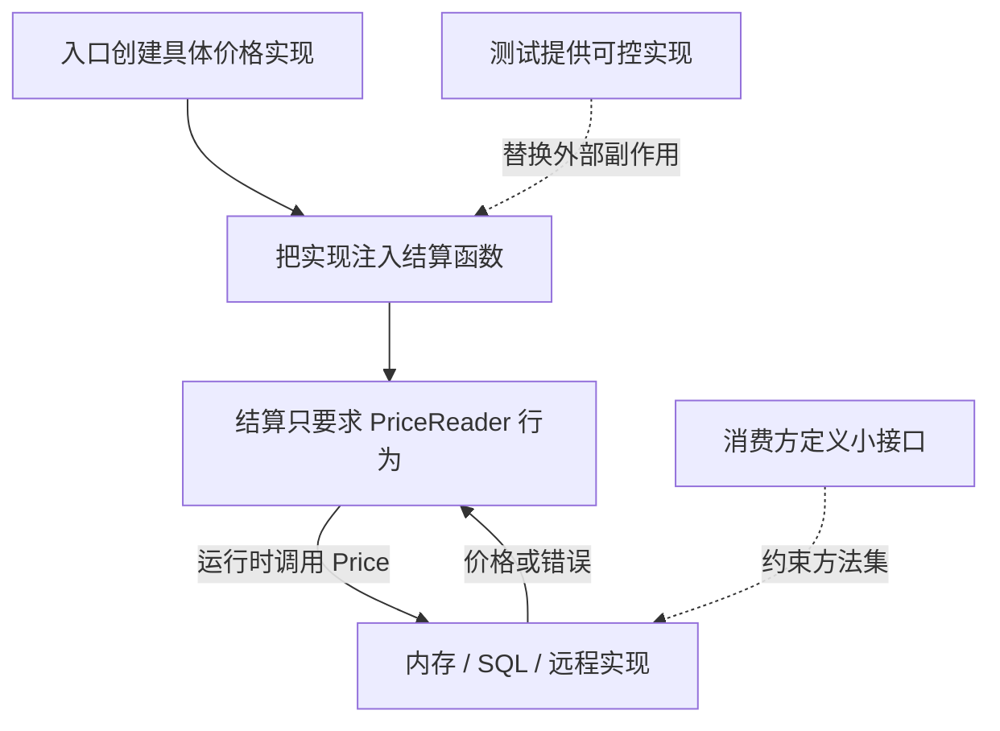

# 005 接口为什么隐式实现？应该由谁定义？

> 难度：基础 · 分类：语言设计

## 简短回答

一个类型的方法集满足接口要求，就能作为该接口使用，无需声明 implements。接口描述调用者需要的行为。业务中的接口通常放在消费方，保持足够小，让实现能够自然满足它；不要机械地给每个结构体生成一个等大的接口。

## 详细解析

### 图解：调用方向与编译依赖不是一回事



实线展示对象装配与调用，虚线展示约束和测试替换。业务不需要导入具体数据库包，但具体实现的方法签名和行为必须满足消费方契约。

### 让业务决定能力边界

订单结算只需要查询价格，不需要知道价格存放在数据库、内存还是远程服务。消费方声明一个价格查询接口，具体实现只要有匹配方法就能注入。下面的内存实现完整可运行，也说明测试替身不需要继承业务基类。

```go
package main

import (
    "fmt"
    "errors"
)

type PriceReader interface { Price(string) (int, error) }
type Prices map[string]int

func (p Prices) Price(sku string) (int, error) {
    n, ok := p[sku]
    if !ok { return 0, errors.New("unknown sku") }
    return n, nil
}

func total(p PriceReader, sku string, count int) (int, error) {
    if count <= 0 { return 0, errors.New("count must be positive") }
    price, err := p.Price(sku)
    if err != nil { return 0, err }
    return price * count, nil
}

func main() {
    n, err := total(Prices{"book": 30}, "book", 2)
    fmt.Println(n, err)
}
```
```output
60 <nil>
```

### 小接口怎样降低耦合

如果把整个数据库客户端的方法都放进 PriceReader，每个替身都必须实现大量无关行为，业务也更容易越过边界。反过来，过度切成几十个只使用一次的接口会使装配难以理解。是否需要接口，取决于是否存在稳定行为边界、替换需求或隔离副作用的测试需求。

「接受接口、返回具体类型」是常见设计建议，不是语法规则。构造函数返回具体类型能让调用者选择所需接口；工厂确实要隐藏实现或返回多种实现时，返回接口也合理。设计时应写明错误语义和并发约束，方法签名本身无法表达这些契约。

示例用整数表示最小货币单位，避免把浮点误差引入价格计算，但它没有处理任意规模金额溢出；真实金额边界应由业务范围校验确定。这说明接口解耦并不能代替业务正确性。

### 隐式实现解耦了什么，又没有解耦什么

隐式实现让一个已经存在的类型可以满足后来定义的小接口，实现方无需反向依赖消费方的声明。这尤其适合把第三方能力适配到业务中：如果第三方类型恰好具有所需方法，就可以直接传入；签名或语义不同，则增加一层明确的适配器，而不是修改第三方代码。

不过，签名相同只说明编译器允许替换，不保证业务效果相同。Price 返回的整数到底是分还是元，商品不存在时返回零还是错误，是否会阻塞到超时，这些都不在方法集中。如果两个实现对这些问题给出不同答案，调用方仍然发生了语义耦合。

| 契约维度 | 价格读取接口应明确的内容 | 忽略后的后果 |
| --- | --- | --- |
| 单位与范围 | 最小货币单位、允许的价格区间 | 同一计算在不同实现下差百倍 |
| 缺失状态 | 商品不存在与免费商品不同 | 把缺失价格作为零价出售 |
| 一致性 | 快照价格还是实时价格 | 展示价与成交价规则不一致 |
| 并发与取消 | 能否并发调用，是否接受 context | 共享实现产生竞态或请求无法退出 |

因此小接口的“小”主要指所需能力集中，不是删掉所有语义约束。若真实实现包含 I/O，可以把 context 加入契约，并定义超时如何表现；这会影响所有实现，应该由实际需要推动，而非一开始给所有纯函数机械加 context。

### 用一次需求变化检验接口是否放对位置

假设数据库客户端新增批量更新和管理员查询方法。若结算服务依赖整个客户端接口，业务替身也必须补齐这些无关方法；若它只依赖 PriceReader，结算代码不需要变化。反过来，业务新增“按会员等级获取价格”后，接口参数的变化应由结算需求发起，适配器再把需求翻译成存储或远程协议。

这解释了为什么消费方接口能减少不必要的变化传播。但只有一个实现、没有替换边界的普通数据结构，不一定需要接口。先使用具体类型，直到调用方确实需要一组独立行为再提取，可以避免结构体与接口永远一比一同步的重复声明。

### 测试替身应控制结果，而不复制实现

测试结算时，价格查询替身只需返回设定价格或设定错误，并按需要记录调用参数。用它覆盖数量非法时不查价格、商品缺失时返回错误、正常数量时金额正确。不要让替身重新实现 SQL 查询或复制生产算法，否则两个实现可能带着同一个错误一起通过测试。

还要注意接口里的 nil。一个非 nil 接口可能装着 nil 具体指针；构造函数返回失败时应避免把这种值当作正常可用依赖。参见 [015](../02-types-memory/015-typed-nil.md)。最后，代码中的整数乘法仍有范围前提：接口解决可替换性，金额上限必须由业务校验或明确的数据类型保证。

## 常见误区 / 面试追问

- **接口越多越符合解耦吗？** 不一定。没有稳定边界的接口只是把变更复制到另一份声明中。
- **隐式实现会隐藏错误吗？** 不匹配的方法集在赋值或传参时由编译器检查；可用编译期赋值断言明确实现意图。
- **为什么某类型指针实现了接口而值没有？** 方法集不同，参见 [016](../02-types-memory/016-method-sets.md)。

## 参考资料

- [Go 规范：接口类型](https://go.dev/ref/spec#Interface_types)
- [Go 官方代码评审建议：接口](https://go.dev/wiki/CodeReviewComments#interfaces)

[返回目录](../README.md) · [上一题](004-composition.md) · [下一题](006-generics.md)
