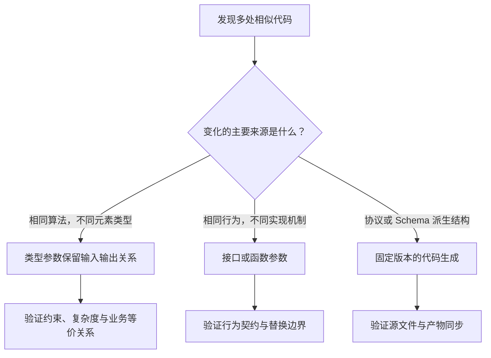

# 006 泛型、接口与代码生成应该如何选择？

> 难度：中级 · 分类：语言设计

## 简短回答

泛型适合保留具体类型的通用算法和容器；接口适合描述可以替换的行为；代码生成适合把协议、Schema 等外部结构变成重复但需要静态检查的代码。三者可以组合，选择依据是重复的来源，而不是哪一种更先进。

## 详细解析

### 图解：从重复的来源选择工具



图中的三条路径并不互斥。例如生成的客户端可以满足业务接口，业务内部的批处理又可以调用泛型算法。选择的起点是变化来源，而不是语法偏好。

### 重复的是算法还是行为

去重算法对字符串和整数都一样，只要求元素可比较。用类型参数可以共享算法并保留输入、输出元素类型。数据库和远程服务都能查询价格，但内部算法不同，适合以接口统一行为。Protobuf 文件里的消息和 RPC 则由工具生成对应语言代码，减少手工同步协议的错误。

```go
package main

import "fmt"

func Unique[T comparable](in []T) []T {
    seen := make(map[T]struct{}, len(in))
    out := make([]T, 0, len(in))
    for _, value := range in {
        if _, ok := seen[value]; ok { continue }
        seen[value] = struct{}{}
        out = append(out, value)
    }
    return out
}

func main() {
    fmt.Println(Unique([]int{3, 1, 3, 2}))
    fmt.Println(Unique([]string{"go", "sql", "go"}))
}
```
```output
[3 1 2]
[go sql]
```

该算法保留首次出现的顺序，预期时间复杂度为 O(n)，额外空间为 O(n)。它不适用于需要自定义等价关系的对象，例如大小写不敏感字符串；这时应先规范化键，或显式传入取键函数，而不是把业务等价关系强行解释为 `==`。

### 约束不是任意反射

类型参数只能使用约束允许的操作。`any` 并不意味着能调用任意方法，`comparable` 也不保证浮点 NaN 能按业务期待被去重。把接口值作为键时，其动态值仍必须可比较，包含切片的动态值可能引发 panic。声明一个宽约束，不会自动获得更强的运行时保证。

代码生成需要固定生成器版本、提交或可重建生成结果，并在 CI 中检查协议和产物是否同步。泛型则不应被用于复制一套已有标准库能力，例如标准库已经提供适用的切片函数时，直接复用更容易维护。

### 沿一次去重调用理解类型关系

调用 Unique([]int{3, 1, 3, 2}) 时，类型参数由输入推断为 int，返回值也是 []int。调用者不需要把结果从 any 断言回来。函数体需要把元素作为 map 键，因此约束必须允许比较；如果只写 T any，编译器不能证明所有允许类型都能作为键。

这个约束保证的是可用操作，并不表达业务相等。对于用户标识，大小写是否敏感可能由协议决定；对于金额对象，相同数值但不同币种不能被简单当作同一项。若改成按键去重，应明确取键函数返回什么、碰撞后保留哪一项，以及顺序是否保留。泛型只是把算法结构复用，并不会替你定义这些规则。

运行时边界仍值得检查。浮点 NaN 不等于自身，因此用普通比较去重可能保留多个 NaN；接口类型作为类型参数时，动态值含不可比较对象仍可能导致比较相关的 panic。处理来自任意 JSON 值的 []any 时，不应因为编译通过就假定所有元素适合作为键。

### 约束为什么有时需要底层类型

若业务定义了自己的 ID 类型，其底层是 string，但它与 string 是不同的定义类型。类型集合中的 string 只接纳相应具体类型，而 ~string 表达底层类型为 string 的一组类型。只有算法确实只依赖底层字符串操作时，这种放宽才合理；不能为了让调用通过就无原则扩大约束。

类型集合中的并集、底层类型项主要用于约束，不意味着可以把所有这样的接口都当普通运行时变量类型。应区分“描述一组可替换方法的接口”与“用于限制类型参数的接口”。前者用于值，后者还可能承载仅供编译期约束使用的类型集合信息。

### 比较三个可能的改造方案

假设服务中有整数 ID 和字符串 ID 两份去重代码，逻辑完全一样。泛型能减少两份算法的维护，并在返回值保留元素类型；改成 []any 会把类型问题转给调用者；用模板生成两份实现则增加生成与产物同步成本，在这个规模下通常没有必要。

但如果重复来自二十个 RPC 消息，各字段、序列化规则和方法名由 Protobuf 文件定义，泛型并不能凭空产生这些声明，生成器更适合。若变化来自内存与数据库两种价格读取方式，强行统一成泛型仓储可能让 SQL、事务和缓存差异藏在大量条件分支里，小接口反而更清楚。

### 练习与回答评价

试着说明为什么 Unique 能保持顺序：不是 map 有序，而是按输入顺序遍历，只把首次遇到的值追加到 out。若把输出改为最后遍历 seen，顺序保证就消失。这个问题同时检查了泛型之外的算法理解。

合格回答能按算法、行为与协议区分三类工具；更完整的回答还应说清约束允许的操作、接口动态值的边界，以及生成代码怎样在 CI 中保持可重建。无需承诺泛型一定更快，性能结论要由当前工具链和真实数据下的测量支持。

## 常见误区 / 面试追问

- **泛型一定比接口快吗？** 没有这种语言保证。编译器实现、内联和数据布局都可能影响结果，应看基准与 profile。
- **为什么不把所有参数都改成 any？** 会丢失编译期关系，调用者需要类型断言，错误更晚暴露。
- **什么时候用函数参数而不用接口？** 只需一个短小行为且无需共享多项能力时，函数参数可以更直接。

## 参考资料

- [Go 泛型入门](https://go.dev/blog/intro-generics)
- [Go 规范：类型参数与约束](https://go.dev/ref/spec#Type_parameter_declarations)

[返回目录](../README.md) · [上一题](005-interfaces.md) · [下一题](007-errors.md)
