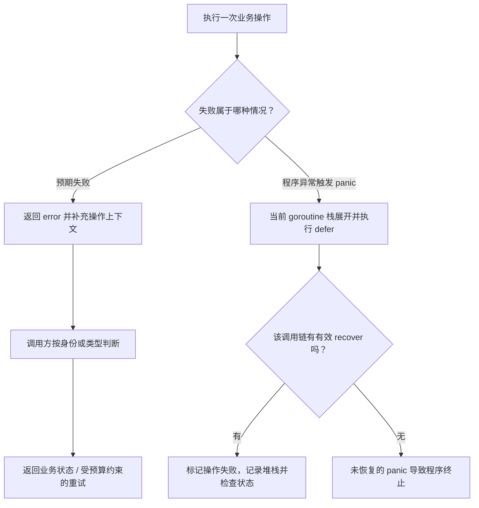

# 007 error、panic、recover 分别解决什么问题？

> 难度：基础 · 分类：语言设计

## 简短回答

error 表达调用者可以检查和处理的失败；panic 中断当前正常控制流并执行栈展开；recover 用于同一 goroutine 的延迟函数中接住 panic。预期的参数错误、依赖超时和资源不存在应作为错误返回，不能把 panic 当成业务分支。

## 详细解析

### 图解：失败如何穿过调用边界



两条路径都必须说明业务操作的最终状态。recover 只改变控制流，不会把已经执行的副作用恢复到起点；并且它只适用于满足恢复语义的 panic，不是对所有进程终止原因的兜底。

### 错误要同时服务机器和人

错误文字提供上下文，错误身份或类型支持程序判断。给数据库错误增加操作背景时，用 `%w` 保留错误链；判断时用 `errors.Is` 或 `errors.As`，避免依赖不稳定的字符串。是否把底层错误公开到上层，要看它是否应成为 API 契约的一部分。

```go
package main

import (
    "errors"
    "fmt"
)

var ErrMissing = errors.New("order missing")

func findOrder(id string) error {
    return fmt.Errorf("find order %s: %w", id, ErrMissing)
}

func main() {
    err := findOrder("A1")
    fmt.Println(errors.Is(err, ErrMissing))
    fmt.Println(err)
}
```
```output
true
find order A1: order missing
```

### 恢复应放在清晰边界

HTTP 或任务执行边界可以设置恢复逻辑：记录堆栈、将此次操作标记失败、返回适当状态。恢复只能处理当前 goroutine 中正在发生的 panic，父 goroutine 的 recover 无法捕获另一个 goroutine 的 panic。并且不是所有运行时致命故障都能恢复。

恢复也不会撤销已完成的数据库写入或外部调用。假如先扣库存再 panic，简单返回成功会掩盖半完成状态；需要事务、幂等与补偿来维护业务不变量。框架恢复中间件提供进程边界上的隔离能力，不能证明业务状态可继续使用。

日志建议在真正处理错误的边界记录一次，底层返回足够上下文。每一层都打印再返回会制造重复告警。面向客户端则把内部错误映射成稳定错误码，避免把数据库地址、SQL 或凭据拼入公开响应。

### 建立一个可供调用方决策的错误契约

假设仓储查询订单时可能出现不存在、超时或存储故障。不存在是业务可理解的状态，可以映射为 ErrMissing；超时表示在期限内没有拿到结果，不一定表示服务端什么都没做；存储故障通常应保留诊断信息，但不应把 SQL 与内部地址直接暴露给客户端。

包装错误时新增的信息应回答“正在做什么、针对什么对象”。仅层层添加 failed 会让堆栈似的长字符串缺乏语义。errors.Is 沿错误包装链判断目标是否匹配，errors.As 用于找到可赋给目标类型的错误；调用者无需知道中间一共有几层包装。

| 决策 | 合适的依据 | 不可靠的依据 |
| --- | --- | --- |
| 返回未找到 | 稳定的领域错误身份 | 字符串里是否出现 not found |
| 提示字段无效 | 校验错误的类型和字段信息 | 解析任意错误文字 |
| 重试远程操作 | 失败类型、幂等条件、剩余预算 | 只要 err 非 nil 就重试 |
| 记录内部细节 | 服务端受控日志与追踪 | 把完整错误作为公开响应 |

公开错误身份也是兼容性承诺。如果 API 使用 %w 让调用者识别具体数据库错误，未来更换数据库时就可能改变上层行为。可以在仓储适配层把驱动错误转换为稳定领域错误，内部诊断信息则留在受控日志或适当的错误上下文中。

### 用一个小程序观察恢复后的控制流

```go
package main

import "fmt"

func task() {
    defer fmt.Println("cleanup")
    panic("broken invariant")
}

func boundary() {
    defer func() {
        if v := recover(); v != nil { fmt.Println("recovered", v) }
    }()
    task()
    fmt.Println("after task")
}

func main() {
    boundary()
    fmt.Println("caller continues")
}
```
```output
cleanup
recovered broken invariant
caller continues
```

task 的清理先执行，随后边界的延迟函数恢复 panic。boundary 不会从 task 调用之后接着执行，所以没有 after task；它结束后，main 可以继续。若 task 内另开 goroutine 并在其中 panic，这个边界无法捕获，因为那是另一条调用栈。需要隔离的后台任务必须在自身入口建立错误与恢复策略。

### 恢复成功不等于业务成功

假设扣库存已提交，写订单前发生 panic。HTTP 中间件可以防止这次 panic 直接逃出请求边界，但库存状态已经改变。若只记录一条日志并返回成功，调用者会失去恢复依据；若盲目重试，也可能重复扣减。解决应回到业务事务、唯一操作身份和状态查询，参见 [047](../05-backend-api/047-idempotency.md)、[052](../06-database/052-transactions.md)。

面试追问“能不能 recover 一切”时，除了说同一 goroutine，还应指出共享状态可能已经被破坏、进程可能因其他致命原因退出，以及恢复边界必须把操作标记为失败。边界是否允许继续服务，需要由被保护对象的不变量决定。

## 常见误区 / 面试追问

- **所有错误都应该重试吗？** 不应。参数错误通常不重试；暂时性依赖错误还要满足幂等、剩余时间和重试预算。
- **recover 后函数从 panic 位置继续吗？** 不会。控制流按照恢复和返回语义结束相关调用，不能当作任意跳转点。
- **错误包装越多越好吗？** 只有新增有用上下文才包装。重复“调用失败”没有诊断价值，参见 [085](../09-kratos/085-kratos-errors.md)。

## 参考资料

- [errors 标准库](https://pkg.go.dev/errors)
- [Go 规范：panic 与 recover](https://go.dev/ref/spec#Handling_panics)

[返回目录](../README.md) · [上一题](006-generics.md) · [下一题](008-defer.md)
