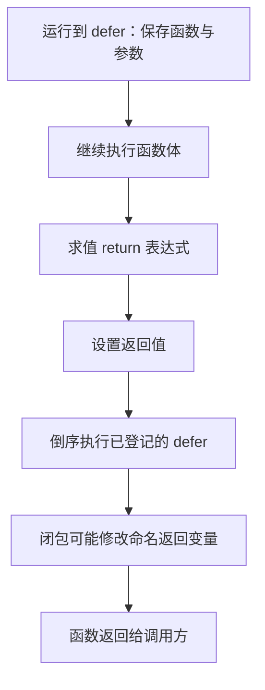

# 008 defer 的求值、执行顺序与资源释放有什么陷阱？

> 难度：中级 · 分类：语言设计

## 简短回答

执行 defer 语句时，函数值与参数立即求值；延迟调用在所在函数返回时按后进先出执行。闭包访问的是捕获的变量，因此可能看到后续修改。资源释放应紧跟资源获取成功之后，且释放时机由函数作用域决定。

## 详细解析

### 图解：return 与 defer 的时间顺序



箭头区分登记、求值、清理和真正返回四个阶段。下面示例的 n 在 defer 登记时为 1，在 return 时为 5，又被延迟闭包改为 6，因此三个观察点不同。

### 求值时间和调用时间不同

下面同时使用普通参数和闭包。理解输出不需要背诵口诀，只需分别标出 defer 注册时保存了什么，以及返回时读取了什么。

```go
package main

import "fmt"

func result() (n int) {
    n = 1
    defer fmt.Println("argument", n)
    defer func() { n++; fmt.Println("closure", n) }()
    n = 5
    return n
}

func main() { fmt.Println("returned", result()) }
```
```output
closure 6
argument 1
returned 6
```

普通调用的参数在 n 为 1 时保存。闭包最后注册、首先执行，它访问命名返回变量，把 5 改为 6。命名返回值可以被 defer 修改，但过度使用会让返回路径隐蔽；除非确实用于清理错误合并等场景，应优先写直观的返回逻辑。

### 循环里的资源积压

在长函数的循环中逐个打开文件并 defer Close，所有文件会等整个函数结束才关闭，可能先耗尽文件描述符。可将单次处理提取到小函数，使每次迭代完成就释放；也可以显式关闭并处理错误。不要为了套用 defer 而牺牲正确的生命周期。

锁同样受作用域约束。持锁后立刻 defer Unlock 能减少漏解锁，但若函数还会进行慢速网络调用，锁会覆盖过大的范围。应先确定最小临界区，再选择是否用 defer 表达结束位置。连接、事务、响应体等也要先确认获取成功，才能注册释放动作。

关闭错误是否重要取决于资源语义。读取文件后的关闭错误与落盘写入后的关闭错误，可能有不同影响；对写文件不能只检查 Write 而忽略最终提交、同步或 Close 的失败。释放资源不等于业务已经成功提交。

### 按时间表解释输出

| 时刻 | 保存或修改的内容 | 对最终输出的影响 |
| --- | --- | --- |
| 第一条 defer | 保存 Println 及参数 argument、1 | 最后打印的参数仍是 1 |
| 第二条 defer | 登记闭包，闭包访问变量 n | 执行时读到的是那时的 n |
| n = 5 | 修改命名返回变量 | return 表达式求值得到 5 |
| 执行延迟闭包 | n 增至 6，再打印 | closure 6 最先出现 |
| 执行第一条延迟调用 | 使用此前保存的参数 | 打印 argument 1 |
| 返回到 main | 调用表达式的结果为 6 | 最后打印 returned 6 |

如果把闭包改为接收 n 的参数，并在 defer 处传入 n，参数也会在登记时求值。理解这个变化比笼统说“闭包总读最新值”更准确：闭包体访问外层变量与闭包参数是两件事。

### 清理范围必须与资源预算匹配

考虑遍历一万个文件，每次打开后都在外层函数中 defer Close。即使每个文件只读一毫秒，早期打开的文件仍会一直保留到整个函数结束。如果并发还有多个这样的任务，资源占用会按任务叠加，而不是一次只占一个描述符。

把“打开、处理、关闭”放进单文件处理函数，会让每次返回都触发清理。这里增加函数是为了定义资源作用域，不是为了抽象而抽象。对锁也一样：获取共享数据的快照后即可解锁，再执行网络调用；若把 defer Unlock 登记在整个请求函数里，就可能让无关请求被远程延迟一起拖住。

可以把资源预算写成粗略上界：同时执行的任务数乘以每个任务在释放前最多持有的资源数。这个上界不替代压测，却能在代码审查时识别明显不合理的作用域。并发不是唯一风险，单个大循环也能耗尽有限资源。

### 释放错误不能覆盖原来的失败原因

若处理文件已经失败，Close 又失败，简单把命名返回 err 替换为关闭错误，会丢失真正的处理错误。应按业务需要保留首个错误或用 errors.Join 组合，让调用者仍可判断各个原因。相反，如果主体成功但最终写入关闭失败，也不能因为 defer 中忽略了返回值就报告成功。

清理动作与提交动作应明确分开。例如回滚一个已提交的事务与关闭一个写入流不是相同语义；应该依据资源 API 的约定处理。不要为了让 defer 看起来整齐，把需要检查结果的 Commit、Flush 或最终 Close 全部写成不观察错误的调用。

### 练习：哪些退出路径会执行清理

正常 return 会执行已登记 defer；panic 栈展开也会执行相应 defer。os.Exit 直接终止进程，不走正常清理路径；进程被强制终止时同样不能依赖 Go 代码完成收尾。因此服务收到退出信号后，应先停止接流量并走受预算限制的正常关闭流程，而不能把所有恢复责任交给 defer。参见 [050](../05-backend-api/050-shutdown.md)。

## 常见误区 / 面试追问

- **defer 必然性能差吗？** 不能这样概括，编译器会优化部分情形。只有 profile 显示热点才需要比较实现。
- **调用 os.Exit 会执行 defer 吗？** 不会。主流程应正常返回，让需要的清理完成，再决定退出状态。
- **把 defer 放到 goroutine 中能更快释放吗？** 会改变生命周期与错误处理，还可能产生竞争，不能当作通用优化。

## 参考资料

- [Go 规范：defer](https://go.dev/ref/spec#Defer_statements)
- [os.Exit 文档](https://pkg.go.dev/os#Exit)

[返回目录](../README.md) · [上一题](007-errors.md) · [下一题](009-packages.md)
