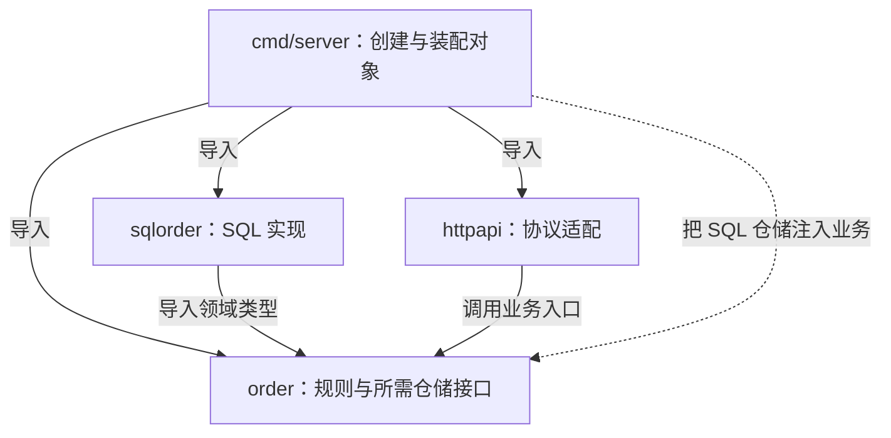

# 009 包如何划分？怎样避免循环依赖和万能 utils？

> 难度：中级 · 分类：语言设计

## 简短回答

包是编译、命名和依赖管理的边界，应围绕稳定职责划分。依赖必须形成无环图。遇到循环依赖，应检查职责是否混杂、接口归属是否错误或两个包是否本就应合并，而不是把所有公共代码搬到 utils。

## 详细解析

### 图解：把装配放在依赖图的外层



实线表示编译期导入，虚线表示入口的装配动作。运行时业务会调用注入的仓储，但 order 无需反向导入 sqlorder。把调用方向直接画成导入方向，往往就是循环依赖的起点。

### 从调用关系推导依赖方向

假设订单业务要访问 SQL 仓储。业务包声明它需要的 Repository 接口；SQL 包依赖业务包以实现该接口；入口负责创建二者并注入。业务可以调用仓储行为，但编译依赖不必指向具体 SQL 实现，这就是接口帮助稳定核心逻辑的方式。

```text
cmd/server ──→ order
    │
    └────────→ storage/sqlorder ──→ order

order 不导入 storage/sqlorder
构造与装配发生在 cmd/server
```

如果 order 又导入 sqlorder，就产生环。修复应移走装配代码或调整接口归属，不应把 order 的整个领域模型复制一份到 SQL 包。重复模型会导致字段和业务含义逐渐漂移。

### 命名反映职责

`utils`、`common`、`base` 只表达“很多地方会用”，没有表达代码做什么。日期解析可以归属负责该协议的包，订单号验证可以留在订单领域。只有确实稳定且被多个边界共同使用的能力才适合提取；多个调用者恰好代码相似，不一定代表抽象相同。

包过细同样有代价。若两个包总是一起改、互相暴露内部结构、只有一个使用方，可以考虑合并。判断标准是变更边界，而不是一个文件只能放一个类型或每层必须建一个目录。

`internal` 目录通过导入路径规则限制可见范围，适合不承诺给外部模块使用的实现。它不能阻止同一允许范围内的坏依赖，也不是运行时权限隔离。公共包则需要认真维护导出标识符、错误语义和兼容性。

### 循环依赖暴露了哪一类职责问题

假设 order 创建订单后需要通知用户，notification 又导入 order 来读取订单结构；如果 order 同时导入 notification 创建具体客户端，就形成双向依赖。先问通知所需的数据是什么：可能只是订单号、接收者和消息内容，并不需要整个订单聚合。此时可以由业务定义通知行为接口，入口注入具体实现，并用明确参数传递必要信息。

另一种情况是两个包共同维护同一状态，每次修改都必须互相调用。此时继续增加接口可能只把循环藏起来，并没有形成真实边界。合并为一个职责完整的包，往往比再建一个 common 包更清楚。判断依据是状态和规则的归属，而不是文件数。

| 循环来源 | 优先检查 | 合理的修正方向 |
| --- | --- | --- |
| 业务创建具体存储 | 装配是否放错层 | 入口构造并注入 |
| 通知只需要少量业务数据 | 是否传递了过大的类型 | 缩小参数或定义消费方接口 |
| 两包共享且共同修改内部状态 | 是否属于同一职责 | 合并或重新划清状态所有权 |
| 大量无关模块导入 common | 公共包是否容纳业务规则 | 把规则移回拥有它的领域 |

### 包名应让调用点可读

调用点会同时展示包名和导出名。包负责表达上下文，函数负责表达动作；不必把包名再重复到每个类型里。但简短名称也不能牺牲含义：一个包同时负责时间解析、SQL 拼装和订单校验，即使每个函数名都很清楚，整体依然没有稳定职责。

相似代码也不一定应共享。例如账单日期解析与日志日期解析当前都接受同一种格式，但前者将来可能受业务时区和结算日规则影响，后者属于可观测性协议。提前合并会让本来独立的需求绑在一起。提取公共能力前，先确认两者的变化原因是否一致。

### 测试和初始化怎样反映依赖边界

如果单测一个金额规则必须启动数据库和 HTTP 服务，通常说明纯业务规则与副作用耦合过紧。可以把规则留在领域包，将外部查询放到小接口后，在装配入口提供真实实现。测试不应为了避开数据库而依赖一组神秘的包级开关，否则测试之间容易互相影响。

包级 init 适合完成受控的初始化工作，但网络连接、环境读取与不可重试失败藏在 init 中，会让导入变成执行副作用。显式构造可以把错误返回给 main，按顺序关闭此前成功创建的资源，也便于测试只构造需要的部分。模块有清晰目录并不代表这些生命周期责任已经清晰。

### 练习：解释一条依赖而不是背目录模板

尝试用一句话说明每条 import 的原因：协议适配需要业务入口，SQL 实现需要业务类型，入口需要所有具体构造函数。若只能说“这是公共包，大家都能用”，继续追问它实际承载了哪条契约。能从变化和状态归属解释边界，比固定套用 controller/service/dao 更有说服力。

## 常见误区 / 面试追问

- **接口放实现方一定错吗？** 不是。通用库可能发布稳定抽象；业务中的小接口优先由需求方定义，是为减少无关依赖。
- **如何识别假分层？** 若 service 只是把所有字段原样转发，而核心规则散落在 HTTP handler 与 SQL 中，应先恢复业务职责，再讨论目录名称。
- **init 适合装配数据库吗？** 不适合隐藏网络副作用和不可控失败。入口显式构造更容易测试、排序和释放资源；参见 [084](../09-kratos/084-dependency-injection.md)。

## 参考资料

- [Go 包组织建议](https://go.dev/blog/package-names)
- [Go 命令：internal 目录规则](https://pkg.go.dev/cmd/go#hdr-Internal_Directories)

[返回目录](../README.md) · [上一题](008-defer.md) · [下一题](010-modules.md)
