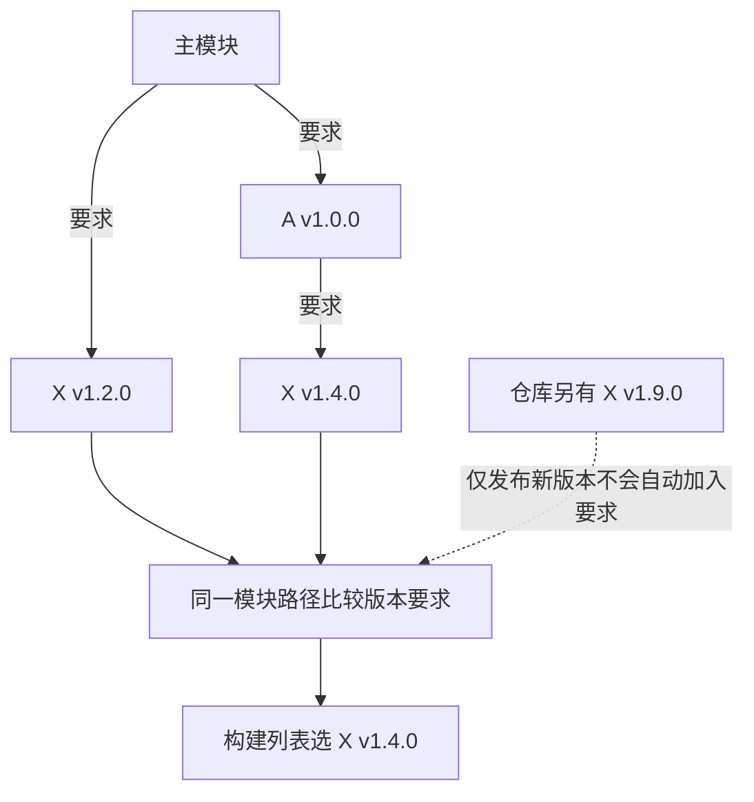

# 010 Go Modules、版本选择与可复现构建如何工作？

> 难度：中级 · 分类：语言设计

## 简短回答

模块是一组一起版本化的包。go.mod 记录模块路径、Go 版本与依赖要求，go.sum 记录下载内容的校验信息。最小版本选择根据依赖图选择满足要求的版本，不会自动追逐仓库最新版本；可复现构建还要固定工具链、生成器和构建环境。

## 详细解析

### 图解：版本要求怎样形成构建列表



图中版本是假设数据，用于说明选择关系。真实构建还要考虑完整模块图与主模块中的替换等指令，不能只看源码直接 import 了哪些包。

### 最小版本选择不是选最低版本

假设主模块要求库 X v1.2.0，依赖 A 要求 X v1.4.0。所需版本中的最高要求是 v1.4.0，构建列表选它。上游后来发布 v1.9.0，并不会仅因版本出现就自动被这次构建采用。更新命令、依赖图变更或 replace 才可能改变实际选择。

```text
应用 ──→ X v1.2.0
  └──→ A v1.0.0 ──→ X v1.4.0

选中 X v1.4.0；不会同时链接两个 X v1 主版本内的小版本。
```

主版本 v2 及以上通常需要出现在模块路径中，例如 `/v2`，这允许不兼容的主版本并存。它并不保证不同版本共享的全局资源或协议就相互兼容，运行时仍需验证。

### 校验和不是完整锁文件

go.sum 可能包含构建列表之外的校验记录，也不负责决定版本。应结合 go.mod、实际模块图和工具链确认最终构建输入。`replace` 指向本地目录时，那个目录内容未必在仓库提交内，换机器就可能得到不同结果；共享工作区中的 go.work 也可能影响本地依赖解析。

在本仓库根目录可运行以下只读检查。它们展示当前文件事实，而不是承诺所有项目得到相同结果。

```sh
go version
go env GOWORK
go list -m all
go mod verify
```

发布流水线应固定工具链和生成器版本，明确 CGO 与目标平台，提交模块文件，并禁止构建阶段悄悄修改依赖。若使用 vendor，需要持续检查它与模块声明一致。缓存用于加速，不能用“开发机缓存里刚好有”来代替完整依赖声明。

### 从依赖声明走到实际使用的代码

go.mod 中的 require 描述版本要求，而不是把每个传递依赖的源码直接写进仓库。工具链按模块图形成构建列表，再解析具体包；go.sum 用于校验相应下载内容。于是“go.sum 里出现过某版本”与“本次构建使用该版本”没有一一对应关系，排查时应查看实际选择结果。

本仓库的声明包含 Kratos v2.9.1、gRPC v1.70.0 和 Protobuf v1.36.2。可以用下列命令只查看这些模块，而不被完整依赖列表淹没；若后续更新了 go.mod，应以新的输出为准。

```sh
go list -m github.com/go-kratos/kratos/v2 google.golang.org/grpc google.golang.org/protobuf
go mod graph
go mod why -m google.golang.org/grpc
```

三个问题分别是“最终选了什么”“版本要求从哪条边进入”“为什么需要这个模块”。这些命令回答的是不同层次的问题。某模块被选入构建列表，也不意味着它的每个包都会进入最终二进制；实际包依赖还受代码导入、平台和构建标签影响。

### 开发机正常而 CI 失败，先查哪些输入

| 差异来源 | 检查方式 | 典型表现 |
| --- | --- | --- |
| 工作区覆盖 | 查看 go env GOWORK 与 go.work | 本地依赖旁边的未提交模块 |
| 本地替换 | 检查 go.mod 的 replace | CI 找不到目录或使用不同内容 |
| 工具链不同 | 对比 go version 与 go.mod | 语法、标准库 API 或编译行为不同 |
| 生成器不同 | 核对 protoc 与插件版本 | 同一协议重新生成产生差异 |
| 平台与 cgo | 对比 GOOS、GOARCH、CGO_ENABLED | 文件选择与原生依赖不同 |

排查顺序应从这些输入开始，而不是先删除缓存。缓存可能暴露问题，但清空后偶然成功不能解释为什么两台机器选择了不同源码。尤其是本地 replace，它不只是一个下载地址设置，还可能改变实际模块内容和依赖关系。

go.mod 的 go 指令与精确锁定某个工具链补丁版本不是同一概念；toolchain 指令和工具链自动选择机制也会影响实际执行的编译器。若验收要求固定版本，应在构建环境中明确安装和选择，并记录 go version。仅看到 go 1.26.0 不能推断执行者必然是某一个 1.26.x 补丁版本。

### 把“可复现”拆成可验收层次

第一层是依赖解析一致：相同模块声明和工作区条件得到预期版本。第二层是产物行为一致：同一套测试在目标平台通过。第三层才是字节级一致：构建路径、VCS 信息、注入变量、原生工具和其他输入也必须被控制。不能用一次 go mod verify 通过替代后两层。

本仓库提交协议生成结果，并提供 [生成脚本](../scripts/generate_proto.py)。普通运行直接使用已提交代码，修改协议时再按固定工具版本生成，检查差异并执行服务测试。这样既能让读者直接运行，也能解释生成结果来自哪里。发布前若生成步骤造成未提交差异，应先查明原因，而不是把漂移隐藏到构建产物中。

## 常见误区 / 面试追问

- **go mod tidy 是升级所有依赖吗？** 不是，它根据源码和相关测试整理依赖与校验记录；仍应检查文件差异。
- **go.sum 通过就没有供应链风险吗？** 它验证内容一致性，不判断代码是否安全、维护者是否可信或许可证是否适用。
- **可复现是否等于二进制字节完全一致？** 不一定。还要控制构建路径、VCS 信息、时间注入和外部工具输入，验收标准必须事先定义。

## 参考资料

- [Go Modules 参考：最小版本选择](https://go.dev/ref/mod#minimal-version-selection)
- [Go 依赖管理](https://go.dev/doc/modules/managing-dependencies)
- [Go 工具链选择](https://go.dev/doc/toolchain)

[返回目录](../README.md) · [上一题](009-packages.md) · [下一模块](../02-types-memory/011-slices.md)
