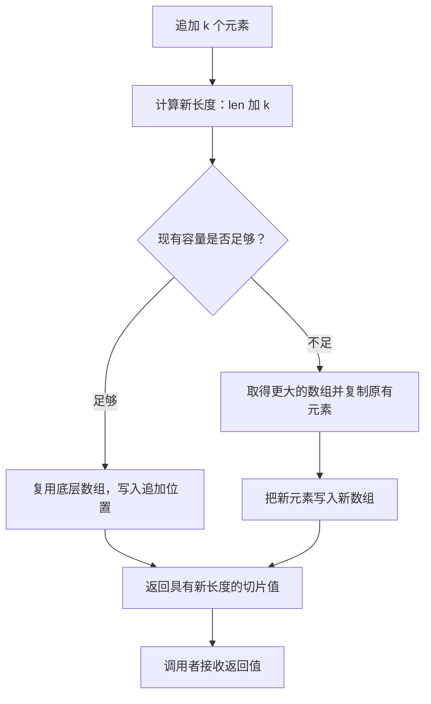

# 011 数组和切片有什么区别？append 为什么需要接收返回值？

> 难度：基础 · 分类：类型与内存

## 简短回答

数组长度属于类型，赋值会复制数组元素；切片描述底层数组中的一段区域，长度和容量是运行时属性。append 返回更新后的切片，因为长度会变，容量不足时底层数组也可能变；调用者必须接收返回值才能继续使用正确视图。

## 详细解析

### 图解：append 的两个分支



两个分支都返回新切片值，只有其中一个必须更换底层数组。因此即使预分配容量充足，也仍需接收 append 的结果；容量只决定存储能否复用，不会自动更新另一个变量的长度。

### 容量决定能否原地追加

长度表示当前可索引元素数，容量表示从切片起点到底层可用区域末端的范围。不能直接索引长度以外的元素，即使容量更大。下面用完整切片表达式限制容量，让追加一定不能覆盖原数组后面的元素。

```go
package main

import "fmt"

func main() {
    original := []int{1, 2, 3}
    shared := original[:1]
    shared = append(shared, 9)
    isolatedGrowth := original[:1:1]
    isolatedGrowth = append(isolatedGrowth, 8)
    fmt.Println(original, shared, isolatedGrowth)
}
```
```output
[1 9 3] [1 9] [1 8]
```

shared 的追加复用了原数组，所以第二个元素变成 9。isolatedGrowth 的容量被限制为 1，追加需要新数组，因此不会把原数组第二个位置改成 8。但追加之前的 `isolatedGrowth[0]` 仍和原数组共享，限制容量不等于复制。

### 为什么不要背扩容倍率

语言保证 append 的结果能容纳新元素，不承诺容量始终翻倍。具体扩容策略属于运行时实现，还受元素大小和分配器粒度影响。本仓库 Go 1.26.5 源码包含 growslice 与 nextslicecap，阅读这些函数可以解释该版本行为，但业务不能据此推断未来版本的共享关系。

如果已知最终长度，可用 make 预分配，减少多次增长和复制；如果输入长度来自不可信请求，应先校验上限，避免一次预分配就耗尽内存。预分配是性能选择，不应改变 API 的正确性。

数组适合固定大小且长度有语义的值，例如摘要；切片适合变长序列。选择数组指针规避复制时，要额外考虑共享修改。二者不存在放之四海皆准的性能排名。

### 长度、容量和起点一起决定可访问范围

设数组有五个元素，切片 a[1:3] 从索引 1 开始，长度为 2，容量为 4。它的第零个元素是原数组的索引 1，而不是原数组的索引 0。若写成 a[1:3:4]，容量变成 3：三下标表达式的最后一个数限制上界，容量等于该上界减去起点。

| 操作 | 当前 len=2、cap=4 时 | 原因 |
| --- | --- | --- |
| 读取 s[1] | 允许 | 位于当前长度内 |
| 读取 s[2] | 越界 | 容量不直接赋予索引权限 |
| 重新切片 s[:4] | 允许 | 新长度没有超过容量 |
| append 一个元素 | 可复用存储 | 新长度 3 不超过容量 |
| 仅给另一变量赋值 t=s | 不复制元素 | 创建另一个共享存储的视图 |

有了这个模型，再看原示例：shared 的追加位置正好是 original 的第二格，所以覆盖了 2。isolatedGrowth 的最大容量是 1，追加触发新存储。两者差异来自可用容量，不来自变量名是否写了 isolated。

### 预分配不是把长度设成预计追加次数

假设要收集最多一百个结果。make([]Item, 100) 创建的是已经有一百个零值元素的切片，再 append 会从第一百零一个位置开始；make([]Item, 0, 100) 才表示当前没有元素，但预留追加空间。若已知每个结果的位置，则创建长度为一百并按索引赋值更直接。

把这两种写法混淆，常见症状是返回结果前面多了一批零值，或遍历时处理了尚未填充的元素。代码审查应同时看写入方式与初始化方式：append 对应增长序列，按索引赋值对应固定长度。

### 数组的值语义有什么实际用途

固定长度摘要用数组可以让长度成为编译期信息，不需要每个调用点重新验证长度。数组赋值复制每个元素，是否进一步共享取决于元素类型：字节数组复制后没有共同的可变字节存储，而指针数组复制后仍指向原来的对象。不能把数组值语义误解为任意结构的深复制。

切片传递成本与元素数量通常不直接成正比，但这不意味着大切片就没有成本。元素分配、复制、GC 扫描和长期保留都可能成为主要开销。把一个大数组改为指针参数，只是把复制问题变成共享及生命周期问题，需要结合 API 的修改权限判断。

### 练习：预测一次追加是否会影响别名

先写出初始 len/cap，再标记两个切片各自覆盖的数组范围，然后判断追加位置是否落在另一视图的有效区间。最后确认追加是否触发重新分配。这个流程适用于查找“为什么追加列表改变了别处数据”的问题；只观察 append 前后的地址，无法替代对所有别名的梳理。

## 常见误区 / 面试追问

- **append 后旧切片会失效吗？** 不会，它仍描述原来的有效区域；新旧切片是否共享取决于是否重新分配。
- **copy 会自动扩容目标吗？** 不会，它最多复制双方长度的较小值，返回实际复制数量。
- **清空长度就释放数组吗？** 不一定，仍持有底层数组引用，参见 [012](012-slice-retention.md)。

## 参考资料

- [Go 规范：切片表达式](https://go.dev/ref/spec#Slice_expressions)
- [Go 1.26.5 切片实现](https://github.com/golang/go/blob/go1.26.5/src/runtime/slice.go)

[返回目录](../README.md) · [下一题](012-slice-retention.md)
