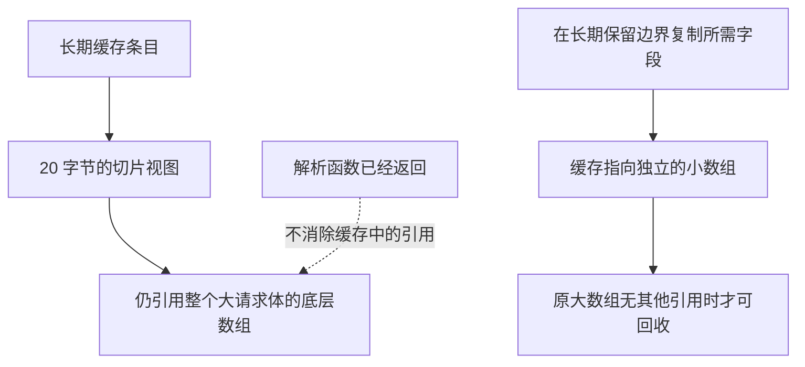

# 012 切片截取为何可能造成内存滞留？如何控制共享？

> 难度：中级 · 分类：类型与内存

## 简短回答

一个很短的切片仍可能引用一个很大的底层数组，使数组无法被回收。需要长期保留少量数据时可以复制到独立存储；从含指针的切片删除元素时还要考虑清理尾部引用。是否值得复制，应比较保留时长、数组规模和分配成本。

## 详细解析

### 图解：短切片为什么留住大数组



图中描述的是可达关系，不是 GC 的时间表。缩短长度或限制容量改变了视图，却没有切断它对原数组的引用；复制才能改变这个存储关系。

### 解析器为什么占着整个请求体

假设解析一个 20 MB 文档，只把其中 20 字节的标识符切片放进长期缓存。缓存保存的不是“只有 20 字节”的独立对象，而是对原数组的引用。即使局部大切片变量离开作用域，底层存储仍可达。把容量限制到长度也不会搬移数据，因此无法解除这个引用。

```go
package main

import (
    "fmt"
    "slices"
)

func main() {
    body := []byte("order=123456")
    view := body[6:9]
    owned := slices.Clone(view)
    body[6] = '9'
    fmt.Println(string(view), string(owned))
}
```
```output
923 123
```

这个实验验证的是共享与复制语义，没有直接证明某次 GC 的内存回收时间。内存滞留应结合 heap profile、对象引用路径与多轮稳定负载观察，不能把一次进程 RSS 没下降就认定为泄漏。

### 删除与清理也是所有权问题

对含指针元素的切片，缩短长度可能把已删除对象的引用留在底层数组尾部。手工移动元素后，可以清理不再使用的尾部区域，再缩短长度。但必须确认这些位置不被其他切片视图继续使用，否则清理会影响仍有效的数据。

`slices.Clone` 复制元素而不递归复制对象。如果元素类型是指针、map 或切片，复制后仍可能共享更深层数据。需要深复制时，应根据领域结构逐项定义，避免通过 JSON 往返隐式丢失类型、精度或未导出字段。

长期缓存与短生命周期缓冲区尤其需要明确契约：函数是借用输入直到返回，还是会持有输入到未来？清晰的所有权约定，比到处加复制更能控制性能和正确性。

### 用数量级判断是否值得复制

假设每个请求体为 20 MiB，缓存只需要一个 20 字节标识，且每个缓存条目对应不同请求体。若一千个条目都保存原始切片视图，可能保留约 19.5 GiB 的请求体存储；只复制标识的数据量约为 20 KB，实际对象分配还会有对齐和管理开销。这是上界场景的计算，不是某次 heap profile 的测量结果。

若标识只在解析函数内短暂使用，复制反而会增加额外分配；若同一请求体本来就要被完整保留，复制单个字段也未必降低当前存活堆。优化点应放在“很大的所有者即将结束，但很小的视图要继续活”的边界，不能把所有切片操作统一改成复制。

### 为什么删除后仍可能保留对象

假设 []*Session 的底层数组原有十个指针，删除中间一项时把后续元素前移，再把长度缩成九。最后一个槽位可能仍存着某个 Session 指针。只要数组仍可达，尾部引用就可能延长对象寿命，即使普通遍历已经看不到该槽位。

正确处理需要先明确所有权，再清理不再使用的尾部位置。若另一个切片还把该位置视为有效元素，清理会破坏它的数据。因此“为了 GC 把尾部清零”不能跨越共享契约。使用标准库 slices 中的删除操作时，应阅读当前版本对尾部清理的说明，并继续处理别名带来的语义变化。

### 把内存现象分成三层

| 层次 | 要问的问题 | 可观察证据 |
| --- | --- | --- |
| 业务存活 | 缓存或队列是否还需要这些数据 | 条目数量、生命周期与退出条件 |
| Go 堆存活 | 哪些分配仍由可达对象保留 | heap profile 中的存活分配及代码关系 |
| 进程与系统内存 | 已释放堆是否已归还操作系统 | RSS 与运行时内存统计的长期趋势 |

heap profile 通常告诉你哪些分配栈贡献了存活空间，并不是一张自动还原所有对象引用的图。需要从分配栈回到源码，检查缓存、闭包、切片视图或 goroutine 是否仍持有相关对象。看到 RSS 暂未下降，不足以证明复制修复无效；反过来，一次手动 GC 后下降也不证明长期负载已稳定。

### 一个可重复的验证方案

用固定大小、固定条目数的输入分别运行保存视图和复制字段两种实现，保持缓存淘汰策略相同。先比较业务输出，确认缓冲区复用不会改变缓存值；再比较稳定阶段的存活堆与分配量。预计复制版本可能增加小对象分配，却显著减少被长期保留的大数组。

如果存活堆仍随着请求总数线性增长，就要继续检查缓存是否无上限、淘汰是否真正删除引用，以及是否有其他长生命周期持有者。这里的验收目标是“内存与允许的存活数据规模相符”，不是强迫进程 RSS 在每个请求结束后立即回落。

## 常见误区 / 面试追问

- **把变量设为 nil 就一定回收吗？** 只有当没有其他可达引用时对象才具备回收条件，回收时机和归还操作系统的时机也不同。
- **为什么不总是复制？** 高频大数据复制会增加分配与内存带宽成本；只在所有权转移或长期保留边界复制。
- **如何验证修复？** 保持输入与负载一致，对比存活堆、分配量和延迟，同时确认输出没有被缓冲区复用破坏。

## 参考资料

- [slices.Clone 文档](https://pkg.go.dev/slices#Clone)
- [Go 切片机制](https://go.dev/blog/slices-intro)

[返回目录](../README.md) · [上一题](011-slices.md) · [下一题](013-strings.md)
