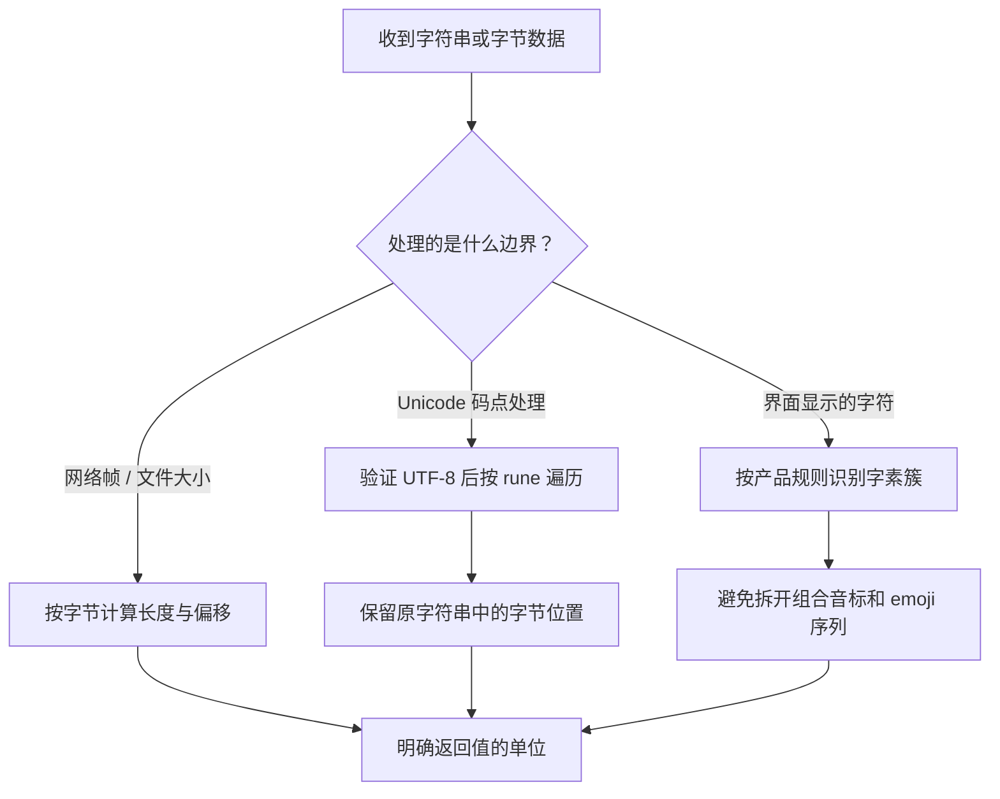

# 013 string、byte、rune 如何选择？怎样正确截取中文？

> 难度：基础 · 分类：类型与内存

## 简短回答

string 是不可变的字节序列，byte 是 uint8 的别名，rune 是 int32 的别名，常用于表示 Unicode 码点。字符串长度和下标按字节计算，range 按 UTF-8 解码码点；用户看到的一个字符还可能包含多个码点。

## 详细解析

### 图解：文本边界决定计数单位



不要把“字符数”当作唯一单位。协议长度限制、搜索结果偏移和界面截断可能需要不同答案，函数命名与文档应把单位写清楚。

### 三种长度不能混为一谈

网络包长度、文件偏移通常按字节计算；按码点遍历适合部分文本处理；界面截断则可能需要按字素簇处理。例如组合音标和家庭 emoji 可能由多个码点组成，转成 `[]rune` 仍可能切断用户看到的一个字符。

```go
package main

import (
    "fmt"
    "unicode/utf8"
)

func main() {
    s := "Go语言"
    fmt.Println(len(s), utf8.RuneCountInString(s))
    fmt.Println(string([]rune(s)[:3]))
    for i, r := range s { fmt.Printf("%d:%c ", i, r) }
    fmt.Println()
}
```
```output
8 4
Go语
0:G 1:o 2:语 5:言
```

range 返回的下标是码点在原字符串中的字节位置，不能拿它当成“第几个字”。上例按码点取前三项是安全的，因为已知内容与长度；处理外部输入还需先校验长度，避免越界。

### 文本与二进制边界

string 可以包含任意字节，并不天然保证有效 UTF-8。需要拒绝无效输入时使用 `utf8.ValidString`；遍历无效编码会得到替代码点，若静默接受可能改变签名、标识符或审计内容。是否规范化 Unicode 则属于协议约定，应在比较、存储和签名前保持一致。

修改内容时可以构建新的字节切片或使用 Builder。把字符串转为可修改字节序列具有独立可修改的语义，编译器可能优化特定只读场景的分配，但业务不能依赖某次优化来设计所有权。大量拼接先看分配 profile，再考虑预估容量，避免为了节省一次分配引入 unsafe。

### 沿字节位置解释中文截取

示例 Go语言 包含两个单字节英文字母和两个各占三个 UTF-8 字节的汉字，因此 len 为 8，码点数为 4。range 返回 0、1、2、5，是四个码点开始的字节位置。若把下标 5 理解为“第六个字符”，后续切片就会混用单位。

按字节取前三字节会截到“语”的部分编码；按 rune 取前三项得到 Go语。但如果内容换成由多个码点组成的显示字符，[]rune 仍不等价于界面上的完整字符。要展示用户名字的前十个可见字符，应先定义字素边界，而不是把中文场景中偶然有效的方法推广到所有 Unicode 文本。

### 无效 UTF-8 与替代字符必须区分

```go
package main

import (
    "fmt"
    "unicode/utf8"
)

func main() {
    for _, s := range []string{"\xff", "\ufffd", "e\u0301"} {
        r, size := utf8.DecodeRuneInString(s)
        fmt.Printf("valid=%t bytes=%d runes=%d first=%U width=%d\n",
            utf8.ValidString(s), len(s), utf8.RuneCountInString(s), r, size)
    }
}
```
```output
valid=false bytes=1 runes=1 first=U+FFFD width=1
valid=true bytes=3 runes=1 first=U+FFFD width=3
valid=true bytes=3 runes=2 first=U+0065 width=1
```

前两项解码出的码点相同，但第一项是无效字节触发的替代结果，第二项是输入里合法编码的替代字符；宽度和有效性检查让二者可区分。第三项是字母 e 加组合音标，通常显示为一个组合字符，却有两个码点。这个例子说明仅看打印效果会漏掉编码差异。

### 标识符比较与协议签名如何处理

两个视觉相似的字符串未必具有相同字节，也未必拥有相同码点序列。业务若允许规范化，应明确在哪个边界应用、使用什么规则，以及是否会影响已存在的唯一键。标准字符串相等比较按字节内容，不会自动完成 Unicode 规范化或大小写折叠。

签名校验尤其不能随意先规范化再验签。若协议规定对原始字节签名，替换无效编码、重排 JSON 字段或改变换行都可能改变被签内容。应先遵循协议验证原始表示，再在允许的业务边界解释文本。这里讨论的是数据一致性，具体安全协议仍应按其规范实现。

### 如何选择修改与拼接方式

字符串不可变意味着不能通过普通字符串下标赋值，但可以创建新的字符串结果。需要逐字节修改时使用 []byte，需要按码点变换时使用解码过程或 []rune；大量顺序拼接可用 strings.Builder。是否预先 Grow 应由可估算的长度和实际分配证据决定，不能从不可信输入直接分配无限容量。

练习时先回答“输入是否必须是 UTF-8、索引单位是什么、返回值能否拆分可见字符”，再选 API。能预测上面三行结果，并解释为什么 byte、rune 和用户感知字符不同，才真正掌握了文本边界。

## 常见误区 / 面试追问

- **一个中文字符总占三个字节吗？** 不是所有 Unicode 字符都如此，UTF-8 编码长度取决于码点，不能按固定字节宽度切分文本。
- **rune 就是字符吗？** 它能表示码点数值，但用户感知字符可能由多个码点构成。
- **密码长度应该按哪种长度算？** 由产品与安全策略定义，并明确编码和规范化规则；不能让 len 的实现偶然决定规则。

## 参考资料

- [Go 官方：字符串、字节与 rune](https://go.dev/blog/strings)
- [unicode/utf8 文档](https://pkg.go.dev/unicode/utf8)

[返回目录](../README.md) · [上一题](012-slice-retention.md) · [下一题](014-maps.md)
