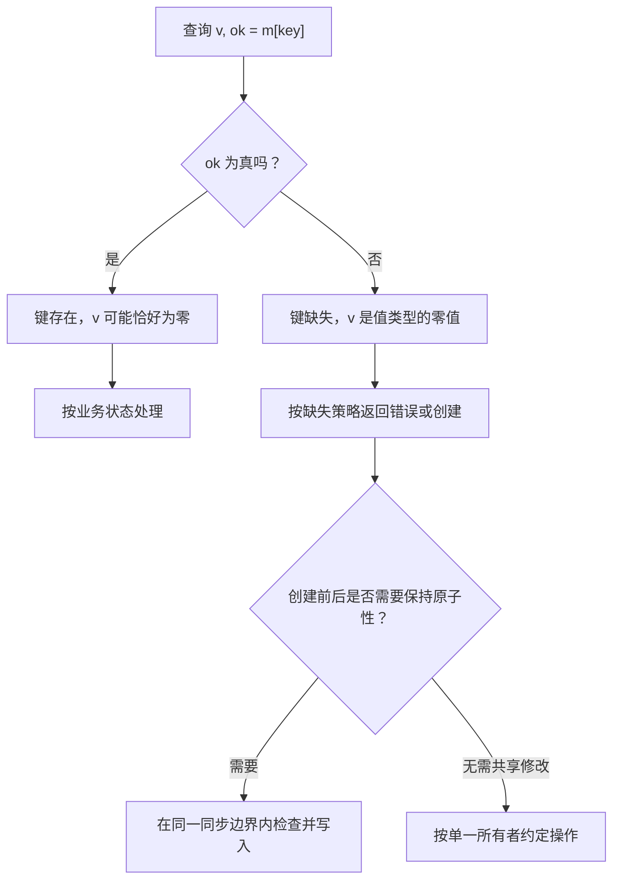

# 014 map 的零值、遍历和并发使用有哪些边界？

> 难度：基础 · 分类：类型与内存

## 简短回答

map 提供键到值的映射，键必须支持比较。nil map 可读、可查询长度和删除，但写入会 panic；遍历顺序没有保证。多个 goroutine 共享 map 时，只要存在未同步的冲突访问就要设计同步，运行时偶尔报错不是并发安全机制。

## 详细解析

### 图解：查到零值之后，还要判断键是否存在



前半部分是查询语义，后半部分是业务的复合操作。即使查询本身返回了准确结果，也不代表随后的创建仍基于同一时刻的状态。

### 缺失与零值需要区分

订单状态 map 中，数值零既可能是合法状态，也可能表示键不存在。使用两返回值查询才能区分。如果要稳定输出、生成签名或编写测试，应显式排序键，不能依赖某次运行恰好稳定的遍历顺序。

```go
package main

import (
    "fmt"
    "slices"
)

func main() {
    m := map[string]int{"b": 0, "a": 2}
    v, ok := m["b"]
    fmt.Println(v, ok)
    v, ok = m["missing"]
    fmt.Println(v, ok)
    keys := make([]string, 0, len(m))
    for k := range m { keys = append(keys, k) }
    slices.Sort(keys)
    fmt.Println(keys)
}
```
```output
0 true
0 false
[a b]
```

### 并发安全要覆盖整个操作

给每次查询和写入单独加锁，仍可能没有保护「读余额—计算—写余额」这个复合操作。锁应覆盖需要保持原子的业务步骤，或使用数据库等提供的条件更新机制。只有完成安全发布且不再修改的 map 才适合无锁并发读取。

map 的元素不可直接取地址。对结构体值通常需要取出、修改、写回；改为保存指针虽然方便修改，但又引入共享对象的同步责任。`sync.Map` 适合其文档描述的使用形态，不是对任意业务 map 的性能升级。

Go 1.26.5 的实现位于 internal/runtime/maps，采用基于 Swiss Table 的设计。旧面试材料中的桶布局和迁移细节不能直接当作当前实现，更不能当作语言规则。理解哈希冲突、负载与查找成本，比背固定桶常数更有迁移价值。

### 复合操作为什么会丢失更新

假设两个 goroutine 都要把计数从 5 加一。若每次读和写各自加锁，可能出现：甲读到 5，乙也读到 5，甲写 6，乙写 6。底层 map 的每次访问都受保护，race detector 也未必报告数据竞争，但结果少了一次递增。这是操作原子性缺失，必须让“读取、计算、写回”落在同一临界区。

| 时序 | 甲 | 乙 | 存储结果 |
| --- | --- | --- | --- |
| 1 | 加锁读取 5 后解锁 | 等待 | 5 |
| 2 | 计算 6 | 加锁读取 5 后解锁 | 5 |
| 3 | 加锁写入 6 后解锁 | 计算 6 | 6 |
| 4 | 完成 | 加锁写入 6 后解锁 | 6 |

因此并发正确性至少有两层：内存访问没有未同步冲突，业务操作也满足需要的原子性。测试时既要运行竞态检测，也要验证最终计数等业务不变量。

### 遍历不是稳定快照

map 遍历顺序没有保证，不能用它作为签名、序列化契约或测试输出的隐式顺序。需要确定顺序时，先得到键集合并排序，再按排序后的键读取。若并发还会修改 map，排序本身并不能提供一致快照：必须在合适的锁内复制所需键值，或读取一个不会再修改的已发布版本。

同一 goroutine 遍历时删除尚未访问的键，该项不会再产生；遍历期间新增的项可能被访问，也可能不被访问。这是语言定义的边界，不应拿它实现要求每项恰好处理一次的工作队列。对正在处理的集合有增删需求时，显式建立下一轮列表更容易推理。

### 值与指针两种存储方式的取舍

map[string]Item 查询得到 Item 值的副本，修改字段后要写回。改成 map[string]*Item 后，查询复制的是指针，调用者可能直接修改共享对象。锁住 map 的查找并不自动保护查找完成后对 Item 字段的读写，这个遗漏在缓存与连接状态表中很常见。

可以选择让对象不可变、更新时整体替换；也可以给对象自身建立同步；或让一个 goroutine 独占全部修改。选择取决于对象是否需要跨键一致更新、读写频率与生命周期。sync.Map 可以提供它定义的并发操作，但无法自动把多个键的更新变成业务事务。

### 运行时知识应该服务哪类问题

哈希分布、键大小与比较成本会影响查找表现，大量长期保留条目会影响内存。了解当前运行时的表结构有助于解释 profile，但正确性必须建立在语言规则上。代码不应假定固定遍历顺序、删除立即缩容或某个桶布局永久不变。

练习时可以设计一个无数据竞争但仍丢失计数的受控时序，明确证明“race 通过”不等于“复合操作正确”。面试答到这一点，比只说 map 不并发安全更完整。

## 常见误区 / 面试追问

- **只写不同键可以不加锁吗？** 普通 map 的内部结构仍被共同修改，不可以据此判断安全。
- **没有 fatal 就没有竞态吗？** 没有报错不能证明安全，应审查同步关系并运行 race detector。
- **删除键后内存马上缩小吗？** 语言不保证底层存储立即收缩，应根据实际实现和 profile 判断。

## 参考资料

- [Go 规范：map](https://go.dev/ref/spec#Map_types)
- [Go 1.26.5 map 实现](https://github.com/golang/go/blob/go1.26.5/src/internal/runtime/maps/map.go)
- [sync.Map 适用范围](https://pkg.go.dev/sync#Map)

[返回目录](../README.md) · [上一题](013-strings.md) · [下一题](015-typed-nil.md)
