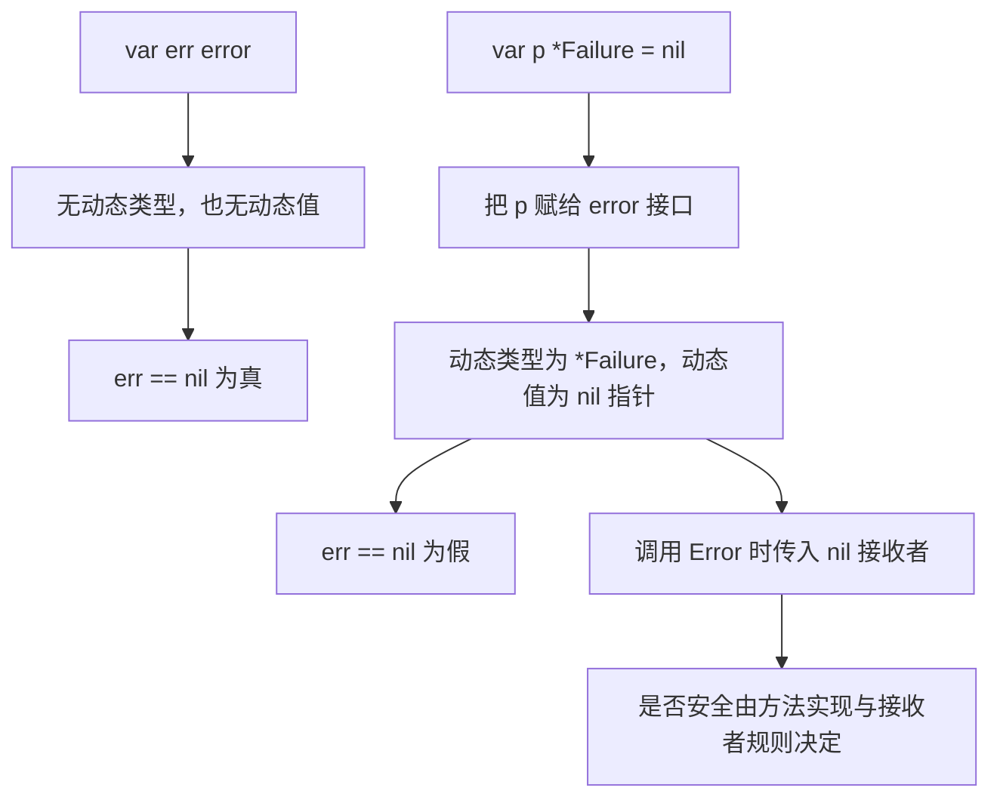

# 015 接口里的 nil 为什么不等于 nil？

> 难度：中级 · 分类：类型与内存

## 简短回答

接口值可以从语义上理解为动态类型与动态值。只有二者都不存在时，接口才等于 nil。把一个 nil 指针赋给接口后，动态类型已经存在，所以接口不等于 nil；error 返回值尤其容易踩到这个边界。

## 详细解析

### 图解：接口为空与接口装着空指针



这是动态类型和动态值的语义模型，不是要求两个字段必须按某个私有布局存储。先画出接口中有没有动态类型，再讨论 nil，能避免被打印结果误导。

### 从错误返回开始推演

下面 fail 返回具体指针类型的 nil，再被装入 error。调用者看到 err 非 nil，是因为接口携带了 `*Failure` 这个类型，而不是因为错误对象真的分配出来了。示例的方法显式允许 nil 接收者，以便安全观察行为。

```go
package main

import "fmt"

type Failure struct{}
func (*Failure) Error() string { return "failure" }
func fail() *Failure { return nil }

func main() {
    var p *Failure = fail()
    var err error = p
    fmt.Println(p == nil, err == nil, err.Error())
}
```
```output
true false failure
```

若 Error 方法访问接收者字段，就可能因解引用 nil 而 panic。接口非 nil 不代表其中对象可用，更不代表它的方法一定能安全执行。

### 修复应在返回边界

声明返回 error 的函数，在成功分支直接 `return nil`，失败时返回具体错误。不要用一个默认 nil 的具体错误指针统一返回所有路径，再期待调用者识别这个实现细节。接口作为配置项时也有类似风险：一个装了 nil 客户端指针的接口可能通过简单的 nil 检查。

不建议在业务中到处用反射实现“万能判空”。反射自身有适用类型边界，而且什么叫空是业务语义：空字符串、空切片、缺失对象不是同一个状态。入口契约和构造函数验证通常能更早、更清楚地解决问题。

接口比较还有另一个边界：如果两个接口的动态类型相同但该类型不可比较，比较可能 panic。例如动态值是切片时，不能把接口当成通用可比较容器。nil 问题与可比较性问题要分别理解。

### 成功路径为什么会返回一个“有类型的空错误”

常见问题是函数声明返回 error，内部先声明 var result *Failure，失败时赋值，最后统一 return result。成功时 result 确实是 nil 指针，但返回动作还包含把它转换为 error 接口的步骤。转换后动态类型已确定，因此调用者进入 err != nil 分支。错误发生在返回边界，不是调用方的判断语句。

修复可以很直接：成功分支返回字面量 nil，失败分支构造并返回具体错误。若必须累计错误，也应让变量本身是 error 类型，并检查每一次赋值来源。不能仅把变量名改为 err，就假设它的静态类型已经改变。

| 表达式或动作 | 判断结果 | 理由 |
| --- | --- | --- |
| nil 的 *Failure 与 nil 比较 | 相等 | 具体指针值为空 |
| error 中装入上述指针，再与 nil 比较 | 不相等 | 接口有动态类型 |
| 两个 error 都装入 nil 的 *Failure | 相等 | 动态类型相同，指针值也相等 |
| error 成功分支直接 return nil | 调用者可得到 nil 接口 | 没有引入具体动态类型 |

这张表同时说明“接口非 nil”不能简化为“对象已分配”。没有分配任何 Failure 实例，也能得到非 nil 的 error 接口。

### nil 接收者的合法行为与危险行为

示例 Error 方法只返回固定字符串，没有解引用接收者，所以可以处理 nil 指针。实际方法如果读取 p.Message，就会访问 nil 指针目标。一个类型有意支持 nil 接收者时，应在方法内部把这种状态定义清楚，不能要求调用方猜测。

另一种边界是值接收者方法经由 nil 指针调用，调用过程可能需要取得指针指向的值，因而在进入方法体前就失败。可见“Go 允许 nil 接收者”不是所有方法调用的通行证，仍要结合方法集、接收者形式与具体执行路径判断。

### 接口依赖的构造比万能判空更可靠

如果服务接收 Repository 接口，传入一个 nil 的 *SQLRepo 后，repo == nil 检查会通过不了你想检查的语义：它会认为接口存在。与其在每个调用点反射判空，不如让构造 SQLRepo 的函数在失败时返回明确错误，入口只在构造成功后装配服务，并避免直接把未初始化指针塞入接口。

反射的 IsNil 只适用于特定种类，遇到普通整数或结构体不能随意调用。泛化的“空值判定”还会混淆缺失、零数值、空集合和已关闭对象。对已关闭的非 nil 客户端，任何 nil 检查都无法证明它可用，真正需要的是生命周期契约。

### 最小回归验证要覆盖什么

成功路径直接断言 err == nil；失败路径用 errors.Is 或 errors.As 检查稳定身份或类型；如果类型明确支持 nil 接收者，再单独验证其约定。只打印 err 或检查 Error 文本，无法证明成功路径返回的是 nil 接口。

还应把接口与 nil 的比较同接口间比较分开：接口与 nil 比较可以用于判空，而两个装有同一不可比较动态类型的接口相互比较可能 panic。不能从前者安全推出后者安全，参见 [014](014-maps.md)中的键约束。

## 常见误区 / 面试追问

- **接口的“两部分”是固定内存布局吗？** 这里是解释语义的模型，不应据此编写依赖私有布局的 unsafe 代码。
- **nil 指针能调用方法吗？** 可以发生方法调用，是否安全取决于接收者类型、方法集与方法实现，不等于自动安全。
- **如何防止回归？** 为成功返回路径检查 `err == nil`，为失败路径检查错误类型或身份，不只打印错误字符串。

## 参考资料

- [Go FAQ：nil error 为何不等于 nil](https://go.dev/doc/faq#nil_error)
- [Go 规范：比较运算](https://go.dev/ref/spec#Comparison_operators)

[返回目录](../README.md) · [上一题](014-maps.md) · [下一题](016-method-sets.md)
