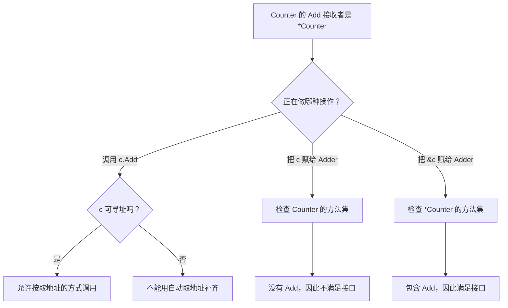

# 016 值接收者与指针接收者如何影响方法集？

> 难度：中级 · 分类：类型与内存

## 简短回答

类型 T 的方法集包含接收者为 T 的方法，指针类型 *T 的方法集还包含接收者为 *T 的方法。可寻址变量调用指针方法时，编译器可以自动取地址，但这种调用便利不会改变 T 是否实现某接口。

## 详细解析

### 图解：方法调用与接口赋值走不同规则



先辨认问题是在问一次方法调用，还是在问类型是否实现接口。这两个问题混在一起，就容易得出“能调用，所以一定能赋给接口”的错误结论。

### 调得动不等于实现了接口

计数器需要修改自身状态，因此 Add 使用指针接收者。变量 c 可寻址，`c.Add()` 可以调用；把 c 放进要求 Add 的接口却不成立，应该传 `&c`。下面通过类型断言观察两者的方法集差别。

```go
package main

import "fmt"

type Counter struct { N int }
func (c *Counter) Add() { c.N++ }
type Adder interface { Add() }

func main() {
    c := Counter{}
    c.Add()
    _, valueOK := any(c).(Adder)
    _, pointerOK := any(&c).(Adder)
    fmt.Println(c.N, valueOK, pointerOK)
}
```
```output
1 false true
```

map 中的值不可寻址，不能像普通变量一样自动取地址调用需要修改的指针方法。可以取出值、修改后写回，或在确有共享对象需求时存放指针；后者要承担 nil 与并发访问责任。

### 选择接收者看语义

需要修改对象、对象很大或含不能复制的同步状态时，指针接收者更合适。小而不可变的值可以使用值接收者。含切片或 map 的结构体即使用值接收者，也可能通过共享存储修改数据，所以“值接收者等于只读”并不成立。

同一类型的方法最好保持一致的使用预期。若部分方法按值复制锁，另一些方法通过指针加锁，会出现看似受保护、实际使用不同锁的错误。`go vet` 能发现部分锁复制，但不能代替对所有权的审查。

方法值也会捕获接收者。保存 `f := c.Method` 之后再修改变量 c，f 观察到什么取决于捕获的是值还是指针。回调、延迟执行与事件注册中，应特别关注这个时间差。

### 用方法集矩阵消除直觉歧义

假设类型 T 有值接收者方法 Read，也有指针接收者方法 Write。T 的方法集含 Read，*T 的方法集含 Read 和 Write。因此只要求 Read 的接口可由二者满足，同时要求 Read、Write 的接口只能由 *T 满足。接口赋值检查不会为了方便调用而临时创造对象地址。

| 表达式 | 是否能调用指针方法 | 关键条件 |
| --- | --- | --- |
| 普通变量 v | 通常可以 | v 可寻址，允许调用便利 |
| 切片元素 s[i] | 可以在类型满足时调用 | 切片元素可寻址 |
| map 元素 m[k] | 不能靠自动取地址调用 | map 元素不可寻址 |
| 函数返回的 T 值 | 不能靠自动取地址调用 | 返回表达式不是可寻址变量 |
| 一个 *T 值 | 按指针方法集调用 | 仍须处理 nil 与生命周期 |

这里的“可以”只说明语言允许表达该调用，不保证方法内部不会 panic，也不代表并发访问安全。接收者规则与对象状态是两个层次。

### 方法值保存了什么

```go
package main

import "fmt"

type Counter struct { N int }
func (c Counter) Value() int { return c.N }
func (c *Counter) Current() int { return c.N }

func main() {
    c := Counter{N: 1}
    snapshot := c.Value
    live := c.Current
    c.N = 9
    fmt.Println(snapshot(), live())
}
```
```output
1 9
```

snapshot 创建时保存值接收者的副本；live 保存指向 c 的接收者。因此回调稍后执行时，二者看到的状态不同。若把这个回调交给其他 goroutine，指针版本还可能与后续写入产生竞态，不能因为创建回调时没有并发就忽略执行时的共享关系。

方法表达式又是另一种形式：类型名加方法名得到的函数需要显式提供接收者，不会在创建函数值时绑定某个对象。事件注册和延迟执行代码应说明保存的是“某个对象的动作”还是“接收任意对象的函数”。

### 接收者选择从不变量开始

计数器、连接状态机等需要持续修改同一对象，指针接收者符合身份语义；时间点、坐标等小型值对象可使用值接收者。包含 Mutex 的对象如果使用值接收者，会复制同步状态，锁住的可能只是副本。包含切片的值对象则仍可能修改共享数组，所以值接收者不自动等于不可变。

一个类型的方法最好给调用者一致预期，但这不是要求所有类型都统一使用指针。真正的问题是是否复制了不该复制的状态、是否暴露共享修改，以及复制成本是否已经成为热点。单凭结构体“超过几个字段”就规定指针，没有解释对象语义。

## 常见误区 / 面试追问

- **指针接收者总能避免堆分配吗？** 不一定，逃逸由使用方式和编译器分析决定，参见 [017](017-escape-analysis.md)。
- **接口中保存的值为什么不能自动取地址？** 接口赋值检查的是方法集，不能靠调用语法便利补齐缺少的方法。
- **不可变类型为什么也可能使用指针？** 可能为了避免大对象复制，但应明确不允许修改的契约，不能靠指针本身表达不可变性。

## 参考资料

- [Go 规范：方法集](https://go.dev/ref/spec#Method_sets)
- [Go 官方接收者建议](https://go.dev/wiki/CodeReviewComments#receiver-type)

[返回目录](../README.md) · [下一题](017-escape-analysis.md)
