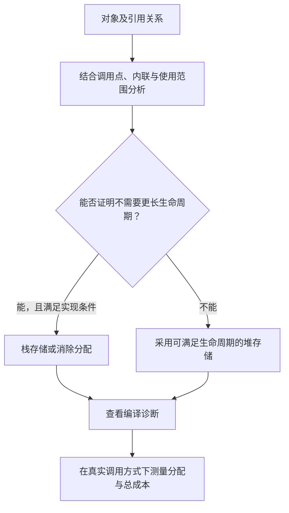

# 017 逃逸分析如何决定栈与堆分配？

> 难度：中级 · 分类：类型与内存

## 简短回答

编译器分析对象的引用与生命周期，决定能否放在栈上、是否需要堆存储，或能否消除分配。返回局部变量地址在 Go 中合法，但“用了 new 就在堆上”“没有返回指针就不会逃逸”都不是可靠规则。

## 详细解析

### 图解：编译器在证明生命周期



这是一张分析思路图，不是编译器全部决策的伪代码。对象大小、动态大小与具体优化能力也可能影响分配，不能把每个堆对象都解释成显式返回了指针。

### 生命周期比语法重要

函数返回后仍需使用的对象不能依赖已结束栈帧中的存储。不过内联可能把函数体放到调用者上下文，使原本看似逃逸的对象得到更精确分析。通过接口传递、闭包捕获、跨 goroutine 使用等，都可能改变编译器能证明的生命周期。

```go
package main

import "fmt"

type Item struct { N int }
func makeItem() *Item { return &Item{N: 7} }

func main() {
    item := makeItem()
    fmt.Println(item.N)
}
```
```output
7
```

这段代码证明返回局部对象地址可以正常使用，不证明该次构建恰好分配了多少堆对象。把代码保存为 main.go 后，用下面的命令观察当前工具链诊断，再结合基准的分配指标判断实际成本。

```sh
go build -gcflags=-m=2 main.go
```

### 如何解读诊断

先定位业务对象对应的诊断，区分“函数本体中逃逸”和“调用点内联后消除”。打印和测试框架本身可能引入接口装箱或额外分配，不能把全部输出都算在被测算法上。某个值移到堆上也不自动表示值得优化：它可能很小、频率很低。

应先确定热点，再尝试减少临时对象、避免不必要的大闭包捕获、预分配有界容器。改后检查分配量、CPU 与可读性，必要时比较多个样本。为了强行避免逃逸而返回内部缓冲区，可能破坏调用者持有数据的正确性，收益得不偿失。

逃逸策略属于编译器实现，可能随 Go 版本、架构、优化选项和代码上下文改变。面试时能够说明如何取得证据，比声称某行代码在所有版本必定分配到某处更可靠。

### 为什么 Go 可以返回局部变量地址

语言要求返回的指针仍能安全访问相应对象，存储位置由实现负责。编译器发现对象的使用可能超过当前函数调用，就必须选择足够长的生命周期；它不会像简单地返回失效栈地址那样留下悬空指针。因此“变量写在函数内部”描述的是作用域，不是固定物理存储位置。

内联又会改变可分析范围。makeItem 单独看返回地址，调用点却可能立即读取 N 并丢弃对象。内联后，编译器有机会把这段关系放在一起分析，消除不必要的对象存储。于是诊断中可能同时看到函数本体的逃逸结论和某个内联调用点的不同结果，它们不一定矛盾。

### 用一个受控实验区分生命周期

```go
package main

import (
    "fmt"
    "testing"
)

type Item struct { N int }
var retained *Item
var observed int

func main() {
    localAllocs := testing.AllocsPerRun(1000, func() {
        item := Item{N: 7}
        observed = item.N
    })
    retainedAllocs := testing.AllocsPerRun(1000, func() {
        retained = &Item{N: 7}
    })
    fmt.Println(localAllocs, retainedAllocs)
    fmt.Println(observed, retained.N)
}
```
```output
0 1
7 7
```

这是本仓库 Go 1.26.5 基线下的结果。第二个闭包把新对象指针保存到包级变量，使其可在闭包返回后使用；第一个只需要一个整数结果。测量针对两种有意不同的生命周期，不是证明“返回值版本总比指针版本快”。AllocsPerRun 关注堆分配次数，也不等于测量对象存活大小或 GC 总成本。

### 如何避免测量改变被测行为

如果为了防止优化而把原本不会逃逸的对象保存到全局变量，可能人为制造逃逸；如果为了打印地址加入 fmt 调用，也可能扩大分析边界。相反，基准中完全不使用结果，编译器又可能消除实际工作。应让测试保留与真实调用相同的结果使用方式，再解释为了观察而增加的操作。

| 证据 | 能回答什么 | 不能单独证明什么 |
| --- | --- | --- |
| 编译器 -m 诊断 | 该构建上下文中的分析结果 | 线上热点占比 |
| allocs/op、B/op | 每操作堆分配次数与字节量 | 对象长期存活规模 |
| heap profile | 分配栈与存活空间分布 | 所有调用的完整引用图 |
| CPU 与延迟测量 | 修改后的整体效果 | 某个优化在全部负载下有效 |

优化后的目标应是用更低成本完成相同契约。如果为了减少复制而让调用者保存即将复用的内部缓冲区，虽然分配数字下降，接口却变得错误。先保持所有权和生命周期正确，再比较性能，才能把逃逸分析用于工程改进而不是编译器猜谜。

## 常见误区 / 面试追问

- **栈永远比堆快吗？** 单次分配成本不是全部，堆对象的存活与 GC 成本也要看；优化要以总效果衡量。
- **闭包一定分配堆对象吗？** 不一定，要看是否逃离调用范围及编译器优化结果。
- **为什么禁止优化构建不能代表线上？** 它会改变内联与逃逸决策，应优先分析与生产相同的构建条件。

## 参考资料

- [Go 编译器命令与诊断选项](https://pkg.go.dev/cmd/compile)
- [Go 官方 FAQ：堆与栈](https://go.dev/doc/faq#stack_or_heap)

[返回目录](../README.md) · [上一题](016-method-sets.md) · [下一题](018-memory-layout.md)
