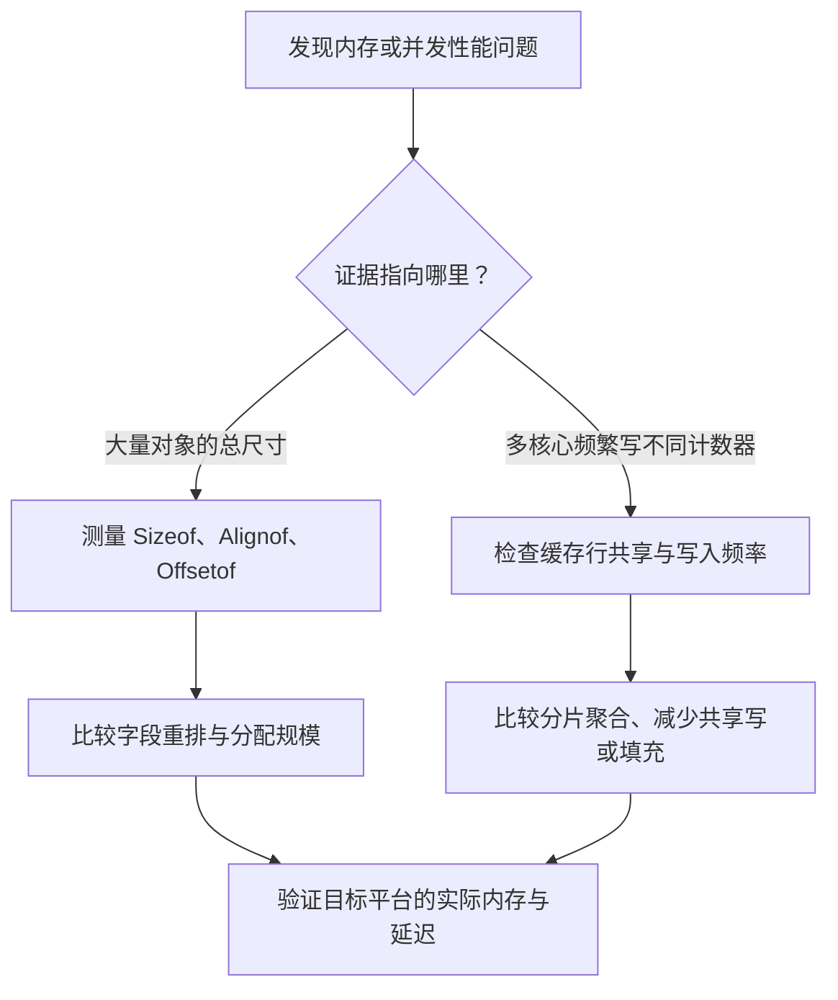

# 018 结构体布局、内存对齐与伪共享如何影响性能？

> 难度：高级 · 分类：类型与内存

## 简短回答

字段对齐可能在结构体内部和末尾插入填充，字段顺序会影响大小。伪共享则是不同线程更新不同变量，但变量落在同一缓存行上，引起缓存一致性流量。前者是布局问题，后者是并发访问与硬件共同形成的问题。

## 详细解析

### 图解：尺寸浪费与伪共享是不同问题



左侧追踪每个对象多占了多少字节，右侧追踪核心之间为什么出现额外一致性流量。结构体更紧凑与并发更新更快可能存在冲突，不能只按一个指标优化。

### 先量尺寸，再谈节省

在本仓库的 amd64 环境，下面两种结构体包含同样字段，大小不同。示例按运行架构报告是否更紧凑，不把固定字节数写成跨平台保证。

```go
package main

import (
    "fmt"
    "unsafe"
)

type A struct { X byte; Y int64; Z byte }
type B struct { Y int64; X byte; Z byte }

func main() {
    fmt.Println(unsafe.Sizeof(A{}) >= unsafe.Sizeof(B{}))
    fmt.Println(unsafe.Offsetof(B{}.Y))
}
```
```output
true
0
```

如果某结构在目标平台由 24 字节降到 16 字节，一千万个连续元素理论上少占约 80 MB 的元素存储；这只是布局计算，不包括切片头、分配粒度和引用对象。对只有几个实例的配置结构体，这种重排通常没有明显价值，反而可能损害按业务含义排列字段的可读性。

### 两把独立锁为什么仍会互相拖慢

两个核心频繁写同一缓存行上的不同计数器，不存在数据竞争，也可能因为缓存行来回转移而变慢。可考虑按工作分片聚合、降低共享写频率，必要时再做填充。盲目填充会扩大工作集，增加缓存未命中，不是免费优化。

缓存行大小与目标硬件有关，不能把某个常见值作为 Go 语言承诺。性能试验要固定线程数、CPU 配额与访问分布，并比较串行、共享更新和分片聚合版本；结果要有多次测量，而不是只贴一次耗时。

字段重排还可能影响依赖内存布局的代码或二进制协议实现。普通业务序列化应通过明确编码规则，不应直接把结构体内存当成跨平台线格式。

### 手算一次字段偏移与尾部填充

本仓库 Go 1.26.5 / windows amd64 实测：A 的大小为 24、对齐为 8，X/Y/Z 偏移分别为 0、8、16；B 的大小为 16、对齐为 8，Y/X/Z 偏移分别为 0、8、9。这些数值由 Sizeof、Alignof、Offsetof 得到，换架构应重新测量。

| 布局 | 字段占用位置 | 填充位置 | 总大小 |
| --- | --- | --- | --- |
| A | X 在 0，Y 在 8–15，Z 在 16 | 1–7 与 17–23 | 24 字节 |
| B | Y 在 0–7，X 在 8，Z 在 9 | 10–15 | 16 字节 |

A 中的 int64 需要满足该平台的对齐要求，因此不能紧接在单个 byte 之后。结构体末尾也要满足整体对齐，使数组中的下一个元素仍能正确对齐。重排减少了中间空隙，但没有消除所有尾部填充。

Sizeof 统计的是值本身占用的空间。若字段是字符串、切片或指针，它不会递归统计所引用的数据。因此一个结构体 Sizeof 很小，仍可能保留大量外部数组；应结合 [012](012-slice-retention.md)理解引用关系。用 Sizeof 直接估算完整缓存占用，会遗漏键、容器与被引用对象。

### 伪共享为何不需要存在数据竞争

设两个工作线程分别频繁更新相邻的原子计数器，每个计数器在语言层面都正确同步。如果两个值位于同一缓存行，硬件对该行的写入所有权仍可能来回转移。线程没有写同一个变量，所以这是性能干扰，不是竞态检测要报告的错误。

把计数器分开可以减轻这种干扰，却可能让每个计数器占用更多缓存空间；如果计数器数量很大、写入不频繁，填充带来的工作集扩大反而可能更糟。另一种办法是每个 worker 使用局部计数，定期汇总，从源头减少共享写入次数。选择应围绕更新频率、读取一致性和可接受的统计延迟。

### 如何设计有意义的对照实验

固定总更新次数、worker 数量、GOMAXPROCS 与目标机器，比较相邻共享计数、分离布局和局部汇总版本。单线程测试可以作为对照：如果只有多核心版本差距明显，就更值得检查共享写路径。测量仍不能仅凭一次结果断言伪共享，应结合 CPU 行为、重复样本及替代解释。

实际修改时还要检查结构体是否被外部协议、cgo 或 unsafe 代码直接依赖。字段顺序不是随意重排的许可。常规 JSON 或 Protobuf 编码应使用明确字段规则，不能用原始内存布局充当跨平台格式。

自测可以先解释 A 为什么不是 10 字节，再解释为什么 B 更小却未必在所有并发负载下更快。这两个答案分别覆盖语言布局和硬件访问，不能互相替代。

## 常见误区 / 面试追问

- **字段按从大到小排一定最优吗？** 不能保证，还受访问局部性、指针扫描、嵌入类型与平台对齐影响。
- **race 检查通过能排除伪共享吗？** 不能，race 检查关注正确性，伪共享可能完全符合同步规则。
- **如何决定值得改？** 先确认大量实例或共享写热点，再用内存与吞吐数据验证，避免只看单个 Sizeof。

## 参考资料

- [unsafe.Sizeof、Alignof、Offsetof](https://pkg.go.dev/unsafe)
- [Go 规范：大小与对齐保证](https://go.dev/ref/spec#Size_and_alignment_guarantees)

[返回目录](../README.md) · [上一题](017-escape-analysis.md) · [下一题](019-reflection.md)
