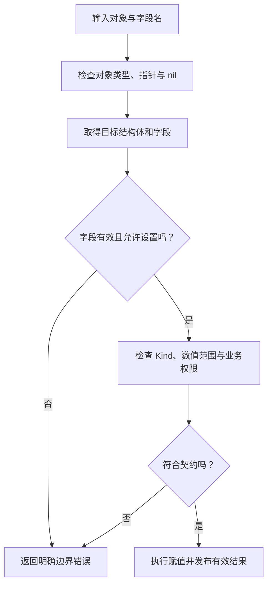

# 019 反射适合哪些边界？为什么业务热路径要谨慎？

> 难度：中级 · 分类：类型与内存

## 简短回答

反射在运行时检查类型与值，适合序列化、配置映射和通用框架边界。它把部分编译期检查推迟到运行时，也增加动态访问成本与复杂性。类型在编译时已知的业务逻辑，优先使用普通字段、接口或适度泛型。

## 详细解析

### 图解：反射写入前逐层验证



每个检查都有对应失败原因。把所有 panic 放进一个 recover 并返回成功，会让调用者无法区分字段不存在、类型不符和根本没有写入。

### 类型信息与可修改性不同

拿到字段不代表能修改它。反射修改需要值可设置，并满足可导出性和类型匹配等规则。下面通过指针取得可设置字段；如果直接反射结构体副本，不能用同样方式修改原值。

```go
package main

import (
    "fmt"
    "reflect"
)

type Config struct { Limit int }

func main() {
    c := Config{Limit: 10}
    copied := reflect.ValueOf(c).FieldByName("Limit")
    field := reflect.ValueOf(&c).Elem().FieldByName("Limit")
    fmt.Println(copied.CanSet(), field.CanSet())
    field.SetInt(20)
    fmt.Println(c.Limit)
}
```
```output
false true
20
```

通用输入处理还必须检查字段是否存在、Kind 是否匹配、数值是否溢出，再执行修改。反射包不是绕过业务校验的捷径；来自请求的字段名也不能被允许任意改写内部状态。

### 将动态工作放在边界

配置系统可以在启动时解析结构体标签、构造映射并校验类型，然后把明确的 Config 对象交给业务。若每个请求都重复扫描同一类型的所有字段，会把可复用的元数据工作放到热路径。缓存类型元数据时应考虑并发安全和类型数量上限，避免无限增长。

反射与代码生成的权衡在于何时知道结构。协议编译时确定且调用频繁，可以通过生成代码获得静态检查；插件形态需要运行时发现未知类型，则可能适合反射。不能简单说反射“一律慢”，也不能因为框架使用反射就认为业务需要跟着使用。

反射错误容易以 panic 暴露，应通过边界校验给出可理解的错误；对确实不可达的内部条件再考虑是否属于编程错误。无条件 recover 并吞掉错误，会使字段静默不生效，排查反而更困难。

### Type、Kind 和 Value 各自回答什么问题

Type 描述精确类型，包括定义类型身份；Kind 描述底层类别，例如 Struct、Ptr、Int。两个不同的定义类型可以具有相同 Kind，但这不代表业务语义相同，也不代表可以在所有位置直接赋值。Value 则承载某个运行时值及其可操作属性。

原示例反射 c 时得到结构体值的副本视图，字段不能被设置；反射 &c 再 Elem 得到对原变量的访问，导出字段可以设置。CanAddr 与 CanSet 也不是完全相同的条件：未导出字段即使有地址，也受到普通反射规则的写入限制。框架不应通过 unsafe 绕过这种封装来完成常规配置工作。

字段查找还可能得到无效 Value。例如 FieldByName 找不到名称时，应先检查 IsValid，再继续检查类型和设置能力；不能先对无效值调用任意操作。对 nil 指针先 Elem，也可能进入无效值状态。正确顺序能把运行时 panic 转化为调用者可处理的边界错误。

### 数值能读出来，不等于能安全写进去

假设配置目标字段是 int8，外部数字解析为 int64 的 300。两者都属于有符号整数，但 300 不在 int8 范围内。应在写入前使用目标值的 OverflowInt 或等价范围校验，再调用 SetInt。单纯验证 Kind 为整数会漏掉截断风险；业务范围可能比类型范围更窄，也需要单独校验。

| 检查 | 解决的问题 | 仍需继续检查 |
| --- | --- | --- |
| 字段存在 | 名称是否匹配 | 是否允许用户修改 |
| CanSet | 反射规则是否允许设置 | 类型是否合适 |
| Kind 或可赋值性 | 操作与类型是否匹配 | 数值溢出与领域语义 |
| 数值范围 | 是否可由目标类型表示 | 例如重试次数是否超过业务上限 |

### 两阶段处理减少热路径动态工作

配置或序列化框架可以先分析类型，得到字段索引、标签、转换规则与校验规则；真正处理实例时复用这些元数据。缓存只保存类型层面的计划，不能把某次请求的 reflect.Value 对象当作永久字段目标，否则可能误写旧对象或保留整个请求生命周期。

缓存本身要按实际 reflect.Type 区分，并处理并发构建。若系统允许动态创建大量不同类型，无上限缓存也可能不断增长。对于类型集合固定的服务，启动时构建往往更容易管理；对于运行时扩展边界，则要定义缓存和插件生命周期。

### 动态能力应该停在哪里

HTTP 请求若直接把用户提供的字段名交给反射 setter，就可能允许修改内部 ID、权限或结算状态。应在协议层定义允许变更的字段集合，再转换成业务操作，而不是把“能反射到字段”当成授权依据。通用机制负责读取结构，业务规则负责判断是否允许改变状态。

评估是否值得改成生成代码时，分别测量元数据构建与实例处理成本。若反射只发生在启动时，优化它对请求延迟可能没有帮助；若每个请求反复扫描相同字段，缓存计划或生成静态访问才可能带来可测收益。

## 常见误区 / 面试追问

- **可以用反射修改未导出字段吗？** 正常反射设置受限制，不应靠 unsafe 破坏封装来实现配置注入。
- **泛型可以完全替代反射吗？** 不能，泛型处理编译时受约束的类型关系，不能自动发现任意运行时字段。
- **怎样证明优化有效？** 分离元数据构建与每请求处理的基准，观察分配量和 CPU 热点。

## 参考资料

- [Go 官方：反射法则](https://go.dev/blog/laws-of-reflection)
- [reflect 文档](https://pkg.go.dev/reflect)

[返回目录](../README.md) · [上一题](018-memory-layout.md) · [下一题](020-unsafe.md)
