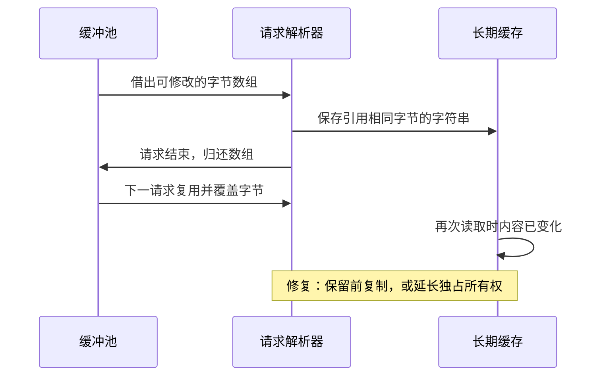

# 020 unsafe 和零拷贝转换的收益与风险是什么？

> 难度：中级 · 分类：类型与内存

## 简短回答

unsafe 允许超出普通类型安全规则的操作，某些转换可以减少复制，但调用者必须自己保证布局、范围、生命周期和不可变性。只有已测量的热点、清晰的所有权边界及可维护的版本约束，才足以支持引入它。

## 详细解析

### 图解：缓冲区复用怎样破坏零拷贝字符串



这是一个错误使用的时序，不是推荐实现。缓存和缓冲池同时认为自己拥有数据，导致不可变字符串的约定被打破；即使这些动作串行发生，也不一定会被 race detector 发现。

### 少一次复制，增加一组约束

把可复用字节缓冲区零拷贝视为字符串后，如果原字节继续被修改，就破坏了字符串使用方对不可变内容的假设。若字符串作为 map 键，后续修改甚至会破坏查找所依赖的内容稳定性。此时节省的复制成本远小于数据错误的代价。

```text
缓冲池借出 bytes → 解析得到零拷贝 string → string 放入长期缓存
           ↓
归还缓冲池 → 下一请求覆盖 bytes → 缓存中的“字符串”内容改变

修复边界：长期保留前复制，或把整个缓冲区所有权转移给接收者。
```

### uintptr 不是保活引用

uintptr 是整数，不是供 GC 追踪的对象引用。把指针地址保存成整数，隔一段时间再转回来，不能保证原对象还有效。合法转换模式需要遵循 unsafe 文档的具体规则，不能凭“当前测试没有崩溃”扩大适用范围。runtime.KeepAlive 也不是任意指针运算的合法化工具。

如果真正问题是频繁拼接，可以先使用 Builder、预分配和流式处理；如果问题是长期保留过大输入，复制小片段反而可能减少总内存。零拷贝只是局部成本描述，不等于全链路占用更小。

### 引入前的验收问题

需要说明谁拥有底层数据、何时允许复用、长度如何验证、是否跨 goroutine、是否依赖特定架构。把操作集中在很小的包边界，提供有界输入测试，并使用 vet、race 和可用的指针检查辅助验证。检查工具通过也不能替代合法性论证，因为并非所有非法使用都会在测试中触发。

unsafe 包明确提示其代码可能不可移植，也不受普通 Go 1 兼容性承诺完全保护。课程因此不给出可直接误用的字符串修改技巧；理解约束与选择安全替代方案，就是这道设计题的重点。

### 零拷贝交换的是哪几项责任

普通转换为调用者提供明确的值语义，而零拷贝视图把源存储的生命周期传递给使用者。要证明正确，至少要说明引用范围完全落在有效对象内、长度没有越界、对象在最后一次使用前不会失效，以及字符串所引用的字节不会被修改。

unsafe.String 的文档明确要求，只要返回的字符串仍存在，相应字节就不能被修改。持有字符串的对象可能被复制到 map、日志队列或后台任务中，因此“当前函数返回后我不再用它”不是足够的生命周期证明。需要分析所有持有者，而不是只看创建视图的那一行。

| 约束 | 容易遗漏的路径 | 应有的处理 |
| --- | --- | --- |
| 不可变性 | 原 []byte 别名仍可写 | 明确只读阶段与禁止复用规则 |
| 生命周期 | 异步回调晚于池归还 | 复制所需数据或转移所有权 |
| 范围 | 外部长度直接用于视图 | 先验证有效存储范围 |
| 可移植性 | 依赖私有头部或固定对齐 | 遵守文档模式并限定目标环境 |

### 一个合法但不一定值得采用的例子

```go
package main

import (
    "fmt"
    "unsafe"
)

func main() {
    data := []byte{'G', 'o'}
    view := unsafe.String(unsafe.SliceData(data), len(data))
    // view 存在期间不修改 data，也不把数组交回可复用池。
    fmt.Println(view)
}
```
```output
Go
```

这段程序展示 API 的受限使用：数组范围明确，没有并发写入或复用。它并没有证明比 string(data) 更快，也不能据此把视图返回到任意调用方。真实热点中还要用相同数据量和持有时长比较分配、CPU 和存活内存；小字符串场景可能根本不值得引入额外契约。

### uintptr 为什么不能代替指针

GC 不会把一个普通整数当作对象引用维护。把地址长期存入 uintptr，再在另一个语句或以后某时转回指针，超出了许多合法转换模式的前提；即使数字看起来没变，也不能证明对象仍存在或地址仍有效。需要地址运算时只能遵循 unsafe 文档明确允许的模式，不应自己构造 reflect.StringHeader 或 SliceHeader 作为通用转换器。

KeepAlive 的作用也很具体：在其语义允许的范围内延长对象的可达性判断，不能让越界访问、任意整数转指针或对字符串字节的非法修改变得正确。“加一个 KeepAlive 就安全”与“测试没崩溃就安全”都缺少完整论证。

### 验证应包含失效路径，而非只测正常输出

可用的辅助检查包括 go vet、竞态检测，以及通过编译选项启用的指针检查；它们分别覆盖部分静态模式、实际执行的共享访问和部分指针约束。仍要人工审查缓冲池归还、异步持有、空输入、长度边界与架构假设。检查通过只能说明覆盖路径中未发现相应问题。

如果最终决定不用 unsafe，也应能解释替代方式为何满足性能目标，例如先切小片段再复制、减少中间拼接或流式处理。设计能力体现在给出有证据的成本与约束，而不是展示最多的指针技巧。

## 常见误区 / 面试追问

- **标准库用了 unsafe，业务就可以照搬吗？** 标准库有特定内部约束与测试，调用者通常没有同样的所有权和版本控制条件。
- **普通转换一定发生堆分配吗？** 不一定，编译器可能优化特定用法，先看实际分配证据。
- **什么时候值得使用？** 例如受控的底层互操作，且安全接口无法满足已验证的约束；应记录原因与验证边界。

## 参考资料

- [unsafe 指针转换规则](https://pkg.go.dev/unsafe#Pointer)
- [runtime.KeepAlive](https://pkg.go.dev/runtime#KeepAlive)

[返回目录](../README.md) · [上一题](019-reflection.md) · [下一模块](../03-concurrency/021-concurrency.md)
