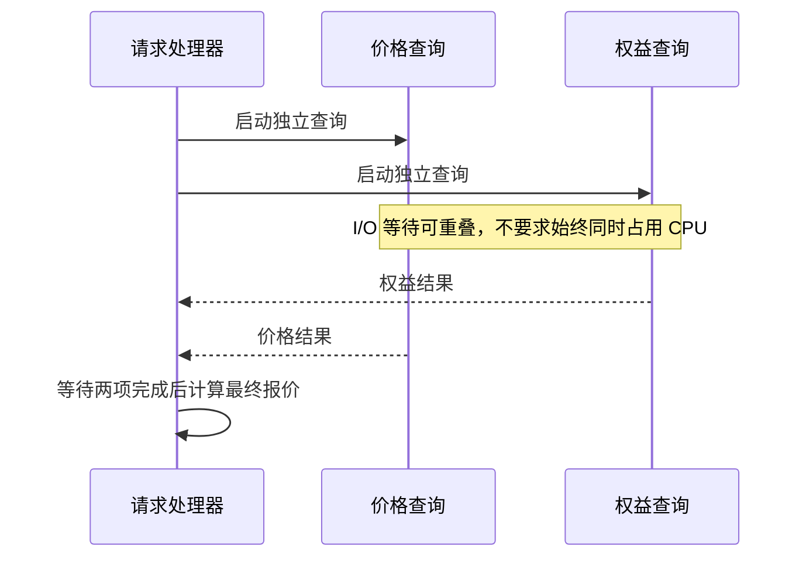

# 021 并发与并行有什么区别？goroutine 为什么不是线程？

> 难度：基础 · 分类：并发编程

## 简短回答

并发是同时组织多项进行中的工作，并行是同一时刻实际执行多项工作。goroutine 由 Go 运行时调度到操作系统线程上，启动成本较低但不为零；创建更多 goroutine 不等于获得更多 CPU 或下游容量。

## 详细解析

### 图解：等待可以重叠，依赖不能跳过



图中响应顺序只是一种可能，结果不能依赖哪个任务先结束。最后的计算需要两份输入，因此它必须等待，而不是再开一个 goroutine 就能提前完成。

### 一个核心也能并发

一个请求等待数据库时，另一个请求可以执行计算，即使只有一个可执行 Go 代码的处理资源，多个请求仍可交错推进。若两项工作都是计算密集型，想缩短总时间需要实际并行资源，还要扣除调度、同步和缓存失效成本。

```go
package main

import (
    "fmt"
    "sync"
)

func main() {
    values := make([]int, 3)
    var wg sync.WaitGroup
    for i := range values {
        wg.Add(1)
        go func(index int) {
            defer wg.Done()
            values[index] = (index + 1) * 2
        }(i)
    }
    wg.Wait()
    fmt.Println(values)
}
```
```output
[2 4 6]
```

例子将每个结果位置交给一个任务，并在读取前等待完成，所以输出不依赖任务执行顺序。它演示正确的生命周期，不声称三次乘法值得并发；对如此小的计算，启动任务的成本很可能更高。

### goroutine 仍然消耗资源

每个任务会占用栈、调度元数据及其引用的对象。阻塞 goroutine 虽不持续占用 CPU，却可能持有请求体、连接或业务对象。百万个等待任务可能把内存耗尽，因此需要并发上限、队列上限和取消路径。

不要在每次循环中无限启动调用下游的任务，再依赖下游连接池阻塞来“限流”。此时压力只是移动到本进程的等待队列。更清晰的方式是在任务准入前施加限制，并明确满载时等待多久或如何拒绝。

判断是否并发化时先画依赖图：彼此独立的步骤才能并发；需要前一步结果的操作强行并发只会引入等待和复杂性。之后用相同负载测总耗时、P99、分配和依赖请求数。

### 用延迟分解判断并发是否有价值

假设读取价格平均需要 40 ms、读取权益需要 60 ms，且两者独立。串行链路的这部分耗时约为 100 ms；理想并发情况下接近较慢的一项，即 60 ms，再加调度、同步及排队成本。这里是示意计算，不是保证 P99 等于两个 P99 的最大值，尾部相关性和共享依赖会改变实际分布。

如果权益查询必须先使用价格服务返回的商品分组，二者就有数据依赖。此时可优化的是接口聚合、缓存或协议设计，不能直接把串行代码分成两个 goroutine。先画依赖图，可以避免把没有并行空间的工作复杂化。

### goroutine 与线程有哪些不同责任

操作系统调度线程，Go 运行时把 goroutine 的执行安排在线程上。某个 goroutine 因通道或网络等待而暂不能继续时，运行时可以让其他就绪任务执行；遇到阻塞系统调用等情况，线程与调度资源的关系还会进一步变化。具体机制见 [031](../04-runtime-performance/031-scheduler.md)。

这并不意味着 goroutine 的栈和保存的业务数据可以忽略。若一万个任务各持有 64 KiB 请求数据，仅这些数据就约为 625 MiB，还没计算栈、结果和运行时开销。即使 CPU 使用率低，服务也可能因为等待任务过多而耗尽内存。

### 三个上限要分别设置

| 上限 | 限制的对象 | 缺失时的后果 |
| --- | --- | --- |
| 执行并发 | 同时进行的昂贵操作 | 下游连接、CPU 或配额被打满 |
| 排队数量 | 已接收但未开始的任务 | 内存与等待时间无界增长 |
| 单任务期限 | 排队与执行允许占用的时间 | 过期工作持续消耗资源 |

只限制工作线程数量，却让生产者不断往无限队列添加任务，不能称为完成了资源控制。只有队列满载时的等待、拒绝或降级行为也被定义，系统才有明确过载边界。

### 返回前等待到底证明了什么

原示例在启动任务前完成 Add，在每个任务退出时 Done，主流程 Wait 后读取结果。每个位置只有一个写入者，读取发生在所有任务完成之后，因此无需为每个独立元素再加锁。若改成多个任务共同 append 同一切片，就会共享切片头，原证明失效。

等待还限定生命周期：调用者看到返回值时，不再有本次任务继续修改结果。真正的 I/O 版本还必须把取消传递到依赖，避免调用者已不需要结果而 worker 永远不退出。并发代码的正确性应同时回答谁拥有数据、谁等待任务、谁取消工作三件事。

## 常见误区 / 面试追问

- **主函数会自动等待所有 goroutine 吗？** 不会，主函数返回会结束程序，需要明确等待。
- **GOMAXPROCS 是 goroutine 上限吗？** 不是，它约束可同时执行用户 Go 代码的调度资源，不直接限制任务总数。
- **并发越多吞吐越高吗？** 只有瓶颈允许时才可能提高，越过饱和点会增加排队与尾延迟。参见 [039](../04-runtime-performance/039-capacity.md)。

## 参考资料

- [Go 官方：并发不等于并行](https://go.dev/blog/waza-talk)
- [runtime.GOMAXPROCS](https://pkg.go.dev/runtime#GOMAXPROCS)

[返回目录](../README.md) · [下一题](022-channels.md)
