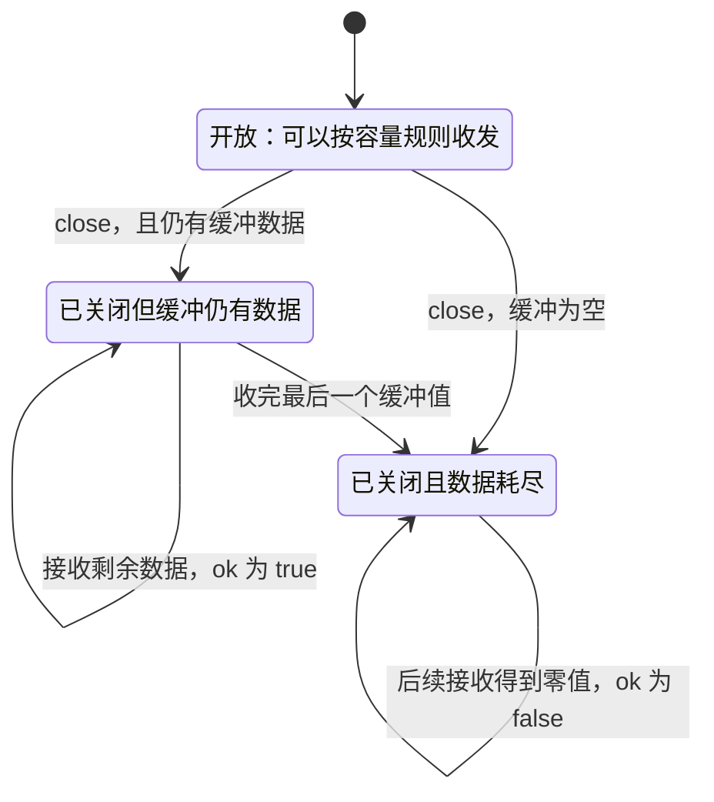

# 022 channel 的发送、接收和关闭由谁负责？

> 难度：基础 · 分类：并发编程

## 简短回答

channel 用来传递值并建立同步关系。关闭表示以后不会再发送，不表示“立即清空”；通常由掌握全部发送者生命周期的一方关闭。接收方不应因为自己不想继续接收，就擅自关闭仍可能有发送者使用的通道。

## 详细解析

### 图解：关闭是一次协议状态转换



发送到已关闭通道会 panic，不属于正常状态转换。nil channel 是未指向通道对象的值，也不等于图中的 Closed；它的发送和接收会阻塞。

### 关闭与读完是两件事

缓冲区中的值在关闭后仍可接收，读空后接收立即返回零值和 false。向已关闭通道发送、重复关闭都会 panic；关闭 nil 通道也会 panic。nil 通道的收发阻塞，可用于禁用某个 select 分支，但必须有明确设计意图。

```go
package main

import "fmt"

func main() {
    ch := make(chan int, 1)
    ch <- 7
    close(ch)
    first, ok1 := <-ch
    second, ok2 := <-ch
    fmt.Println(first, ok1, second, ok2)
}
```
```output
7 true 0 false
```

只读返回值而忽略 ok，会把“通道已结束”误解为又收到一个合法零值。对消费直到完成的场景，range 可以直接表达读到关闭且耗尽后结束。

### 多发送者怎样关闭

如果多个 worker 向同一个结果通道发送，让每个 worker 都 defer close 会产生冲突。应由协调者等待所有 worker 结束，再关闭结果通道。接收者提前退出时，发送路径还必须能观察取消信号，否则 worker 会一直堵在发送操作上，协调者永远等不到它们结束。

通道容量表达允许积压的数量，并不是正确性补丁。把容量从零改成一万可能暂时掩盖发送阻塞，却增加内存、排队时间和故障恢复成本。容量应来自允许排队的时间、任务大小及吞吐预算。

不需要通知接收结束、且所有参与者都已离开的通道，不必为回收而专门 close；GC 根据可达性管理对象。close 是协议事件，不是类似文件 Close 的资源释放义务。

### 把所有权拆成发送权、关闭权和取消权

发送者有权提交数据，但多个发送者未必都能判断其他人是否已经结束。关闭者必须知道以后不会再出现发送；接收者决定不再消费时，应通知取消，而不是直接关闭别人正在发送的通道。三种权力可能由不同组件承担。

例如十个 worker 共享 results：协调者启动全部 worker，等待它们完成，最后关闭 results；消费者 range 直到耗尽。如果消费者因错误提前返回，还应触发取消，让 worker 的发送 select 有机会退出。否则协调者会卡在等待 worker，results 永远不会关闭，形成生命周期互相等待。

| 场景 | 谁负责 close | 为什么 |
| --- | --- | --- |
| 单生产者的数据流 | 生产者 | 它知道最后一次发送何时完成 |
| 多 worker 的结果流 | 等待全部 worker 的协调者 | 单个 worker 无权代表其他发送者 |
| 广播完成信号 | 完成状态的唯一拥有者 | close 用于让多个等待者同时观察结束 |
| 不再需要的局部通道 | 未必需要关闭 | 无参与者等待结束时，关闭不是回收条件 |

### 缓冲改变等待位置，不改变数据所有权

无缓冲发送需要与接收配对，缓冲发送在仍有空位时可以先完成。但如果传的是切片或指针，传递的值仍可能引用共享对象。发送后立即复用字节数组，接收者即使成功收到切片，也可能读到后来覆盖的数据。可以复制，或约定接收者处理完后归还所有权；通道不会自动深复制。

容量也影响资源预算。若队列容纳一千个、每个任务保留 1 MiB 数据，仅排队就可能接近 1 GiB。增加容量会延迟背压到达上游，不会提高慢下游的处理能力。应根据允许排队的时间、吞吐和任务大小选容量，并监控队列长度与拒绝次数。

### 关闭通知提供什么同步保证

先写入结果，再关闭完成通道，等待者接收到因关闭而返回的结果后，能够按内存模型的同步关系读取此前写入的结果。这与让等待者 Sleep 一段时间不同，后者没有建立完成关系。但如果写入发生在 close 之后，或完成后还有其他任务继续写，原来的同步论证就不成立。

同样，接收到了一个值不代表发送者后续所有工作都结束了。若业务需要“任务已经释放全部资源”，完成信号应在清理完成之后发出，或者提供单独的等待接口。数据流结束、业务成功和资源释放是不同事件，必要时分别建模。

### 如何在评审时找到关闭错误

从每个 close 反向追踪：它如何知道所有发送者都停了？再从每个发送点追踪：接收者离开后它如何退出？如果回答依赖“这两个 goroutine 应该差不多同时结束”，说明缺少协议。加容量或套 sync.Once 只能改变部分症状，不能代替这两条生命周期证明。

## 常见误区 / 面试追问

- **先判断通道没关闭再发送就安全吗？** 判断和发送间仍可发生关闭，正确性应来自所有权协议。
- **用 sync.Once 包住 close 就解决了吗？** 只避免重复关闭，不能阻止其他 goroutine 在关闭后发送。
- **什么时候用单向 channel？** 在函数边界声明只读或只写能力，帮助编译器限制误用，但仍需明确关闭责任。

## 参考资料

- [Go 规范：channel](https://go.dev/ref/spec#Channel_types)
- [Go 规范：close](https://go.dev/ref/spec#Close)

[返回目录](../README.md) · [上一题](021-concurrency.md) · [下一题](023-select.md)
