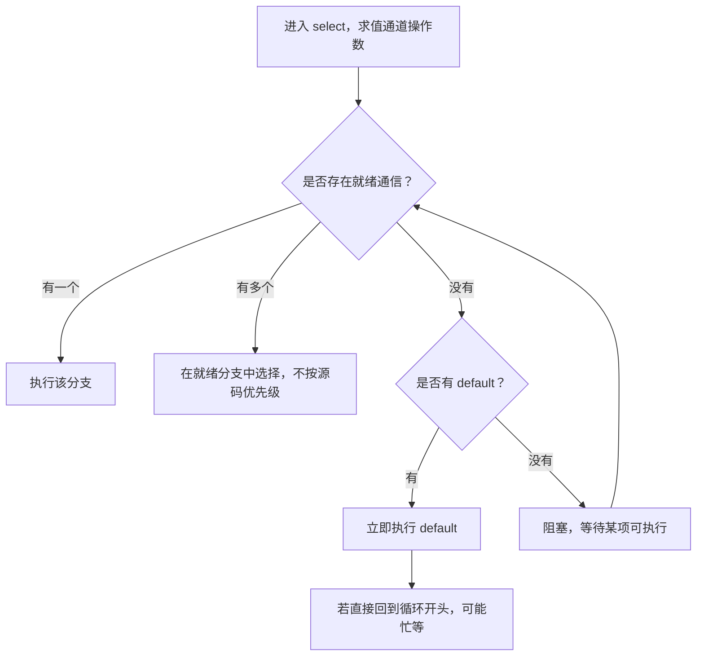

# 023 select 如何实现取消？为什么 default 可能造成忙等？

> 难度：中级 · 分类：并发编程

## 简短回答

select 等待多个通道操作中可执行的一个；有多个就绪分支时，不保证按源码顺序或优先取消。没有就绪分支且存在 default 时会立即执行它，因此把 select 加 default 放进无限循环可能持续占用 CPU。

## 详细解析

### 图解：select 的选择条件



图中 default 只在没有通信就绪时生效。取消是普通就绪条件之一，把它写在最上面不构成优先级协议。

### 取消是一个可等待事件

下面用已取消的 context 和没有接收者的无缓冲通道，确定性验证发送可以被取消打断。这里没有依赖 Sleep 来猜测调度顺序。

```go
package main

import (
    "context"
    "fmt"
)

func send(ctx context.Context, out chan<- int, n int) error {
    select {
    case out <- n:
        return nil
    case <-ctx.Done():
        return ctx.Err()
    }
}

func main() {
    ctx, cancel := context.WithCancel(context.Background())
    cancel()
    fmt.Println(send(ctx, make(chan int), 1))
}
```
```output
context canceled
```

如果 out 同时可发送，发送和取消都已就绪，select 可能选择发送。因此这段代码保证等待可以终止，不保证取消后绝对不再产生一次发送。若业务要求“撤销成功后绝不能提交”，需要围绕提交点设计状态同步或事务，单靠 context 不够。

### default 的合理用途

default 可以表达立即拒绝、尝试投递或丢弃非关键遥测，但要明确丢弃策略和指标。它不适合拿来轮询“有没有新消息”，否则没有消息时循环仍不断执行。应该阻塞等待事件，或使用有界定时器驱动周期任务。

当某个输入通道已关闭时，它的接收会持续就绪。多路合并若不处理 ok，就可能不断读零值并饿死其他业务。可在确认关闭后把该通道变量置为 nil，使其分支不再就绪，并在全部输入结束时退出。

超时也是生命周期问题：不要为无界循环的每轮创建长寿命 timer 后直接丢弃；优先复用明确管理的 timer，或者使用一次请求的 context deadline。具体 timer 的 Stop、Reset 语义应核对所用 Go 版本。

### 非选中分支也可能已经求值

进入 select 时，各接收操作的通道表达式，以及发送操作的通道和发送值表达式，会按语言规定先求值。假设写出 case out <- expensiveBuild()，即使最终选中了取消分支，构建发送值的工作也可能已经发生。若 expensiveBuild 包含 I/O 或副作用，select 不能替你把它变成可撤销操作。

因此昂贵计算应有自己的预算与取消检查，发送阶段再等待通信；或调整协议，让消费者拉取任务后才执行。不能仅在外面套一个 select，就声称整个函数都能及时取消。通道准备过程、case 里的业务处理和下一轮循环之间，都需要明确边界。

### 关闭输入后为什么会一直收到零

已关闭且耗尽的通道接收立即返回零值和 false，因此它会持续成为就绪分支。多路合并时，如果丢弃 ok 并继续循环，可能反复处理合法外观的零值。正确流程是读到 ok 为 false 后把该局部通道变量设为 nil，禁用该分支，并在全部输入都结束时退出。

把变量设为 nil 只影响当前 goroutine 持有的通道引用，不会关闭或改变别人手中的通道。若全部分支都变为 nil 且没有其他可执行分支，select 会永远等待，所以“禁用输入”还必须配合循环结束条件。

### default 应表达明确业务策略

| 场景 | default 的含义 | 必须补齐的契约 |
| --- | --- | --- |
| 有界任务队列已满 | 立即拒绝提交 | 调用者如何收到过载错误 |
| 可丢弃的遥测事件 | 当前无法投递就丢弃 | 丢弃计数与可接受损失 |
| 不阻塞的状态探测 | 本次没有事件 | 调用频率由谁控制 |
| 无限循环中等待工作 | 容易形成忙等 | 应改为阻塞或受控定时事件 |

给忙等加 Sleep 能降低 CPU，却又引入轮询延迟与固定时间参数。若需求本来就是等事件，直接阻塞在通道或定时器上通常更符合契约。

### 取消优先级的两层含义

在进入 select 前先检查 ctx.Err，可以快速拒绝已经取消的工作，但检查完成后仍可能立即发生取消。因此它只能缩小窗口，不能实现“取消完成后绝无一次提交”。需要强顺序保证时，应让取消和提交通过同一状态机、锁或存储条件更新竞争一个明确的提交点。

测试也要区分这两层。验证可取消等待时，可以构造无法完成的无缓冲发送，再关闭取消信号并等待函数退出；验证提交顺序时，则要用可控状态机断言提交与取消的关系。不能用一次输出 context canceled 就推断所有竞态窗口都已消失。

## 常见误区 / 面试追问

- **把取消分支放第一行能获得优先级吗？** 不能，源码顺序不提供这种保证。
- **用 default 就是非阻塞高性能吗？** 非阻塞描述等待行为，不代表 CPU 利用合理。
- **如何测试取消？** 构造受控阻塞点，触发取消并等待退出信号；不要仅靠固定 sleep 观察进程结束。

## 参考资料

- [Go 规范：select](https://go.dev/ref/spec#Select_statements)
- [context 文档](https://pkg.go.dev/context)

[返回目录](../README.md) · [上一题](022-channels.md) · [下一题](024-mutex.md)
