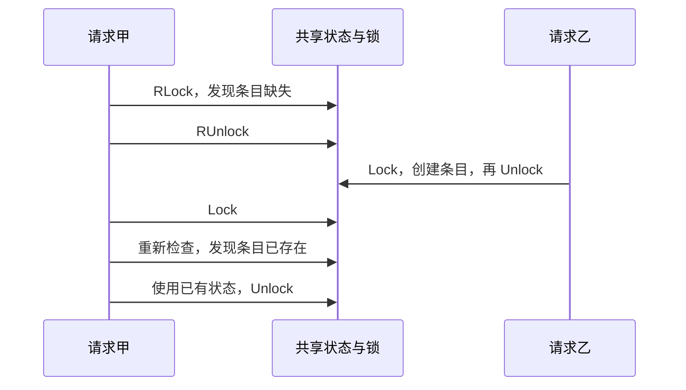

# 024 Mutex 和 RWMutex 如何选？为什么不能复制锁？

> 难度：基础 · 分类：并发编程

## 简短回答

Mutex 保护互斥访问，RWMutex 允许多个读者同时进入但写者独占。只有实际读操作足够多且临界区值得并行时，读写锁才可能有收益。锁在首次使用后不能复制；复制会破坏同一份数据由同一个同步对象保护的前提。

## 详细解析

### 图解：释放读锁后必须重新检查



从读锁到写锁之间存在空窗，图中乙就在此时改变了条件。释放后重加锁不保留之前的判断，也不是原子升级。

### 锁保护的是不变量

缓存中的 map 与过期时间若必须一起更新，应置于同一临界区。只分别保护字段读写，也可能让调用者看见新值配旧过期时间。设计锁时先写清哪些状态必须共同成立，再决定锁的范围。

```go
package main

import (
    "fmt"
    "sync"
)

type Counter struct { mu sync.Mutex; n int }
func (c *Counter) Add() { c.mu.Lock(); defer c.mu.Unlock(); c.n++ }
func (c *Counter) Value() int { c.mu.Lock(); defer c.mu.Unlock(); return c.n }

func main() {
    var c Counter
    var wg sync.WaitGroup
    for i := 0; i < 100; i++ {
        wg.Add(1)
        go func() { defer wg.Done(); c.Add() }()
    }
    wg.Wait()
    fmt.Println(c.Value())
}
```
```output
100
```

方法使用指针接收者，避免复制锁与计数状态。若结构体中保存 map，复制结构体更危险：可能复制出两把锁，却仍共享同一个 map 的底层存储。

### 读锁不是随意升级的锁

RLock 内不能在未释放读锁的情况下直接 Lock 来升级；这会破坏预期并可能死锁。若先释放再加写锁，中间状态可能已变化，必须重新检查条件。对多把锁需要统一获取顺序，并避免持锁执行网络 I/O 或调用未知回调。

RWMutex 自身有计数和同步开销，写请求还会影响读者推进。对很短的 map 查询，即使读多写少，也可能没有优于 Mutex；应在接近真实访问比例、CPU 数和键分布的基准下选择。

返回受保护数据的指针或切片可能让调用者在锁外继续修改它。解决方式是返回快照、不可变对象或提供在锁内完成的操作，而不是只在 getter 里加锁就宣布线程安全。

### 先写出要保护的不变量

假设缓存项包含 value、expiresAt 和 generation。读取者必须看到属于同一代的数据与过期时间，写入者必须一次更新这一组字段。此时锁保护的是“一个条目的完整版本”，而不是某个字段名。把三个字段分开加锁，虽然单次访问可能无数据竞争，读取结果仍可能来自不同更新。

临界区应覆盖检查条件与执行更新，例如“余额足够才扣减”。若先加锁检查、解锁后再加锁扣减，另一个请求可能在中间消费余额。缩小锁范围不能以破坏不变量为代价；应先识别真正需要原子完成的步骤，再把无关工作移出锁外。

### 复制带锁对象为什么特别隐蔽

假设对象包含 Mutex 和 map。复制对象会复制锁状态，却只复制 map 值，两个对象仍访问同一映射。于是甲持有自己的锁写入，乙持有另一把锁也写入，看起来每个方法都 Lock，实际上没有互斥。

复制不只发生在显式赋值，还可能来自值接收者、按值参数、从容器取出结构体副本等位置。应让已使用的同步对象通过指针稳定共享，并运行 go vet 的相关检查。把方法改为指针接收者能修复一类问题，但不能自动阻止其他位置复制整个对象。

### RWMutex 为什么不能凭读比例选择

读写锁允许多个读者进入，但登记读者也有同步成本。若读临界区只是一次极短查询，竞争和缓存一致性开销可能超过并行收益。若读操作会执行较长的纯计算，或者复制一个较大快照，多个读者并行才可能带来明显改善。

还要看写延迟。当写者已等待锁时，新的读锁请求会受到限制，以避免写者长期无法推进。于是“读多写少”的系统也可能在写入时出现读者排队。应同时测读吞吐、写延迟、P99、核心数和数据热点分布，而不是只用百分比下结论。

递归读锁也不能当成安全习惯：第一次 RLock 持有期间，如果写者开始等待，第二次 RLock 可能阻塞；写者又在等待第一次读锁释放，形成死锁。把公共方法拆成“负责加锁的入口”和“已在锁内调用的内部逻辑”可以明确责任，避免层层重复加锁。

### 返回值不能绕过锁的边界

getter 在锁内取出 map、切片或指针再返回，锁外调用者仍可能修改共享目标。可采用不可变快照、必要复制或提供在锁内完成的操作。若为了避免复制选择共享只读对象，就必须保证发布后没有任何写入者，并说明其生命周期。

评审时逐项追踪：锁实例是否唯一，所有冲突访问是否遵守同一规则，回调会不会重新进入，是否持锁等待外部 I/O，以及返回值是否泄漏可变状态。锁的名字和数量不能替代这些具体证明。

## 常见误区 / 面试追问

- **同一 goroutine 能重复 Lock 吗？** Mutex 不提供可重入语义，重复获取会阻塞。
- **TryLock 失败能读共享字段吗？** 失败不建立同步关系，不能因此读取未经保护的状态。
- **锁是越细越好吗？** 细锁增加顺序和生命周期复杂度，应在测得竞争后再拆分。

## 参考资料

- [sync.Mutex](https://pkg.go.dev/sync#Mutex)
- [sync.RWMutex](https://pkg.go.dev/sync#RWMutex)

[返回目录](../README.md) · [上一题](023-select.md) · [下一题](025-atomics.md)
