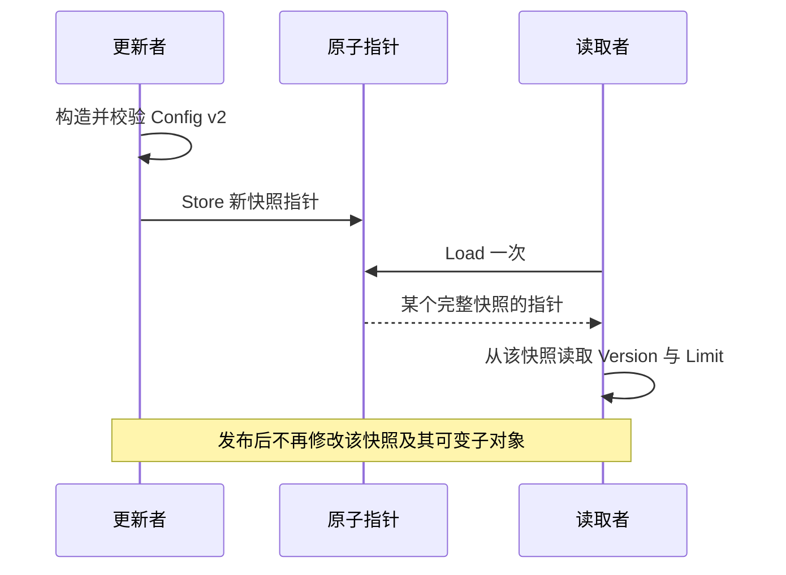

# 025 原子操作能否替代互斥锁？什么是 happens-before？

> 难度：中级 · 分类：并发编程

## 简短回答

原子操作适合独立计数、状态位或不可变快照发布，不自动保护跨字段业务约束。happens-before 描述内存操作的有序关系：通过锁、通道、原子操作等建立同步后，才能可靠解释跨 goroutine 的可见性。

## 详细解析

### 图解：先构造完整快照，再发布一个指针



读取者可能得到旧版或新版，取决于 Load 时刻，但一次业务决策应只加载一次并使用同一快照。若读取每个字段前都重新 Load，仍可能拼出跨版本结果。

### 原子读取两个字段仍可能读到混合状态

设配置包含折扣比例和版本号。分别用两个原子变量存储，读取者可能先读到新版本再读到旧比例。每个读取都原子，不代表两次读取形成一致快照。可把完整配置构造成不可变对象，再通过一个原子指针发布。

```go
package main

import (
    "fmt"
    "sync/atomic"
)

type Config struct { Version int; Limit int }

func main() {
    var current atomic.Pointer[Config]
    current.Store(&Config{Version: 1, Limit: 100})
    current.Store(&Config{Version: 2, Limit: 200})
    snapshot := current.Load()
    fmt.Println(snapshot.Version, snapshot.Limit)
}
```
```output
2 200
```

关键约束是发布后不再修改 Config。原子指针只同步指针本身的发布，不会让其指向的普通字段自动变成原子字段。如果读取者自行修改 Limit，仍可能制造竞态。

### 为什么 sleep 不能代替同步

“写入后等一秒再读取”没有建立内存模型规定的同步关系，也不证明写入任务已经完成。应使用明确完成信号或锁。race-free 程序可以依据同步关系推演结果，而有数据竞争的程序不能靠某个 CPU 上反复运行正常获得保证。

CAS 循环可以实现条件更新，但竞争激烈时可能多次失败重试，并且复杂状态机可能涉及 ABA 等问题。Go 的 GC 降低某些手工内存回收难度，不会自动消除逻辑状态反复变化的风险。没有经过证明的无锁算法，不值得为了少一把锁引入。

选择原子还是锁，应该从不变量数量和可解释性出发。一个统计计数器可能用 atomic.Int64；账户余额与流水必须一致，则更适合事务或明确临界区。

### happens-before 不是墙上时钟的先后

它来自单个 goroutine 内的操作顺序与跨 goroutine 的同步关系，再通过传递性连接起来。程序员认为“那个写入早就执行了”，或者日志时间看起来更早，都不能代替同步边。没有同步关系的普通并发读写仍可能构成数据竞争。

下面的程序先写入 message，再关闭 done；主 goroutine 等待关闭后才读取 message。关闭通道与观察到关闭的接收建立同步关系，把两边的普通操作连接起来。

```go
package main

import "fmt"

func main() {
    var message string
    done := make(chan struct{})
    go func() {
        message = "ready"
        close(done)
    }()
    <-done
    fmt.Println(message)
}
```
```output
ready
```

把等待替换成 Sleep 会破坏这份证明；把 message 的写入移到 close 之后也一样。正确性依赖操作和同步的顺序，而不是通道名字恰好叫 done。

### 多个原子操作不自动组成事务

Go 的原子操作具有文档规定的顺序一致性语义，但一次 Load 或 Store 的原子性不能扩展到一段任意业务代码。例如余额与冻结额各自使用原子整数，先检查余额再更新冻结额时，另一个 goroutine 仍可能穿插修改。若必须同时满足两个字段的约束，锁住完整操作往往更清楚。

用原子指针发布快照可以避免拆分读取，但“不修改快照”必须递归考虑其中的可变引用。Config 内若有 map，复制 Config 结构体后继续修改同一 map，旧快照也会变化。应为新版本建立独立可变数据，完成校验后发布，再把整张快照当成只读。

### CAS 循环里不能随意放副作用

CAS 比较当前值与预期值，匹配时才替换；竞争失败后调用者往往重新读取并重算。因此循环体可能执行多次。若在计算新状态时就发消息、扣费或写外部日志状态，失败重试会重复副作用，而这些动作不受 CAS 保护。

ABA 也属于语义问题：状态从 A 变为 B 再变回 A，单看当前值等于 A，无法证明中间没发生变化。是否需要版本号取决于业务是否在意这段历史。GC 管理对象回收，并不能消除“逻辑状态绕了一圈”的问题。

### 选择工具时看证明成本

| 需求 | 可优先考虑 | 仍需证明 |
| --- | --- | --- |
| 独立累计统计量 | 类型化原子计数器 | 读取精度、溢出与热点写入成本 |
| 读多写少的完整配置 | 原子发布不可变快照 | 构造完整、只加载一次、发布后不变 |
| 多字段条件更新 | Mutex 临界区 | 所有访问遵守相同锁规则 |
| 持久业务状态与外部副作用 | 存储事务与业务协议 | 幂等、提交窗口及恢复 |

“无锁”不是比“有锁”更高级的标签。只有同步语义可解释、性能收益有证据、失败路径可验证，才值得采用更复杂的原子协议。

## 常见误区 / 面试追问

- **原子一定更快吗？** 高频共享写仍会产生缓存一致性成本，批量或分片汇总可能更有效。
- **普通读配原子写安全吗？** 对同一被并发访问的位置不能混用未经同步的普通访问。
- **原子对象可以复制吗？** 类型化原子对象使用后不应复制，应通过指针共享同一实例。

## 参考资料

- [Go 内存模型](https://go.dev/ref/mem)
- [sync/atomic](https://pkg.go.dev/sync/atomic)

[返回目录](../README.md) · [上一题](024-mutex.md) · [下一题](026-context.md)
