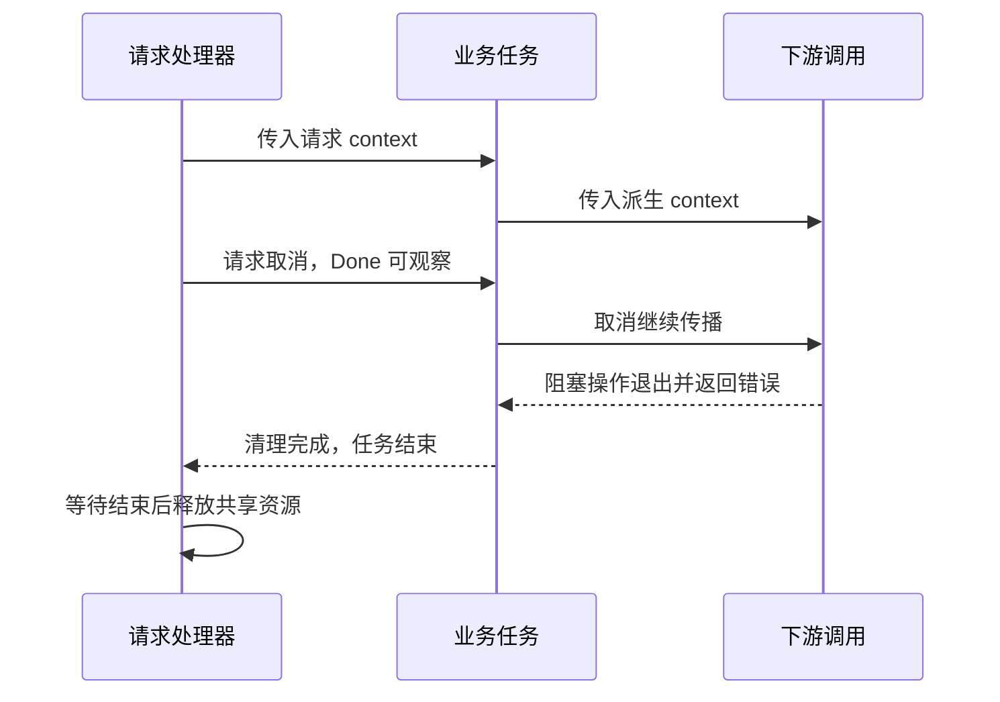

# 026 context 如何传递超时、取消和请求信息？

> 难度：基础 · 分类：并发编程

## 简短回答

context 沿调用链传递截止时间、取消信号和少量请求范围的元数据。取消是协作通知，不会强杀 goroutine，也不撤销已提交的副作用。创建子 context 的一方应及时调用 cancel，使用方要把它继续传给支持取消的阻塞操作。

## 详细解析

### 图解：取消向下传播，完成需要向上确认



取消信号和任务完成沿不同方向流动。调用 cancel 后立刻关闭任务还在使用的资源，会把“通知停止”误当成“已经停止”。

### 生命周期从请求一路向下

HTTP handler 使用请求 context，业务函数接收它，数据库查询使用 QueryContext，RPC 客户端同样继承它。若中途换成 Background，请求已离开后下游仍可能继续消耗资源。若某个操作需要更短期限，可以派生子 context，但不能把父级已到期的时间“延长”。

```go
package main

import (
    "context"
    "errors"
    "fmt"
)

func main() {
    parent, cancelParent := context.WithCancelCause(context.Background())
    child, cancelChild := context.WithCancel(parent)
    defer cancelChild()
    cancelParent(errors.New("client left"))
    <-child.Done()
    fmt.Println(child.Err())
    fmt.Println(context.Cause(child))
}
```
```output
context canceled
client left
```

Err 提供标准取消类别，Cause 可以保留更具体的原因，适合内部诊断。不要把内部原因直接作为公开错误响应，里面可能含有不适合暴露的信息。

### 信号发出后还需要收尾

cancel 返回不代表任务已经退出。发起方应等待任务组或完成通道，确保不再使用即将关闭的资源。网络操作是否立即结束还取决于库和协议；自己写的长计算循环要在合适粒度检查取消，不能只在函数入口检查一次。

context.Value 适合请求级追踪信息，不适合放数据库连接、可选业务参数或大型可变对象。用私有键类型避免冲突，核心业务参数保持显式传递，方便理解与测试。共享 context 是安全的，不代表放在 Value 里的对象就自动线程安全。

真正需要脱离请求继续执行的工作，应由应用生命周期管理或持久任务队列承接，明确上限、重试和关停规则。简单把 context 替换为 Background 并启动 goroutine，会失去请求约束，又没有建立新的任务所有者。

### 从一个请求拆出可执行的时间预算

假设请求整体预算为 800 ms，入口校验和排队已经消耗 100 ms，业务仍需查询两个依赖并编码响应。给每个后续调用都重新设置 800 ms 并不能恢复已经花掉的时间；派生 context 的有效截止时间不会晚于父 context。

串行依赖要预留后续处理时间，并行依赖也共享整体期限。若某项依赖允许的最长等待只有 200 ms，可以在调用前派生更短的子期限，调用结束后及时 cancel。循环中逐项调用时，应在每项作用域结束就释放相应取消资源，而不是把所有 defer 留到长函数退出。

### 确定性验证运行中的任务响应取消

```go
package main

import (
    "context"
    "fmt"
)

func main() {
    ctx, cancel := context.WithCancel(context.Background())
    defer cancel()
    entered := make(chan struct{})
    done := make(chan error, 1)
    go func() {
        close(entered)
        <-ctx.Done()
        done <- ctx.Err()
    }()
    <-entered
    cancel()
    fmt.Println(<-done)
}
```
```output
context canceled
```

entered 证明任务已经开始，done 证明任务已经按自己的逻辑结束。示例没有依赖 Sleep 猜调度时机，也没有把 cancel 的返回当成完成信号。真实测试还应设置等待上限，避免被测代码退化后整个测试一直挂住；该上限用于发现失败，不用于决定任务何时执行。

### context 不能撤回什么

数据库提交、消息发布或外部扣款可能在超时被观察到之前已经完成。取消只代表调用者不愿继续等待或剩余期限耗尽，不是远程系统的回滚指令。遇到结果不确定，应使用稳定请求身份查询状态，不能默认失败后换一个新身份重试。

对不支持 context 的阻塞库，外层再开 goroutine 并在超时后提前返回，只让等待者离开，内部工作仍在执行。应使用库提供的底层期限、可关闭资源或可取消 API；如果无法做到，就必须把仍在运行的任务计入资源预算和关闭流程。

### 值传递与请求生命周期的边界

追踪 ID、请求来源等少量元数据适合随 context 传播；商品数量、权限决策输入等核心参数应保持显式。把大对象或可变 map 放入 Value 会延长它们的生命周期，并可能让多个 goroutine 共享修改。context 的并发使用保证不会自动扩展到这些对象。

需要在响应后继续执行的邮件或审计任务，应明确交给应用管理的任务系统，或先可靠写入持久队列。交接成功的条件是什么、进程退出如何处理、失败如何重试，都应由新所有者定义。简单脱离请求取消链路，并没有完成生命周期交接。

## 常见误区 / 面试追问

- **超时是否保证没有扣款？** 不保证，请求可能已在下游提交，需通过幂等键与状态查询确认结果。
- **只要 defer cancel 就够了吗？** 它只负责取消和相关资源释放，仍需要下游响应取消并等待任务结束。
- **是否把 context 存到长期结构体里？** 通常随操作显式传入，避免混淆不同请求的生命周期。

## 参考资料

- [context 标准库](https://pkg.go.dev/context)
- [Go 官方：Contexts and structs](https://go.dev/blog/context-and-structs)

[返回目录](../README.md) · [下一题](027-task-groups.md)
