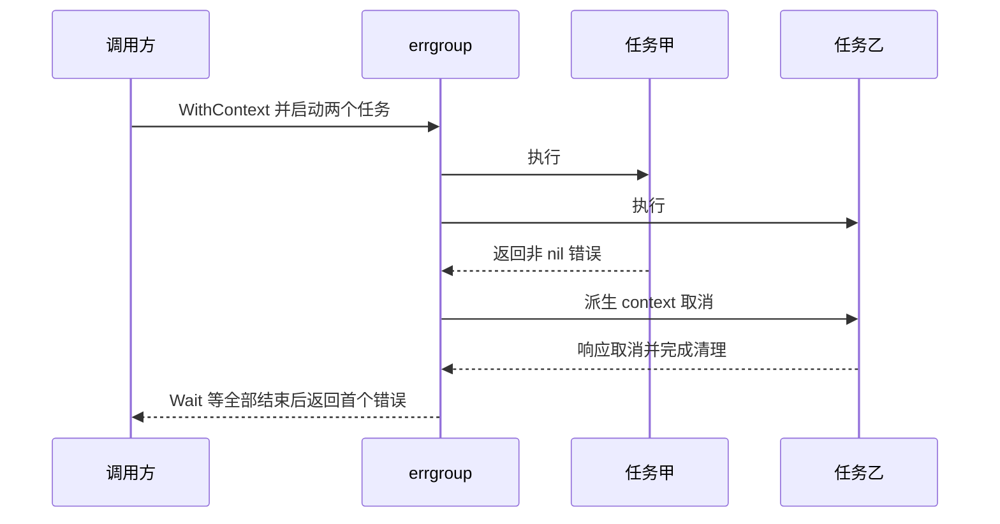

# 027 WaitGroup 与 errgroup 如何管理一组并发任务？

> 难度：中级 · 分类：并发编程

## 简短回答

WaitGroup 负责等待任务完成，不自动传递错误或取消其他任务。errgroup 可以聚合首个非 nil 错误，并在使用 WithContext 时取消关联工作。两者都不能强行终止不响应取消的函数，也不能替代并发资源预算。

## 详细解析

### 图解：errgroup 的取消不等于立即返回



乙若不观察取消，也没有自身超时，Wait 仍会等待它。任务组能发出信号，却无法越过函数契约强行收回控制权。

### 先登记任务再等待

使用 Add/Done 时，正向计数应在启动 goroutine 之前完成，避免 Wait 先看到零而提前返回。任务中 defer Done，确保正常返回路径扣减计数；计数为负会 panic，使用后复制 WaitGroup 也会破坏同步语义。

```go
package main

import (
    "fmt"
    "sync"
)

func main() {
    values := make([]int, 2)
    var group sync.WaitGroup
    group.Go(func() { values[0] = 10 })
    group.Go(func() { values[1] = 20 })
    group.Wait()
    fmt.Println(values[0] + values[1])
}
```
```output
30
```

WaitGroup.Go 在 Go 1.25 引入，本课程基线 Go 1.26 可以使用。它减少登记与启动分离造成的错误，但传入函数不得 panic，且不返回业务错误；旧版本项目需要使用正确的 Add/Done 模式。

### 错误传播改变任务协议

商品页面并行读取价格与库存，如果任一项失败就不能返回完整页面，可用 errgroup.WithContext。每个任务返回 error，并使用派生 context 调用下游。Wait 等待全部任务结束，返回捕获到的首个错误；它不是收集所有错误的容器。

派生 context 在首个任务失败或 Wait 返回时会取消，因此不要在 Wait 成功后继续拿它发起一个新的独立查询。需要继续工作时使用正确的父 context，且仍遵守请求整体时间预算。

SetLimit 限制活跃任务数，达到上限时 Go 可能阻塞。调用方必须理解提交阻塞的生命周期，也不能在任务正在执行时随意改变限制。对于队列拒绝、优先级、持久化等要求，应使用明确任务调度设计，不能靠任务组附带解决。

### 先确定汇总策略，再选任务组

商品详情必须同时拿到价格和库存时，任何关键任务失败都意味着完整响应无法构成，适合首个失败触发取消。批量导入一百行数据时，业务可能希望成功行保留、失败行单独返回，此时首错取消反而会丢掉有价值的工作。应先明确结果是否要求全有或全无。

| 需求 | 任务协议 | 汇总结果 |
| --- | --- | --- |
| 全部独立计算完成 | WaitGroup 配明确结果位置 | 完整结果集合 |
| 任一关键依赖失败就中止 | errgroup.WithContext | 首个错误与已结束任务 |
| 部分成功有价值 | 每项状态与统一等待 | 每项成功或失败信息 |
| 完整收集多项错误 | 显式错误集合与同步 | 多个错误的清晰顺序或身份 |

“首个错误”是并发执行中被任务组首先记录的非 nil 错误，不一定对应输入顺序第一项。若错误展示需要稳定顺序，应按任务索引保存结果并统一整理，而不是依赖调度时机。

### 有限并发下的提交阻塞也需要设计

SetLimit 限制活跃 goroutine 数量，达到上限时后续 Go 调用会等待名额。如果父任务占着唯一名额，又在其中调用同一组的 Go 启动子任务，子任务提交可能等待父任务退出，父任务却在等提交完成，形成死锁。限制数量不是透明选项，它改变了控制流。

同样，提交方取消并不意味着一个正在等待限额的 Go 调用必然立即返回。需要立即拒绝时可考虑 TryGo 并处理失败；需要支持取消的排队时，可以使用明确的有界通道与 select。不要假定所有形式的等待都由 errgroup 的 context 自动管理。

### 结果存储与任务等待是独立责任

WaitGroup 只提供完成同步。原示例让任务写不同的预分配元素，再在 Wait 后读取，因此所有权明确。若改成共同 append、写同一个 map 或更新多个共享字段，就必须额外同步。错误传播也一样：用共享 err 变量让所有任务无锁赋值，并不会因为最后 Wait 了就自动正确。

可复用 WaitGroup 的下一批任务必须等上一批 Wait 完成之后再开始相应的新登记流程。不要把一个组当作无边界的全局任务注册表，否则很难知道某次 Wait 究竟应该等待哪些工作。组应对应一个清晰的业务批次或生命周期。

### 测试如何覆盖首错取消

设置一个任务进入受控等待，另一个任务返回确定错误；断言等待任务观察到派生 context 取消并发出退出信号，最后检查 Wait 返回预期错误。若只断言 Wait 返回了错误，可能漏掉清理未完成或后台任务泄漏。

还应验证全部成功时的结果与派生 context 生命周期。WithContext 的派生 context 会在 Wait 返回时取消，成功后的新操作应使用仍有效的父 context，而不是把任务组 context 当作可以无限复用的请求凭据。

## 常见误区 / 面试追问

- **Wait 之后一定没有数据竞争吗？** 它解决完成时序，但任务执行期间仍可能同时修改同一 map 或切片头。
- **errgroup 会恢复 panic 吗？** 不应把它当作 panic 恢复边界，任务错误应按约定返回。
- **部分结果可以接受时怎么办？** 明确定义每项状态及汇总策略，不要让首个错误取消掉本来有价值的独立工作。

## 参考资料

- [sync.WaitGroup](https://pkg.go.dev/sync#WaitGroup)
- [errgroup 官方文档](https://pkg.go.dev/golang.org/x/sync/errgroup)

[返回目录](../README.md) · [上一题](026-context.md) · [下一题](028-worker-pool.md)
