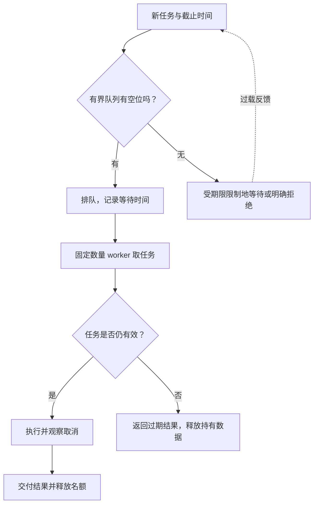

# 028 如何设计有界 worker pool 和背压？

> 难度：中级 · 分类：并发编程

## 简短回答

worker pool 用固定数量的工作者处理任务，用有界队列限制积压。背压把处理能力不足的信号传回生产者，使其等待、减速或拒绝；如果只是无限缓存待处理任务，就没有真正控制资源。

## 详细解析

### 图解：背压必须回到提交者



worker 数限制正在执行的工作，队列容量限制已接收的积压，截止时间限制过期工作。三者缺一，背压都可能停留在系统内部而没有真正约束上游。

### 同时限制执行和排队

下面使用两个 worker 和容量为二的任务通道，完成有限批次计算。任务位置互不重叠，结果只在所有 worker 完成后读取。生产者负责关闭任务输入，worker 不抢着关闭共享通道。

```go
package main

import (
    "fmt"
    "sync"
)

func main() {
    jobs := make(chan int, 2)
    result := make([]int, 5)
    var wg sync.WaitGroup
    for i := 0; i < 2; i++ {
        wg.Go(func() {
            for index := range jobs { result[index] = index * index }
        })
    }
    for index := range result { jobs <- index }
    close(jobs)
    wg.Wait()
    fmt.Println(result)
}
```
```output
[0 1 4 9 16]
```

这是有界批处理程序，任务是确定可终止的短计算。接入网络服务时，提交和执行都要支持取消：投递用 select 同时等待队列与 context.Done，下游调用传递 context。不能把例子的有限循环直接扩展成不受请求生命周期约束的后台系统。

### 队列越大不一定越好

若每个 worker 平均每秒处理 50 个任务，四个 worker 理想吞吐约为 200 个每秒；排队 1000 个任务意味着仅清空队列就可能需要约五秒，还未计新到达任务。若接口期限只有一秒，这个队列很可能只是在保存注定超时的请求。

容量应由允许等待时间和实际服务速率推导，并同时限制任务体积。一个队列元素可能引用几十 MB 数据，因此只限制元素数并不能精确限制内存。队列满时选择等待、拒绝还是丢弃，必须与业务语义相符：付款不能静默丢弃，采样遥测可能允许丢弃并计数。

关停时要定义停止接收、是否处理剩余任务、最长等待时间和结果归属。进程内队列没有天然持久性，不能承诺重启后任务不丢失。

### 从吞吐推导等待，而不是先选一个大容量

假设四个 worker，每个平均处理一项需要 20 ms，忽略外部竞争时总处理能力约为 200 项每秒。若稳定到达 250 项每秒，积压平均每秒增加约 50 项；容量 1000 的队列从空到满约需 20 秒。扩大到 10000 只是把显性拒绝推迟，系统仍不稳定。

若接口允许排队 100 ms，可以用服务速率乘允许等待时间估算平均量级，即约 20 项，再结合突发与服务时间分布验证。这个计算不是保证所有任务等待不超过 100 ms；需要在出队时检查期限，并观察真实排队分布。长尾任务和共享下游限制会让理想速率失真。

### 名额应该在创建大量任务之前取得

一万个 goroutine 先启动，再各自等待 semaphore，虽然同时执行的可能只有十个，但其余任务仍持有栈、请求参数和闭包引用。若目标是限制整体资源，应在提交阶段就建立上限，让生产者承担等待或收到拒绝，而不是先把所有压力装入后台任务。

对有限批处理，预分配结果数组与输入规模成正比，这在原示例中是明确成本。对无限请求流则不能沿用同样策略，结果应由单项调用者接收，或者进入有界持久存储。任务生命周期决定数据该放在哪里。

### 关停协议应先选择排空还是取消

| 阶段 | 排空模式 | 取消模式 |
| --- | --- | --- |
| 停止准入 | 新任务收到关闭状态 | 新任务收到关闭状态 |
| 已排队任务 | 在关闭预算内继续执行 | 标记取消并通知等待者 |
| 正在执行 | 等待完成，必要时到期取消 | 立即通知取消，仍等待收尾 |
| 最后释放 | worker 退出后关依赖 | worker 退出后关依赖 |

关闭 jobs 可以让 range worker 在处理完缓冲任务后结束，但它本身不取消正在执行的 I/O。如果有多个并发提交者，还要先阻止新发送并协调在途提交，否则 close 与 send 竞态会导致 panic。一个应用级 worker pool 比有限演示程序多出来的，正是这些协议责任。

### 验收时不能只看完成数量

检查活跃 worker 从未超过上限，队列满时行为符合约定，取消的提交能够退出，任务过期不会继续进入昂贵依赖，关闭后所有等待者都得到确定结果。再看队列长度、排队 P99、执行 P99、拒绝率与完成吞吐能否解释同一负载状态。

对付款、订单等不能丢的任务，进程内队列不能承担最终可靠受理边界；应先持久化任务身份与状态，再由 worker 执行。并发池控制资源，持久队列解决重启恢复，两者解决的问题不同。

## 常见误区 / 面试追问

- **先开无限 goroutine 再抢 semaphore 算有界吗？** 只限制执行，不限制等待任务和其持有内存。
- **worker 数等于 CPU 核数吗？** CPU 与 I/O 工作不同，还要看下游连接配额和单任务内存。
- **如何判断背压正常？** 同时观察队列长度、排队时间、拒绝率和完成吞吐，而不是只看 CPU。

## 参考资料

- [Go 官方并发流水线](https://go.dev/blog/pipelines)
- [Go channel 规范](https://go.dev/ref/spec#Channel_types)

[返回目录](../README.md) · [上一题](027-task-groups.md) · [下一题](029-leaks.md)
