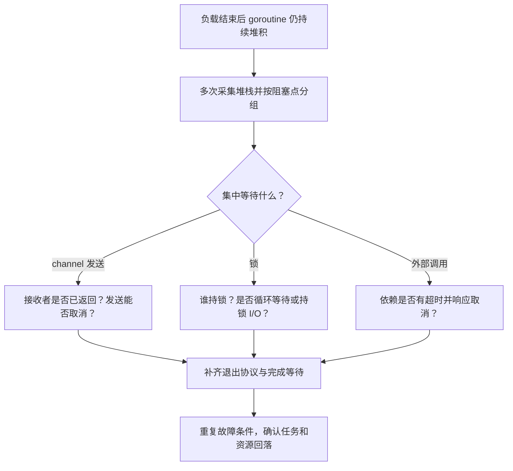

# 029 如何定位 goroutine 泄漏和死锁？

> 难度：高级 · 分类：并发编程

## 简短回答

goroutine 泄漏是任务已经失去业务意义却无法退出；死锁是等待关系无法继续推进。先获取多次 goroutine 堆栈，按阻塞位置聚类，再追问“谁负责让这里就绪、那一方是否还活着”。任务数量上升只是信号，堆栈和生命周期才是证据。

## 详细解析

### 图解：沿等待关系寻找消失的参与者



堆栈只说明当前停在哪里，下一步必须找到能让它继续的参与者。无法指出接收者、解锁者或超时边界，才是生命周期缺口的关键证据。

### 从结果发送阻塞还原故障

聚合接口启动三个下游查询，主流程只接收最快结果就返回。剩下两个任务继续向无缓冲通道发送，但已经没有接收者。流量越大，堵在同一发送位置的 goroutine 越多，且各自保留请求数据。

```text
请求进入 → 创建 worker → worker 查询完成 → 发送结果（永久等待）
                 │
主流程收到首个结果 → 提前返回，接收方消失

排查重点：发送点是否能观察取消；返回前是否取消并等待工作者。
```

给结果通道增加容量可能解决某个有限场景，但若任务数量或发送次数不受控，只是延迟故障。应明确剩余结果是否允许丢弃，并在发送 select 中加入取消路径，任务本身也要让外部调用响应取消。

### 区分等待与泄漏

稳定数量的空闲 worker 等待任务并不必然泄漏。对比负载前、期间和负载结束后的堆栈，看任务是否按预期回落。使用 goroutine profile 查看阻塞点，配合 block、mutex profile 或 execution trace 判断等待的是锁、通道还是外部 I/O。

全局死锁有时会被运行时报告，但如果 HTTP 监听或后台定时器仍在运行，部分业务链路永久卡住未必触发全局检测。不能因为进程还在、健康接口还能响应就排除死锁。

修复时为每个 goroutine 写出启动者、退出条件和等待者。针对故障路径构造确定性测试：让下游进入可控阻塞，取消请求，等待退出确认。不要用“睡一秒后数量差不多”作为唯一证据，因为测试框架也会产生后台任务。

### 一份模拟现场怎样形成根因假设

下面数字是教学用模拟数据，不是本仓库生产运行记录：空闲时约 80 个 goroutine；压测五分钟后增长到 8000；停止流量两分钟后仍接近 8000。连续三份堆栈显示，大部分任务停在同一个 result <- value 的发送点，而请求日志已经记录完成。

这组证据支持“响应结束后仍有结果发送者”的假设，但还不能直接认定所有任务都是泄漏。继续检查该通道是否还有长期接收者、发送任务是否有截止时间，以及请求结束时是否取消并等待其他 worker。如果接收者只负责取第一份结果就返回，而发送没有取消分支，因果链才完整。

修复不能只把 channel 容量设为 8000。若每个 worker 恰好发送一次且数量有严格上限，足够缓冲可以是某个局部协议的一部分；但面对持续请求流或多次发送，容量只是延后阻塞。更稳妥的设计是明确哪些结果可丢弃，并让发送者在消费者离开后退出。

### 死锁需要画出等待环

考虑请求甲持有账户锁，再等待库存锁；请求乙持有库存锁，再等待账户锁。每把锁都正确互斥，组合起来却无法推进。建立统一获取顺序可消除这种特定环，但如果持锁期间调用未知回调，回调又回到原对象取锁，仍可能出现新的等待环。

另一个常见环是：主流程等待 WaitGroup；worker 等待向结果通道发送；结果通道由主流程准备在 Wait 之后读取。任务组、通道和锁单独都合法，错误在组合顺序。排查应画出“谁等谁”，不能只统计使用了多少同步原语。

### 采集工具各自能提供什么

goroutine profile 适合查看活跃任务的栈和当前阻塞位置；block profile 关注采样到的阻塞事件；mutex profile 关注锁竞争；execution trace 可以进一步关联调度与等待时间。某个永远不再推进的阻塞，不一定会在所有事件型采样里呈现为你期待的完成事件，因此不能只依赖单一 profile。

如果服务已有受控的诊断端点，可在故障窗口采集多份快照；没有端点时应使用既定诊断方式，避免为了排查临时把敏感诊断接口开放到公网。采集本身也有开销，按证据选择需要的工具，参见 [036](../04-runtime-performance/036-pprof.md)、[037](../04-runtime-performance/037-trace.md)。

### 为退出协议写可控测试

让下游通过 entered 通道通知“已进入阻塞点”，测试收到该信号后取消请求，再等待 exited。这样能区分测试没有命中目标路径与代码没有响应取消。等待超时只是失败保护，不应拿固定 Sleep 作为任务已经开始的证明。

恢复验收除了任务数量回到合理区间，还包括在途请求、连接占用和持有内存不再持续增长。稳定的 worker、监听和维护任务可能长期存在，不能要求总数必须回到零。最终要能给每类长期 goroutine 指出其所有者与正常退出条件。

## 常见误区 / 面试追问

- **GC 会回收阻塞 goroutine 吗？** 不能把它当成生命周期管理，仍活着的阻塞任务及可达对象可能持续存在。
- **检测到泄漏就重启够了吗？** 重启可以暂时恢复资源，但需要保存证据并修复退出路径，否则流量一来再次累积。
- **如何处理不支持取消的库？** 设置其可用的底层超时或替换实现；外层包一层 goroutine 并提前返回不会停止内部工作。

## 参考资料

- [runtime/pprof](https://pkg.go.dev/runtime/pprof)
- [Go 诊断指南](https://go.dev/doc/diagnostics)

[返回目录](../README.md) · [上一题](028-worker-pool.md) · [下一题](030-concurrency-review.md)
