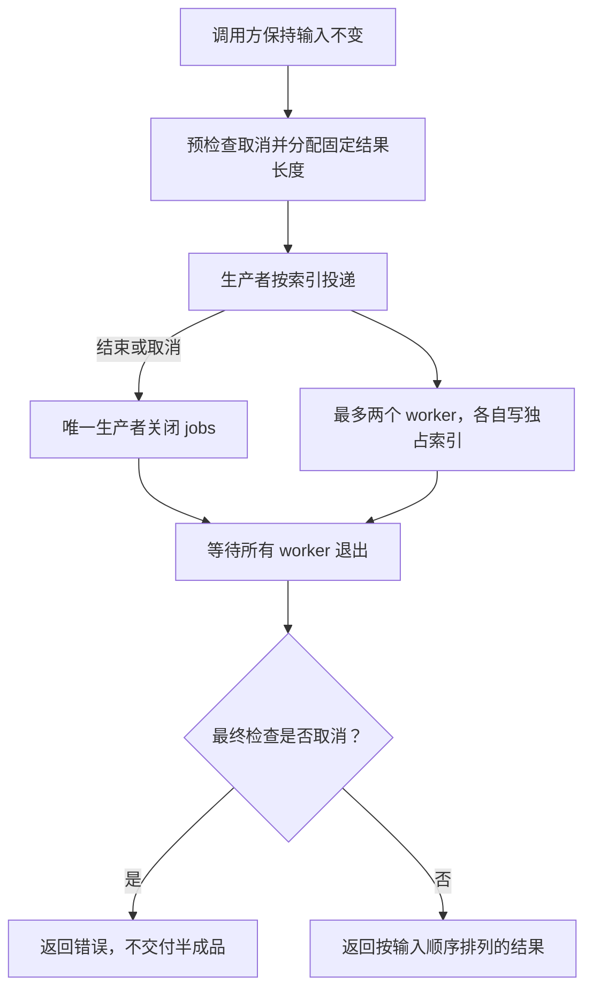

# 030 代码 Review：怎样修复并发聚合中的竞态与取消问题？

> 难度：高级 · 分类：并发编程

## 简短回答

审查并发聚合时，逐项检查任务上限、结果所有权、错误传播、取消响应和返回前等待。常见错误是多个 goroutine 同时 append 同一切片、先返回再留下发送者、只限制下游连接却不限制任务数量。

## 详细解析

### 先审查问题代码，再看修复

下面是**故意保留错误的完整反例**，不是推荐实现。它能编译，也调用了 Wait，却仍有共享切片竞态、无限按输入扩张的任务数、未使用的取消信号和不明确的输出顺序。不要把它接入业务。

```go-bad-race
package main

import (
    "context"
    "fmt"
    "sync"
)

func broken(ctx context.Context, input []int) []int {
    var result []int
    var wg sync.WaitGroup
    for _, n := range input {
        wg.Add(1)
        go func(value int) {
            defer wg.Done()
            result = append(result, value*value)
        }(n)
    }
    wg.Wait()
    return result
}

func main() {
    input := make([]int, 1000)
    for i := range input { input[i] = i + 1 }
    ctx, cancel := context.WithCancel(context.Background())
    cancel()
    fmt.Println("items", len(broken(ctx, input)))
}
```

该反例没有固定预期结果：即使某次恰好打印 1000，也不能证明正确。运行 `python scripts/check_bad_examples.py 030` 会单独提取它并启用 race detector，预期是发现 `WARNING: DATA RACE` 且进程非零退出；这属于反例验证成功，不计为正常示例通过。若没有出现诊断，脚本会判定本次复现证据不足，而不是把反例判为正确。

### 图解：修复后的所有权与退出路径



图中的 Wait 仍不可缺少，但它与独占结果槽位、受控任务数一起才能构成完整证明。取消时也要先收尾，再把结果所有权交回调用者。

### 四项问题逐一对应修复

| 反例位置 | 触发与后果 | 对应修复 |
| --- | --- | --- |
| 多任务共同 append | 同时修改切片头与存储，可能丢值或损坏 | 预分配长度，每个索引只交给一个 worker |
| 每个输入都启动 goroutine | 大批次产生大量在途任务 | 固定 worker 数，投递阶段施加背压 |
| ctx 从未使用 | 预取消仍处理整个批次，等待无法取消 | 入口检查，投递与接收同时观察 Done |
| 按完成顺序追加 | 即使加锁也无法保证输入顺序 | 结果与输入索引一一对应 |

注意反例已经使用 Wait，所以这次 Review 不能泛泛声称“所有问题都是没有等待”。它保证返回前 worker 已完成，却没有保护完成之前的共同 append；这是完成同步与执行期间互斥的区别。

### 明确需要保持的行为

本题处理一批整数，返回对应平方；任务取消时返回 context 错误，不返回半成品。固定最多两个 worker，结果按输入索引写入。这个例子用有限计算模拟工作，不包含外部 I/O；替换为 HTTP 查询时必须把 ctx 传给请求。

```go
package main

import (
    "context"
    "fmt"
    "sync"
)

func square(ctx context.Context, input []int) ([]int, error) {
    if err := ctx.Err(); err != nil { return nil, err }
    result := make([]int, len(input))
    jobs := make(chan int)
    var wg sync.WaitGroup
    for i := 0; i < 2; i++ {
        wg.Go(func() {
            for {
                select {
                case <-ctx.Done(): return
                case index, ok := <-jobs:
                    if !ok { return }
                    result[index] = input[index] * input[index]
                }
            }
        })
    }
dispatch:
    for index := range input {
        select {
        case <-ctx.Done(): break dispatch
        case jobs <- index:
        }
    }
    close(jobs)
    wg.Wait()
    if err := ctx.Err(); err != nil { return nil, err }
    return result, nil
}

func main() {
    result, err := square(context.Background(), []int{2, 3, 4})
    fmt.Println(result, err)
    ctx, cancel := context.WithCancel(context.Background())
    cancel()
    _, err = square(ctx, []int{2})
    fmt.Println(err)
    empty, err := square(context.Background(), nil)
    fmt.Println(len(empty), err)
}
```
```output
[4 9 16] <nil>
context canceled
0 <nil>
```

### 为什么这几处修改有效

结果切片长度一次确定，每个索引只分配给一个 worker，避免共同修改切片头。只有生产者关闭 jobs，worker 只读；返回前 Wait 确保没有后台任务继续访问 result。无缓冲输入把排队压力留在提交方，而不是无限创建任务。

最终检查 ctx.Err 定义了取消优先于返回结果的策略，但取消仍可能发生在最后检查之后。它不是与外部副作用原子提交的协议。本例不会无限等待，因为计算有界；对不响应取消的下游，Wait 仍可能一直等，这是必须在依赖层解决的限制。

输入切片在函数期间由调用者保持不变，整数范围也限制在平方不会溢出的业务域。并发正确性不能替代数据范围校验。空输入能够正常关闭通道并等待，输出为空结果。

### 怎样验证修复没有悄悄改变契约

成功路径断言结果数与输入相同、顺序对应；空输入返回空结果；预取消返回取消错误。再用 race detector 执行修复程序，验证覆盖路径没有检测到共享访问竞态。反例的错误输出与修复后的稳定输出必须分开记录，不能把竞态反例混进普通课程运行器。

对于真正的远程聚合，还需要受控的运行中取消测试：让依赖报告已进入阻塞状态，再取消并等待退出。这份平方函数只做有限计算，没有可控 I/O 阻塞点，因此不能声称它验证了任意远程库的取消行为。可以参考 [026](026-context.md)的完成信号实验，以及 [Kratos 示例测试](../examples/catalog/catalog_test.go)中的运行中取消路径。

### 继续追问：如果一个任务返回业务错误

平方计算在规定整数范围内没有业务错误，直接引入通用任务框架没有必要。若改成 RPC 查询，则需要决定首错取消还是保留部分结果、如何保证其他 worker 退出、如何让错误关联输入索引。可以选择 errgroup 或显式结果结构，但仍保留有界投递与数据所有权。

合格的 Review 要指出具体竞态位置并提出正确修复；更完整的 Review 要说明加锁 append 为什么仍不满足顺序、取消为什么不能撤销副作用，以及测试目前证明了哪些路径。把所有问题归结为“加锁”或“用 errgroup”都不够。

## 常见误区 / 面试追问

- **改成加锁 append 可以吗？** 可以避免那一处竞态，但输出顺序变成完成顺序，仍需检查是否符合契约。
- **只跑成功路径能验证取消吗？** 不能，至少覆盖预取消和运行中取消；后者需要可控阻塞任务来确保命中路径。
- **如何处理任意任务返回错误？** 可以采用 errgroup 配合有界投递，或单独定义错误收集协议，不能静默丢弃错误。

## 参考资料

- [Go race detector](https://go.dev/doc/articles/race_detector)
- [sync.WaitGroup](https://pkg.go.dev/sync#WaitGroup)

[返回目录](../README.md) · [上一题](029-leaks.md) · [下一模块](../04-runtime-performance/031-scheduler.md)
