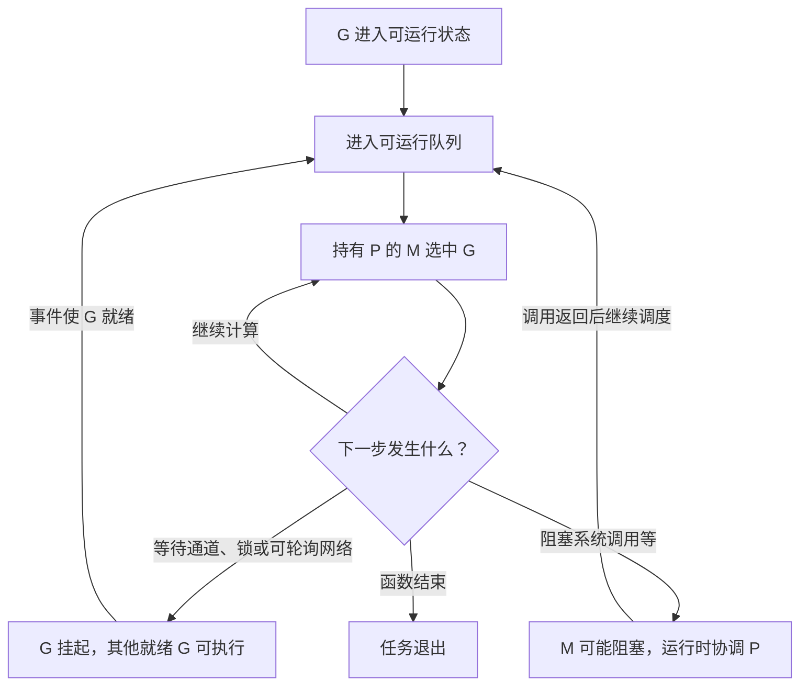

# 031 G、M、P 分别是什么？调度器如何分配执行机会？

> 难度：中级 · 分类：运行时与性能

## 简短回答

在本仓库 Go 1.26.5 的运行时实现中，G 代表 goroutine，M 代表工作线程，P 代表执行 Go 代码所需的调度资源。调度器把就绪 G 分配给有 P 的 M，并结合运行队列、网络轮询和抢占机制推进任务。

## 详细解析

### 图解：就绪、执行与等待



这张图强调状态转换，没有承诺每一步对应固定函数或严格公平次序。等待中的 G 与正在占用线程的阻塞调用要分开分析，否则很容易误判线程数量。

### 从阻塞请求看三者关系

HTTP 请求读取网络数据时，支持网络轮询的等待通常可以让 G 暂停，线程继续处理其他就绪工作。某些系统调用或 cgo 调用会占用线程，运行时需要协调 P，让其他线程继续执行 Go 代码。不能概括为“每次阻塞都新建线程”或“所有阻塞都不占线程”。

```text
就绪 G → 本地/全局可运行队列 → 持有 P 的 M 执行
   ↑                                  │
网络就绪、锁释放、定时器到期 ← G 进入等待
```

每个 P 的本地工作与全局协调降低了单一队列竞争，同时需要偷取工作、唤醒线程等机制避免有活却无人执行。具体队列大小、抢占策略与调度常数是实现细节，应查对应版本源码，不属于程序可依赖的公平性契约。

### GOMAXPROCS 不是万能吞吐旋钮

它影响可同时执行用户 Go 代码的资源数量，不限制 goroutine 总数，也不等于线程总数。容器里还必须考虑 CPU 配额：增加执行并行度可能让进程更快耗尽一个调度周期的配额，然后遭到节流，尾延迟反而变差。

现代 Go 对部分容器环境有相关默认策略，但行为与版本、平台和显式设置有关。应记录实际 GOMAXPROCS、容器配额和节流指标，而不是照抄“设成宿主机核心数”的旧建议。

如果任务已经就绪却迟迟没运行，execution trace 可以帮助观察调度等待；如果大部分时间在数据库连接池等待，提高 GOMAXPROCS 通常不能解决瓶颈。调度器知识应服务故障定位，而不是替代测量。

### 三种资源分别限制什么

G 保存任务的执行状态及其栈；M 是操作系统线程，需要由系统调度；P 承载执行用户 Go 代码所需的运行时资源。很多 G 可以复用相对少的执行线程，但不能把它理解成固定的一对一映射。GOMAXPROCS 约束 P 的数量，也就约束同时执行用户 Go 代码的并行度。

| 现象 | 首先检查 | 不能直接推出 |
| --- | --- | --- |
| goroutine 数很多 | 是否大量等待、是否泄漏 | 同时占用同样多的 CPU 核心 |
| 线程数很多 | 系统调用、cgo、锁线程等 | GOMAXPROCS 被设置成同样的数 |
| 运行队列长期较长 | CPU 容量、配额与任务成本 | 一定是调度器实现有问题 |
| 请求慢而运行队列不长 | 外部等待与业务锁 | 增加 P 一定改善延迟 |

运行时会在任务阻塞、唤醒与抢占之间协调执行机会，但应用不能依赖某个任务必定在固定时间内得到运行。需要业务超时与准入上限时，应在应用协议中实现，而不是期待调度器提供实时保证。

### 本地队列为什么还需要全局协调

把所有就绪任务放在一个全局队列，会让频繁取放产生集中竞争。本地队列可以降低这类开销，但负载可能不均：一个 P 积压很多任务，另一个 P 却没有工作。因此运行时需要在本地、全局、网络就绪与其他工作来源之间协调，包括工作窃取等机制。

这种优化服务吞吐与利用率，并不等价于按创建顺序执行。即使两个 go 语句相邻，也不能据此推断两个任务中的读写先后。第一个任务创建得早，但第二个可能先完成；结果顺序必须由索引、通道协议或显式同步保证。

### 容器里的“有核心”不等于“有可用配额”

假设宿主机有很多核心，但容器只获得较小 CPU 配额。大量 CPU 密集工作短时间并行运行，可能更快用完某个配额周期允许的执行时间，随后被系统节流。此时平均 CPU 图表的口径、配额周期和 P99 之间需要一起解释。

调参前记录实际 GOMAXPROCS、容器限制与节流计数，再区分 CPU 消耗和可运行等待。不要仅从宿主机逻辑核心数推导并行度，也不要把某版本在特定容器环境下的默认行为推广到全部系统。本仓库 Windows 示例不构成 Linux 容器节流的实测证据。

### 诊断练习：为什么增加 P 没有效果

若请求堆栈集中在连接池等待，增加 P 不会增加数据库连接或缩短事务持有时间；若 profile 显示 CPU 热点且运行队列积压，才有理由评估更多执行资源；若 trace 显示大量任务就绪后迟迟没有运行，还应排查容器节流与其他进程竞争。

合格回答能区分 G/M/P；更完整的回答能用上述现象选择下一份证据，并明确哪些结论来自语言语义、哪些来自固定版本源码、哪些仍需运行验证。

## 常见误区 / 面试追问

- **goroutine 会按创建顺序执行吗？** 没有这种保证，正确性需要显式同步。
- **抢占是否保证严格响应时间？** 不保证实时调度期限，运行时、系统和依赖都可能引入延迟。
- **线程数很多就是调度器坏了吗？** 先检查 cgo、系统调用、锁线程以及外部阻塞，再判断是否异常。

## 参考资料

- [Go 1.26.5 调度器源码](https://github.com/golang/go/blob/go1.26.5/src/runtime/proc.go)
- [runtime.GOMAXPROCS](https://pkg.go.dev/runtime#GOMAXPROCS)

[返回目录](../README.md) · [下一题](032-gc.md)
