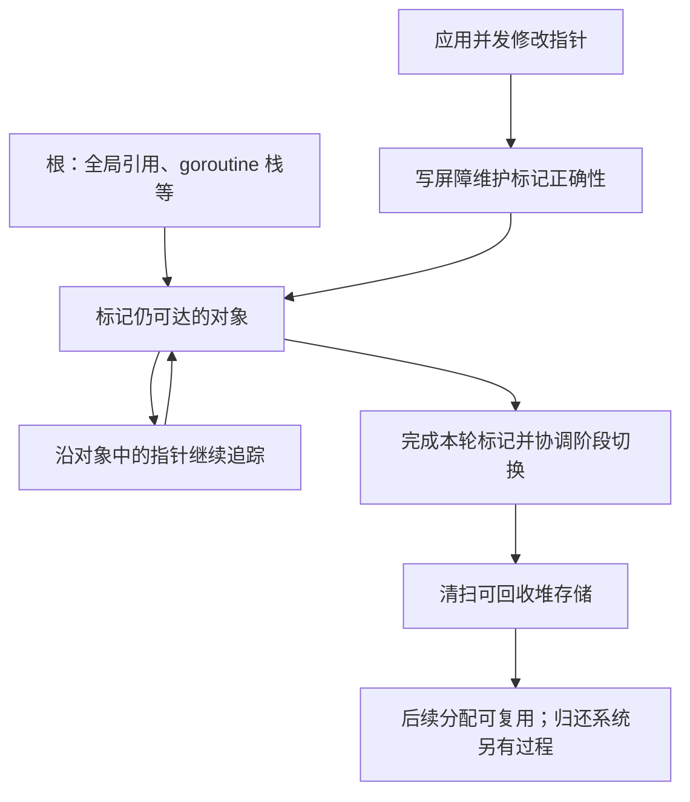

# 032 Go GC 如何工作？为什么低停顿不等于没有成本？

> 难度：中级 · 分类：运行时与性能

## 简短回答

Go GC 追踪仍可达的对象，回收不再可达的堆存储；标记工作可以与应用并发进行，但仍有同步阶段与 CPU 成本。低 STW 停顿只描述一部分延迟，持续分配、扫描和分配辅助同样会影响吞吐与尾延迟。

## 详细解析

### 图解：可达性与回收工作如何衔接



循环箭头表示遍历对象图，不表示 GC 会无限工作。应用与标记并发推进，需要写屏障等机制保持正确性；这也是“没有长暂停”仍可能有执行成本的原因。

### 从可达性理解对象存活

请求结束后，若对象仍被全局缓存、后台任务或小切片引用，它依然可达，GC 不会因为业务已经“不需要”就释放它。需要先修复引用生命周期，再讨论调整 GC 参数。资源连接关闭与对象回收也是不同问题。

```text
根：全局变量、运行中的 goroutine 栈等
              ↓ 追踪指针
          仍可达对象 → 保留
          不可达对象 → 可回收

缓存忘记删除引用：对象仍可达，并不是 GC 没工作。
```

### 成本由什么决定

分配速率高，意味着更快消耗可用堆增长空间，可能更频繁触发回收；存活堆大，意味着每轮需要处理更多仍存活的数据。含大量指针的对象图还会增加扫描工作。减少不必要临时对象与减少长期保留对象，分别作用于不同成本来源。

假设两个服务存活堆都为 100 MB，一个每秒分配 10 MB，另一个每秒分配 1 GB，它们的 GC 压力通常不能只凭“堆一样大”判断相同。反过来，低分配服务若保存数 GB 指针丰富的缓存，也可能承担显著标记成本。

GC 并发执行仍会消耗处理器，应用可能参与辅助工作。仅观察最大暂停时间，容易漏掉整个请求因 CPU 竞争而变慢。应同时查看分配速率、存活堆、GC CPU、暂停分布和请求 P99。

具体收集器内部算法和优化会随工具链演进。本课程以可达性、分配与存活成本作为稳定推理框架，不把某一版实现的内部阶段常数当成长期承诺。

### 一轮回收里应用为什么仍会付费

本仓库 Go 1.26.5 的 runtime/mgc.go 描述并发标记清扫及写屏障。阶段转换需要协调，标记期间后台工作者和分配辅助共同推进，之后清扫可以在后台或分配需要时完成。这里介绍机制，不把具体扫描策略或阶段耗时写成跨版本常数。

并发 GC 的“并发”意味着应用无需在整个回收周期停住，不意味着工作免费。标记线程消耗 CPU，写屏障让某些指针更新承担额外工作，快速分配的 goroutine 还可能参与辅助。如果机器 CPU 已经饱和，这些成本会与业务争抢执行机会，表现为吞吐下降或请求排队。

只监控 STW 最大时长，会把“每次暂停都短”误当作“GC 对延迟影响很小”。更完整的解释应包含一段时间内的 GC 工作总量、分配速度与可用 CPU，而不只看单次暂停。

### 对象大小与扫描工作不是同一个维度

一个很大的纯字节数组会占用大量堆，但其内容不包含需要逐项追踪的 Go 指针；大量链表节点虽然每个很小，却形成指针丰富的对象图。两者的内存占用相同，也可能具有不同的扫描与缓存访问成本。

这不代表大字节数组可以免费保留。它仍消耗容量，可能迫使系统更早回收其他对象，并影响内存限制。优化要同时看总大小、对象数量、指针关系和存活时间，不能只选择某一个指标来宣布“GC 友好”。

| 优化动作 | 主要影响 | 可能的代价 |
| --- | --- | --- |
| 减少重复编码中间对象 | 分配速率 | 实现复杂度可能增加 |
| 给缓存设置合理淘汰 | 存活堆 | 命中率可能下降 |
| 复制长期保存的小字段 | 大数组保留时间 | 增加少量新分配 |
| 批量或紧凑存储 | 对象数量与局部性 | 更新方式可能更复杂 |

### 如何区分分配热点与保留热点

分配热点是在一段时间内产生很多对象的位置；保留热点则是在观察时仍占大量存活堆的位置。某个短命缓冲区可能每秒分配很多但很快死亡，某个一次性加载的索引可能分配次数很少却长期保留大量数据。两种问题的修复方向不同。

对第一类可以考虑减少临时表示、复用或流式处理；对第二类要检查业务是否真的需要保留、索引是否有上限、是否存在意外引用。若只降低分配次数却把对象长期放入无界池，可能把第一类问题转化成第二类。

### 诊断时怎样避免把 RSS 当作唯一真相

运行时可复用的堆页不一定立刻归还系统，进程也可能包含 cgo 或映射内存。应把 Go 存活堆、运行时管理内存、进程 RSS 和容器计费放在不同口径下观察。若 heap 已稳定但 RSS 增长，继续检查非 Go 内存与页保留；若存活堆随请求总数持续增长，则优先寻找未结束的业务引用。

最终验收应在相同工作量下确认输出正确、峰值可承受、存活规模稳定，同时比较 GC CPU 与请求延迟。单次调用 runtime.GC 后数字下降，既不证明问题已经解决，也不是长期治理方案。

## 常见误区 / 面试追问

- **手动 runtime.GC 能修复泄漏吗？** 不能回收仍可达的对象；频繁强制 GC 还可能降低吞吐。
- **RSS 不下降就是内存泄漏吗？** 不是，运行时保留、归还操作系统时机及非 Go 内存都可能影响 RSS。
- **如何优先优化？** 先找到最大分配来源和异常存活引用，再改变代码；参数调节见 [033](033-gc-tuning.md)。

## 参考资料

- [Go GC 指南](https://go.dev/doc/gc-guide)
- [runtime/metrics 指标定义](https://pkg.go.dev/runtime/metrics)
- [Go 1.26.5 GC 阶段说明](https://github.com/golang/go/blob/go1.26.5/src/runtime/mgc.go)

[返回目录](../README.md) · [上一题](031-scheduler.md) · [下一题](033-gc-tuning.md)
