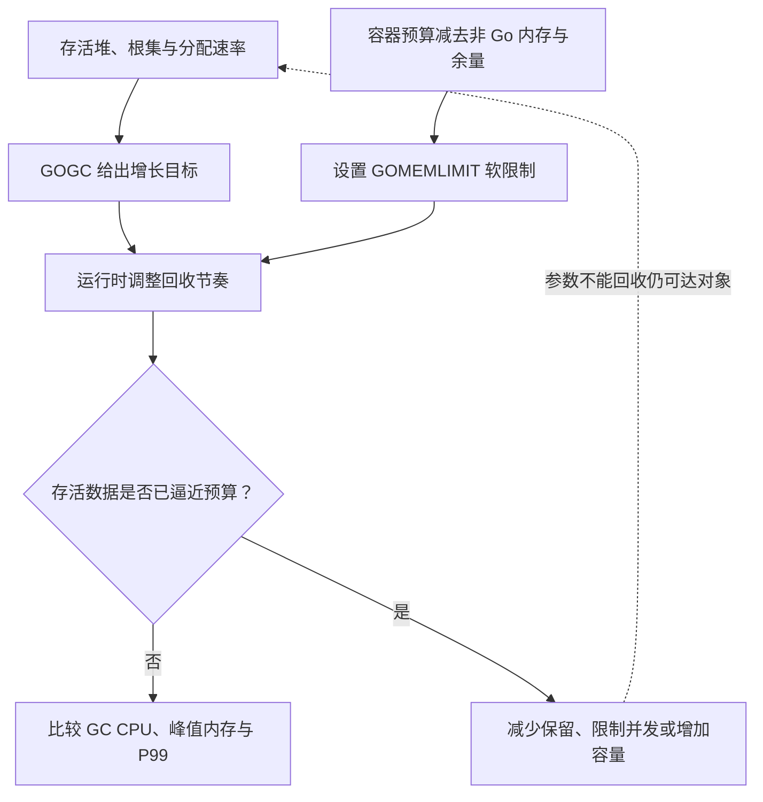

# 033 GOGC 与 GOMEMLIMIT 如何共同影响吞吐和内存？

> 难度：高级 · 分类：运行时与性能

## 简短回答

GOGC 调节相对存活堆的目标增长空间，影响回收频率与内存之间的权衡；GOMEMLIMIT 为运行时管理的内存设置软限制。它不是进程 RSS 的硬上限，更不能保证容器绝不 OOM。调参必须给非 Go 内存和负载波动预留空间。

## 详细解析

### 图解：增长目标与内存预算共同约束回收

GOMEMLIMIT 不是直接给“堆目标”取一个简单最小值：其口径还包含其他由运行时管理的内存。图中强调共同约束和容量问题，不省略统计口径差异。

### 用一个近似模型建立直觉

忽略根扫描等细节，存活堆 200 MB、GOGC 为 100 时，目标堆可以粗略理解为接近 400 MB；提高 GOGC 允许更多增长，通常减少回收频率但增大内存。真实目标还受根集、最小堆和内存限制等因素影响，这个算例不能作为精确容量承诺。

| 观察到的情况 | 可尝试的方向 | 必须验证的代价 |
| --- | --- | --- |
| GC CPU 高且内存充足 | 适度提高 GOGC | 峰值内存是否可承受 |
| 容器接近上限 | 减少存活数据并设置合理软限制 | 回收是否过于频繁 |
| 存活数据已接近限制 | 降缓存、限并发或扩容 | 不能靠反复 GC 凭空回收活对象 |

### 为什么不能把限制设到容器上限

进程还可能有 cgo 分配、映射文件以及运行时统计范围之外的内存，容器计费范围也不等同于 Go 管理的内存。将 GOMEMLIMIT 设成容器硬上限，会缺少这些部分的余量。应从实测峰值组成出发设预算，并在压力和故障条件下验证。

软限制太低时，GC 可能频繁工作却没有多少可回收对象。运行时为避免应用完全失去进展可能允许超过软目标，因此它不能代替操作系统硬限制。即使关闭基于增长目标的 GC，设置内存限制仍可能驱动回收，不能把两者当成互不相关的开关。

建议每次只改变一个主要参数，保留同一负载下的吞吐、P99、GC CPU、存活堆和峰值内存。若指标改善来自吞吐下降、实际请求变少，则不是有效优化。回滚条件应在实验前确定。

### 把近似计算补到可解释程度

按 GC 指南的增长目标模型，目标堆约为存活堆加上“存活堆与根集之和乘以 GOGC 百分比”。若存活堆为 200 MiB、根集为 20 MiB，GOGC=100 时约为 420 MiB，GOGC=50 时约为 310 MiB。实际还受最小目标、内存限制与运行时调节影响。

这个模型解释了为什么同样的堆存活量，goroutine 栈等根集规模不同，也可能影响目标。它不是申请到操作系统的总内存承诺，更不能直接与容器硬限制比较。将所有口径都写成“内存”会让预算失去意义。

### 一份假设预算怎样落地

假设容器硬限制为 1 GiB，测量显示峰值非 Go 管理部分约 120 MiB，另希望为突发与测量误差保留 150 MiB，那么运行时软预算的初始候选约为 754 MiB。这些数字仅用于演示计算，不是本仓库的容量实测，也不是推荐所有服务照抄。

SetMemoryLimit 文档给出的对应口径是 MemStats.Sys 减 HeapReleased，或相应 runtime/metrics 两项之差。它与 RSS 不同，包含运行时管理的多类内存，也排除部分外部内存。设定后要在真实容器、cgo 使用方式和峰值负载下重新验证。

| 观察组合 | 可能的解释 | 下一步 |
| --- | --- | --- |
| GC CPU 上升，存活堆仍接近预算 | 没有足够可回收对象 | 降低保留量或在途工作 |
| Go 指标稳定，容器内存继续上升 | 其他内存口径增长 | 检查 cgo、映射与容器计费项 |
| 降低限制后 P99 显著恶化 | 回收压力影响业务进展 | 检查辅助工作与 CPU 余量 |
| 提高 GOGC 后周期变少、峰值上升 | 用更多空间换更少回收 | 判断是否仍在容量边界内 |

### 为什么软限制不能承诺绝不越界

若存活集本身已经大于合理预算，再频繁标记也不能把这些对象回收。运行时还需要平衡 GC 工作与应用进展，软目标不具备操作系统硬上限的强制终止语义。容器 OOM 仍可能来自不可回收数据、瞬时峰值或不在软限制范围内的内存。

因此应先限制缓存、请求体、并发与队列，再用参数调节剩余权衡。把 GOGC 调得很低可以增加回收频率，却不会给无界业务状态创造一个有限上界；把 GOGC 关闭也不意味着设置的内存软限制失效。

### 实验记录应能支持回滚决定

固定请求分布、数据规模和完成工作量，先记录基线，再改变一个主要参数。观察吞吐、超时比例、P99、GC CPU、存活堆和总内存峰值。如果“内存下降”是因为请求被更早拒绝或完成量更少，就需要把这个代价一并报告。

实验还应覆盖慢依赖：请求积压会增加存活数据，健康压测下合适的参数可能在故障时没有余量。预先定义回滚条件，例如延迟恶化或 GC CPU 超过预算，并保留参数与构建版本，才能解释改动带来的因果关系。

## 常见误区 / 面试追问

- **GOMEMLIMIT 设置后为什么仍 OOM？** 检查软限制语义、非 Go 内存、存活集大小和短时峰值，不能只看一个环境变量。
- **降低 GOGC 能解决缓存无限增长吗？** 不能，缓存仍可达，首先需要生命周期和容量约束。
- **推荐一个通用百分比吗？** 不存在脱离负载的通用最优值，预算应由内存组成和性能目标决定。

## 参考资料

- [Go GC 指南：内存限制](https://go.dev/doc/gc-guide#Memory_limit)
- [runtime/debug.SetMemoryLimit](https://pkg.go.dev/runtime/debug#SetMemoryLimit)

[返回目录](../README.md) · [上一题](032-gc.md) · [下一题](034-sync-pool.md)
