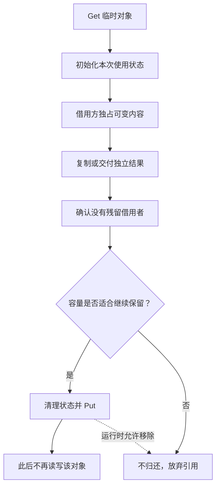

# 034 sync.Pool 为什么不能用作连接池或持久缓存？

> 难度：中级 · 分类：运行时与性能

## 简短回答

sync.Pool 用来复用可丢弃的临时对象，运行时允许随时移除其中对象，Get 也不保证得到之前 Put 的对象。它不提供容量、借用期限、可靠保留和关闭协议，因此不适合数据库连接池或必须命中的缓存。

## 详细解析

### 图解：借出期间独占，归还后不再访问



池只管理临时对象复用，不负责业务结果的生命周期。结果必须在归还前变成独立数据，或者借用期必须延长到最后一个使用者结束。

### 临时缓冲区的借还协议

每次 Get 后初始化状态，用完后确保没有其他持有者再 Put。下面复用 Buffer，但只依赖“得到一个可用对象”，不依赖它的身份或一定来自上次归还。

```go
package main

import (
    "bytes"
    "fmt"
    "sync"
)

func main() {
    pool := sync.Pool{New: func() any { return new(bytes.Buffer) }}
    b := pool.Get().(*bytes.Buffer)
    b.Reset()
    b.WriteString("ready")
    result := b.String()
    b.Reset()
    pool.Put(b)
    fmt.Println(result)
}
```
```output
ready
```

Buffer.String 返回的字符串在此安全保留；若返回的是 Buffer.Bytes 提供的切片视图，再把 Buffer 归还池，下一使用者就可能覆盖仍被调用者读取的数据。必须在归还前结束所有借用，或显式复制交付的数据。

### 控制大对象滞留

某次请求把缓冲区增长到数十 MB，Reset 只重置逻辑长度，不一定释放底层容量。可以根据明确阈值决定大对象不归还，让其失去引用后由 GC 回收。阈值来自负载和内存预算，不应随意照搬别的服务。

对象池也可能增加维护成本：清理不彻底会泄露上一请求的数据，跨 goroutine 重复使用会造成竞态，频繁小对象如果本来不逃逸，则池化甚至可能增加分配与接口开销。应比较池化前后的实际分配率和吞吐，而不是默认复用就更快。

连接需要最大数量、健康检查、等待超时和主动 Close，这些是资源管理协议。数据库应使用 database/sql 提供的连接池能力，不能把连接塞进可被静默丢弃的 sync.Pool 后期待自动正确释放。

### Get 与 Put 不是对象身份契约

即使同一个 goroutine 刚刚 Put 一个对象，下一次 Get 也不能要求取回相同实例。测试应该验证“得到可初始化并使用的对象”，而不是比较指针是否相等；业务也不能把待处理状态暂存在 Pool 中，再期待以后原样取回。

如果 New 没有设置，Get 可能返回 nil，调用方必须按接口约定处理。New 的作用是对象缺失时提供构造方式，不是给池预热固定容量。池本身也不承诺最多保存几个对象，因此不能用它实现总连接数上限或内存硬上限。

### 三种结果交付方式的所有权差别

| 交付方式 | 归还缓冲区后能否继续使用 | 需要证明什么 |
| --- | --- | --- |
| bytes.Buffer.String 的普通字符串结果 | 可以按其语义保留 | 没有额外 unsafe 共享转换 |
| Buffer.Bytes 返回的切片视图 | 不能假定安全 | 底层数组不会被后续操作覆盖 |
| 把所需字节复制到独立切片 | 可以由接收方持有 | 接收方自己的并发与生命周期 |

异步日志、响应写入和后台队列尤其容易跨过归还点。若函数把视图交给异步发送者就立刻 Put，发送者可能在下一请求改写后才读取。竞态检测只覆盖实际执行到的冲突，串行复用也可能造成逻辑数据错误，因此仍需明确借用契约。

### Reset 与清理引用不是同一回事

Buffer.Reset 使逻辑长度归零，但通常仍保留可复用容量。自定义对象中的切片、map、用户信息或回调也不会因为放回池就自动清空。清理时应解除不再需要的对象引用，避免上一请求的状态泄漏到下一请求，或让大对象继续存活。

如果请求偶尔产生 32 MiB 缓冲，数十个这样的对象同时保留就可能占据显著容量。可以为大对象设置不归还阈值，但这只是对象保留策略，不保证瞬时总占用小于某值；并发数与单请求上限仍要独立控制。阈值应通过真实大小分布和复用收益选择。

### 为什么连接池需要完全不同的协议

连接可能有服务端会话、事务、超时和关闭副作用。一个合格连接池要知道最大活跃数、谁借出了连接、等待者如何取消、损坏连接如何淘汰，以及应用退出时如何主动关闭。sync.Pool 可以静默丢弃对象，又没有统一借出计数和关闭通知，无法承担这些责任。

即使对象实现了 Close，也不意味着 Pool 移除时会自动调用它。把连接放进去可能让外部资源悬而未决。应使用 database/sql 或组件已经提供的专用资源池，并按其协议归还与关闭。

### 什么时候池化才算成功

对比相同输入、并发与生命周期下的分配率、CPU、峰值内存和尾延迟，并覆盖大对象与空闲回落。若对象原本可在栈上或被优化消除，放入 any 容器和跨调用复用反而可能增加成本。池化应解决已经观察到的临时对象热点，不能仅凭“复用”二字推断收益。

## 常见误区 / 面试追问

- **每次 GC 都一定清空 Pool 吗？** 不应依赖具体清理周期，API 只允许对象随时被移除。
- **Put 后还能读对象吗？** 除非有额外且可靠的所有权保证，否则视为已交还，不能继续访问可变内容。
- **Pool 自身线程安全等于对象线程安全吗？** 不等于，Get 后对象的并发使用仍由调用者负责。

## 参考资料

- [sync.Pool](https://pkg.go.dev/sync#Pool)
- [bytes.Buffer.Bytes](https://pkg.go.dev/bytes#Buffer.Bytes)

[返回目录](../README.md) · [上一题](033-gc-tuning.md) · [下一题](035-benchmarks.md)
