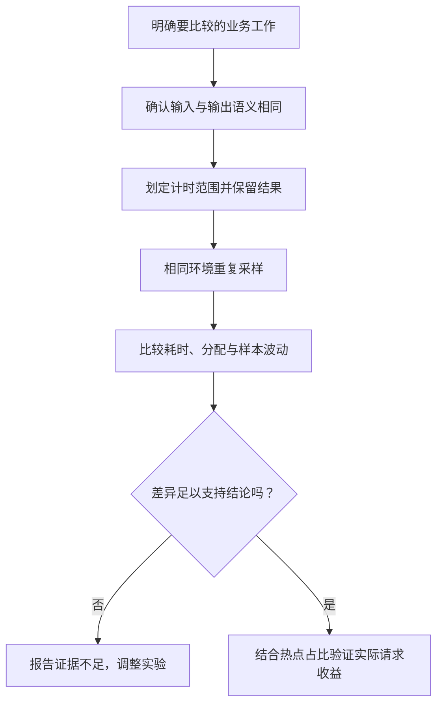

# 035 如何用 benchmark 测量性能而不是测量噪声？

> 难度：中级 · 分类：运行时与性能

## 简短回答

基准必须明确工作量、输入分布与度量边界，并避免结果被编译器消除。固定环境、重复采样，同时观察耗时和分配，再用统计方法比较变化。单次快几纳秒或不同机器的结果，通常不足以支持工程结论。

## 详细解析

### 图解：从可比较的工作量到全链路验证



单个 ns/op 数值只是中间证据。比较对象做了不同工作，或者局部优化不在热点上，即使数字变化很大，也不能支撑相同的工程结论。

### 先验证比较对象做了同样的事

比较字符串构造时，不能把一方的输入准备算入耗时而排除另一方，也不能让一方只计算不使用结果。下面是独立可运行的基准驱动，使用本课程工具链支持的 B.Loop；它只打印语义检查结果，测量值可通过 result.String 在本机查看。

```go
package main

import (
    "fmt"
    "strconv"
    "testing"
)

var sink string

func main() {
    result := testing.Benchmark(func(b *testing.B) {
        for b.Loop() { sink = strconv.Itoa(123456) }
    })
    fmt.Println(sink == "123456", result.N > 0)
}
```
```output
true true
```

在常规项目中把相同测量体放进 `_test.go` 的 Benchmark 函数，再使用 `go test -bench . -benchmem -count 10` 收集多个样本。需要比较变更时分别保存修改前后的输出，用官方 benchstat 工具分析，不要只选最好的一次。

### 微基准的边界

基准循环主要说明特定输入上的局部成本。真实 API 还包含连接等待、序列化、缓存命中差异和排队，局部函数快一倍可能只让全链路快百分之一。应结合 profile 估算热点占比，再决定是否值得增加代码复杂度。

并发基准需要指定线程和并发条件，单 goroutine 结果不能推断锁在高竞争下的表现。数据库、网络等外部依赖也会引入缓存与环境噪声，应该分开测试纯逻辑和集成路径，并记录数据规模。

结果应保留工具链、CPU、操作系统、构建参数、输入和样本数量。性能变化如果落在噪声范围内，就应报告未能证明提升，而不是用“看起来更快”替代证据。

### 运行仓库里的可重复对照

[format_test.go](../examples/bench/format_test.go)提供 strconv.Itoa 与 fmt.Sprint 的两个完整基准。它们使用相同整数集合，循环外先核对输出一致，循环内按同样顺序选输入，并把结果保存到同一个观察变量。刻意保留相同输入选择成本，避免一方多做数据准备。

```sh
go test ./examples/bench -run '^$' -bench . -benchmem -benchtime 200ms -count 3
```

本仓库在 Go 1.26.5、Windows amd64、AMD Ryzen 7 8745H 上执行这条命令，三次样本中 Itoa 约为 9.6–10.5 ns/op，Sprint 约为 39.5–41.5 ns/op。它说明这个输入集合和测量边界下的局部差异，不构成所有机器或完整接口的性能保证；正式决策应增加有代表性的样本并用统计方法比较。

### 为什么 0 allocs/op 仍可能伴随分配

本次 Itoa 输出同时出现 4 B/op 与 0 allocs/op。Go 1.26.5 testing.BenchmarkResult 的相关方法使用累计计数除以迭代数的整数结果；当每次操作的平均分配次数小于一时，显示为零并不等于整个基准从未分配。不同输入也可能走不同实现路径。

因此要结合累计量、输入分布和分配 profile 理解结果。把一个显示为零的整数指标当作绝对保证，可能误导优化方向。这个现象也说明为什么不能只挑固定的小整数来代表所有格式化场景。

### 计时边界会怎样改变结论

如果比较两种序列化方式，一方复用输出缓冲区，另一方每轮重新分配，再把结果宣称为“编码算法速度差异”，就混入了所有权与分配策略。它可以是有意义的方案比较，但必须明确方案包含哪些成本，而不是给算法本身贴标签。

类似地，把文件读取、测试数据生成或日志输出放进循环，会让测量包含这些工作；把生产中必须进行的拷贝移到循环外，又可能低估真实成本。B.Loop 帮助管理计时与避免部分优化陷阱，但不能代替对工作边界的判断。

### 用热点占比估算优化上限

假设某函数只占请求总成本的 5%，即使把它优化到原来的四分之一，总成本仍约为 95% 加 1.25%，即 96.25%，理想收益只有 3.75%。这还是忽略排队和其他变化的粗略模型。若为此引入难维护的 unsafe 或复杂缓存，可能不值得。

若热点占比达到 60%，相同局部改善才更可能影响整体。应先用 profile 找到占比，再用基准验证局部假设，最后在真实请求路径上检查吞吐和 P99。三种证据各有边界，不能互相替代。

### 保存结果，避免选择性汇报

记录工具链、系统、CPU、构建标志、输入集合、benchtime、count 与原始输出。前后版本使用相同条件，先核对结果语义，再比较全部样本。若机器同时执行其他重任务或频率变化很大，应把它视为实验噪声；没有稳定证据时，结论就应是尚未证明提升。

## 常见误区 / 面试追问

- **零分配就代表最快吗？** 不一定，可能以额外扫描或复制换取少分配，应看总体成本。
- **开启 race 后的性能可以代表生产吗？** 不可以，检测插桩有额外开销，正确性检查和性能测量应分开。
- **怎么避免过拟合基准？** 使用代表性输入分布，并在真实调用链验证收益没有被其他成本淹没。

## 参考资料

- [testing 基准文档](https://pkg.go.dev/testing#hdr-Benchmarks)
- [benchstat 官方工具](https://pkg.go.dev/golang.org/x/perf/cmd/benchstat)
- [Go 1.26.5 基准结果计算](https://github.com/golang/go/blob/go1.26.5/src/testing/benchmark.go)

[返回目录](../README.md) · [上一题](034-sync-pool.md) · [下一题](036-pprof.md)
