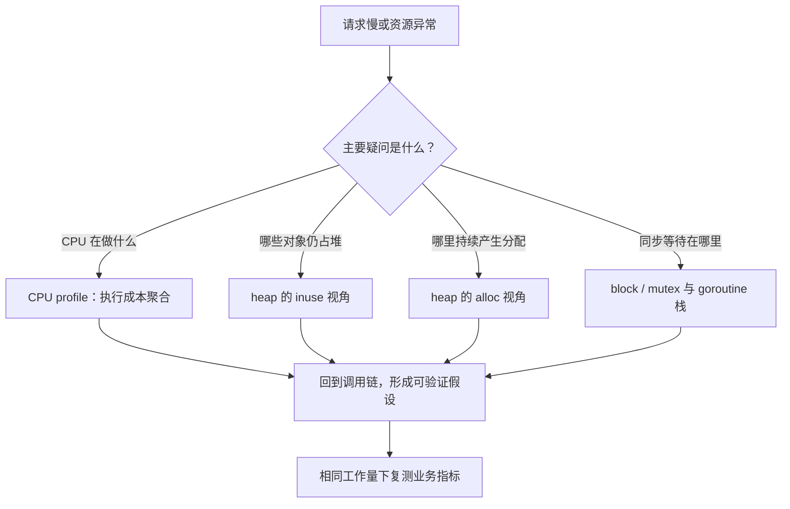

# 036 CPU、堆和阻塞 profile 分别回答什么问题？

> 难度：高级 · 分类：运行时与性能

## 简短回答

CPU profile 观察采样期间 CPU 时间花在哪里，heap profile 观察分配与存活内存，block 和 mutex profile 帮助定位同步等待。应根据问题选择证据：慢请求不一定消耗 CPU，内存大也不一定来自当前分配最多的函数。

## 详细解析

### 图解：先问问题，再选采样视角



这些工具回答不同问题。网络等待很长的接口可以只有很少 CPU 样本，长期缓存也可能不是当前累计分配最大的调用点。

### 先把问题翻译成可观测量

| 问题 | 首选证据 | 容易误读的地方 |
| --- | --- | --- |
| CPU 满了 | CPU profile | 样本比例不是单次请求耗时 |
| 堆持续增长 | inuse_space 与对象引用 | 存活与累计分配不同 |
| GC 太频繁 | alloc_space、分配速率 | 小对象高频分配也可能很贵 |
| 任务互相等锁 | mutex、block profile | 需正确开启采样，注意额外开销 |

假设 CPU profile 中 JSON 编码占 40%，只有先确认采样来自相同负载和有效窗口，才能讨论优化它。若服务主要阻塞在数据库，CPU profile 可能几乎看不到那段墙钟时间，应去看追踪、连接池统计和阻塞证据。

### 采样与比较流程

在受控诊断地址采集 profile，记录实例、版本、时间窗和流量。pprof 端点可能暴露堆栈和运行信息，应绑定诊断网络并限制访问，不直接作为公网业务路由。对已生成的文件，可以离线运行：

```sh
go tool pprof -top cpu.pprof
go tool pprof -sample_index=inuse_space -top heap.pprof
go tool pprof -sample_index=alloc_space -top heap.pprof
```

这些命令需要真实采集文件，本仓库不伪造生产 profile。累计分配值与采样持续时间相关，比较两个版本要对齐工作量和运行阶段；首次预热、初始化缓存与稳定负载应分别考虑。

优化后用同样窗口重新采样，确认热点减少且总吞吐、延迟没有恶化。只看到某个函数占比下降还不够：可能是另一处变慢，分母变大。最终应比较绝对工作量和业务指标。

### 在本仓库生成真实的本地 profile

先在仓库根目录创建 `.work` 目录，再执行以下命令。它采集的是 [格式化基准](../examples/bench/format_test.go)，不会访问生产服务；profile 属于教学实验，不代表 Kratos 服务的线上热点。

```sh
go test ./examples/bench -run '^$' -bench 'BenchmarkSprint$' -benchtime 1s -cpuprofile .work/cpu.pprof -memprofile .work/heap.pprof
go tool pprof -top -nodecount=8 .work/cpu.pprof
go tool pprof -sample_index=alloc_space -top -nodecount=8 .work/heap.pprof
go tool pprof -sample_index=inuse_space -top -nodecount=8 .work/heap.pprof
```

本次 Go 1.26.5 实验中，CPU 输出包含 fmt 的整数格式化、内存分配和 Pool 路径；alloc_space 输出中 fmt.Sprint 及基准调用点占据主要累计分配。这个结果与实验工作量相符，证明采样链路可运行，但没有证明业务系统存在相同瓶颈。

### flat 与 cum 如何避免误读

flat 表示归因到当前函数自身的样本，cum 包含它及其下游调用的样本。上层业务函数自身可能很少执行指令，却因调用昂贵库函数而具有较高 cum；底层分配器 flat 较高，也不代表应该直接修改分配器，而应追查谁在频繁分配。

| 观察 | 合理追问 | 不合理跳跃 |
| --- | --- | --- |
| 上层函数 cum 高、flat 低 | 哪个下游路径贡献最大 | 直接认为上层函数代码最慢 |
| malloc 相关样本高 | 哪类对象、哪个调用方在分配 | 一律加入对象池 |
| 编码函数占比下降 | 绝对 CPU 和吞吐是否改善 | 不看分母就宣布优化成功 |
| CPU 样本很少但请求慢 | 是否在等待资源 | 采样工具没找到就没有问题 |

### 堆 profile 的四种常见口径

inuse_space 关注存活字节，inuse_objects 关注存活对象数；alloc_space 关注累计分配字节，alloc_objects 关注累计分配对象数。少数大对象与大量小对象可能在不同视角中排名不同。比较前先写清自己希望减少哪种成本。

这些数据基于采样和运行时记录，不是每个对象的完整审计。累计分配通常随完成工作量增长，如果新版处理了两倍请求，总分配更多并不直接表示每请求更差。应同时记录请求数、数据大小、运行阶段及采样窗口。

### 阻塞与互斥采样如何补齐时间解释

block profile 需要按目标场景启用阻塞采样，mutex profile 也需要设置相应采样比例。前者帮助识别同步操作的等待，后者帮助定位锁竞争归因。goroutine 堆栈则提供当前任务在哪里停住的快照，不能把这些输出全部当作 CPU 时间。

对仍未结束的长等待，应结合多次堆栈与 trace，而不是期待一种事件统计完整解释全部永久阻塞。采样配置越激进，越要检查额外开销；保存配置和时间窗，才能让其他人复核结论。

### 一次完整诊断如何收尾

从异常指标提出假设，采集对应证据，定位到具体调用与资源，再进行最小修改。复测时除了热点变化，还要核对输出正确性、完成量、错误率和 P99。若只是把等待从应用锁移到数据库队列，就没有真正改善用户体验。

## 常见误区 / 面试追问

- **火焰图最宽的框就是根因吗？** 它是高占比调用路径，不一定是可以独立消除的成本，需结合调用者和业务工作量解释。
- **profile 没出现某函数就没有问题吗？** 采样可能错过短暂事件，也可能该函数一直等待而不占 CPU。
- **能永久打开所有高精度采样吗？** 先评估开销，按问题选择采样率与时间窗口。

## 参考资料

- [runtime/pprof 文档](https://pkg.go.dev/runtime/pprof)
- [net/http/pprof 文档](https://pkg.go.dev/net/http/pprof)
- [Go 诊断指南](https://go.dev/doc/diagnostics)

[返回目录](../README.md) · [下一题](037-trace.md)
