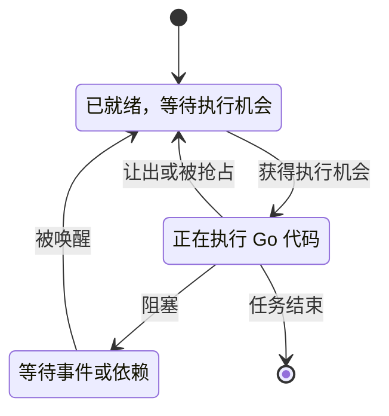

# 037 如何用 execution trace 定位调度与延迟问题？

> 难度：高级 · 分类：运行时与性能

## 简短回答

execution trace 记录 goroutine 调度、阻塞、系统调用和运行时事件的时间关系，适合解释“为什么一段时间没有推进”。它补充 profile 的聚合视角，但不等于跨服务的分布式追踪，两者需要结合请求上下文使用。

## 详细解析

### 图解：延迟要按状态分解



请求延迟可能分布在三种状态中。CPU profile 主要聚合执行成本，trace 则帮助观察状态如何随时间变化；“等待依赖”与“已经就绪但没运行”对应不同修复方向。

### 同样的慢有不同时间线

请求总耗时 300 ms，CPU 实际只执行 10 ms，剩余时间可能在等待网络、等待锁、等待调度或等待配额。CPU profile 能说明那 10 ms 在干什么，trace 更适合把其余时间拆成状态转换。

```text
请求 A：运行 5ms → 网络等待 280ms → 运行 5ms
请求 B：可运行但未获调度 250ms → 运行 10ms → 等锁 30ms

总延迟相近，但 A 优先检查依赖，B 优先检查调度资源与竞争。
```

对已有测试包，可通过 `go test -trace trace.out` 捕获运行轨迹，再用 `go tool trace trace.out` 查看。对长时间服务，runtime/trace 支持程序化采集；采集窗口应覆盖故障且控制长度，避免为了诊断增加过大 I/O 和存储压力。

### 用业务区域解释运行时事件

仅有 goroutine 编号往往难以对应到“查询库存”或“构造响应”。可以用 trace task、region 和 log 标注业务阶段，让运行时事件有可解释的上下文。标记应少而有意义，避免为每次微小循环写事件，反而淹没信息。

如果观察到大量 goroutine 已就绪却长期无法运行，继续核对 GOMAXPROCS、CPU 配额节流、长时间占用线程的调用等证据。若任务在 channel receive 上等待，应回到发送者的生命周期，不能只把结论写成“调度慢”。

trace 也不自动提供 SQL 执行计划、远端服务器内部排队或业务事务状态。跨进程部分需要分布式追踪与依赖指标补齐。完整根因通常来自多种证据相互支持。

### 用真实服务测试生成一份轨迹

先创建 `.work` 目录，在仓库根目录运行：

```sh
go test ./examples/catalog -run '^TestHTTPGRPCAndAppLifecycle$' -count=1 -trace .work/catalog-trace.out
go tool trace .work/catalog-trace.out
```

该测试启动本机 TCP 上的 Kratos HTTP/gRPC 服务，发送成功与失败请求，并验证应用关闭；因此轨迹包含真实网络与任务生命周期，但没有外部数据库或生产流量。第二条命令在本机启动轨迹查看器，查看结束后可退出工具进程。

本轮验收实际执行了采集，并用 `go tool trace -pprof=sched` 解码出调度等待 profile。文件能被解码只证明采集和格式有效，不说明这个很短的功能测试足以代表稳态性能。

### 先从一个业务问题选时间窗口

假设请求从进入到返回用了 300 ms，分布式追踪显示数据库调用只有 20 ms。先找到与请求相关的任务和 goroutine，再检查剩余窗口是在运行、通道等待、锁等待还是就绪等待。不要从全局最拥挤的区域开始就认定它属于这个慢请求。

短暂延迟尖峰可能被长窗口聚合掩盖，过短窗口又可能只截到等待中间而没有起止事件。采集时记录触发条件和业务时间点，并选择覆盖异常开始与恢复的窗口。轨迹文件很大时，先限制场景和时间范围，比无限延长采集更有效。

### task、region 与 log 应表达业务阶段

task 用于为一项逻辑工作建立上下文，region 标记有意义的代码区域，log 记录少量离散事件。可以围绕“构建报价”“查询库存”“序列化响应”设置标记，避免给每个微小函数都创建区域。

标注只帮助建立关联，不会自动把 context 变成取消机制，也不会自动采集远程服务器内部状态。多个 goroutine 协作时，需要让关联上下文沿任务传递，并让区域的开始与结束符合对应 API 的生命周期要求。框架已有的分布式 trace ID 与本地运行时标记也应区分。

### 三种时间线的判断练习

| 时间线 | 优先解释 | 后续证据 |
| --- | --- | --- |
| 很快进入网络等待，较晚被唤醒 | 外部 I/O 或依赖响应较慢 | 下游 span、网络与服务端指标 |
| 已就绪却长时间未执行 | 执行资源竞争 | CPU、GOMAXPROCS、配额节流 |
| 多个任务依次被同一锁唤醒 | 临界区串行化 | mutex profile 与持锁路径 |

这些都是待验证假设。网络等待也可能来自客户端连接获取，锁等待可能由持锁调用远端触发，不能只根据状态名称直接改参数。把事件时间线与源码、请求指标相互对照，才能还原原因。

### 修复后的验收看等待是否真正减少

使用相同输入与压力，比较目标阶段等待、请求 P99、吞吐和错误率。若提高并发让本地就绪等待减少，却使下游排队更长，整体可能反而退化。运行时 trace 是单进程证据，跨进程的因果链仍需依赖服务端与网络层数据补齐。

## 常见误区 / 面试追问

- **trace 能代替 pprof 吗？** 不能，聚合热点和事件时间线回答不同问题，按疑问选择工具。
- **一次轨迹可以说明长期性能吗？** 只能证明该窗口发生的行为，需要重复或指标趋势支持普遍结论。
- **怎样确认修复？** 在同样压力下比较等待状态占比与业务 P99，确保没有把等待转移到另一个队列。

## 参考资料

- [runtime/trace](https://pkg.go.dev/runtime/trace)
- [Go execution tracer](https://pkg.go.dev/cmd/trace)

[返回目录](../README.md) · [上一题](036-pprof.md) · [下一题](038-allocations.md)
