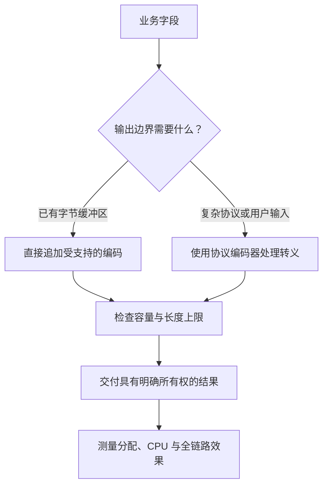

# 038 怎样减少分配、拷贝和无效格式化？

> 难度：中级 · 分类：运行时与性能

## 简短回答

先定位高频分配来源，再考虑有界预分配、直接写入目标缓冲区、复用适当临时对象和减少重复转换。优化必须保持所有权与错误语义，不能通过返回会被复用的内部切片，把分配问题换成数据损坏。

## 详细解析

### 图解：减少中间表示，而不破坏输出契约



减少临时字符串只是其中一条路径。只要协议需要转义、校验或稳定格式，就必须把这些成本包含在正确方案中，不能为了少一次分配省略。

### 消除中间表示

构造简单协议字段时，如果先格式化成字符串，再转字节，再复制到输出缓冲区，就可能产生多次中间处理。strconv 的 Append 系列可以直接把数字追加到目标切片。下面展示完整结果，不对某个编译器版本的分配次数作未经测量的承诺。

```go
package main

import (
    "fmt"
    "strconv"
)

func main() {
    out := make([]byte, 0, 32)
    out = append(out, "id="...)
    out = strconv.AppendInt(out, 42, 10)
    out = append(out, "&active="...)
    out = strconv.AppendBool(out, true)
    fmt.Println(string(out))
}
```
```output
id=42&active=true
```

如果实际协议含用户输入，仍需使用对应协议的编码器进行转义，不能照此直接拼接 URL、SQL 或 JSON。低层拼接只是实现手段，协议正确性优先。

### 预分配需要可靠上界

根据可信元素数量预留容量可减少增长复制，但把攻击者提供的长度直接交给 make，可能导致巨大分配。批量接口应限制条数与总字节量，并在预算内处理。对长期保留的小片段，主动复制可能比共享大数组更省总内存。

日志也可能制造无效格式化：如果某级别未启用，仍先构造大型字符串，就浪费 CPU 与分配。使用结构化日志并核对库的求值边界；昂贵字段计算必要时由显式级别判断保护，不能假设传入日志方法就自动延迟求值。

优化前后比较每操作分配、总 CPU 和吞吐，在真实输入分布下验证。删除一次分配但新增多次全量扫描，未必划算。若热点来自不合理算法或过多外部请求，微调缓冲区容量通常不是主要矛盾。

### 沿数据经过的表示找重复工作

假设最终要向网络写入字节，却先把整数转成字符串，再把字符串转成 []byte，最后复制进另一个缓冲区。每一步都可能有其必要性，也可能只是 API 拼接留下的中间形式。strconv.AppendInt 让整数直接追加到已有字节切片，便于把输出构建集中到一个拥有者中。

但“可能减少处理”不能写成“必然少两次堆分配”：编译器可能优化某些转换，缓冲区容量也会影响 append 是否分配。应把所有权关系与实际分配证据分开描述，参见 [017](../02-types-memory/017-escape-analysis.md)。

### 预分配的上界怎样计算

示例由固定前缀、整数文本、固定分隔符与布尔值组成，可以估计一个很小的容量。真实批量编码若包含用户字符串，仅知道条目数不够，还要计算或限制总字节量，并考虑协议转义可能扩大输出。长度相加还应避免整数溢出后得到错误的小预算。

| 情况 | 合理策略 | 需要避免 |
| --- | --- | --- |
| 元素数与长度都可控 | 适量预分配 | 每轮仍创建同样的中间对象 |
| 输入总量未知但有上限 | 增量处理并限制总大小 | 直接相信请求里的长度字段 |
| 超大输出可流式交付 | 分块编码和受控写入 | 把完整结果先堆在内存 |
| 小结果需长期保存 | 在保留边界复制 | 为零拷贝长期引用大输入 |

预分配只改变容量管理，不自动限制请求大小。若处理一百万条用户输入，每条又可引用大对象，单纯预分配结果切片仍无法控制整体内存。

### 日志调用前已经发生的计算不会自动消失

调用 logger.Debug(expensiveFormat()) 时，参数先求值。即使 Debug 级别关闭，昂贵格式化也可能已经完成。是否需要显式判断级别，要看日志库的 API 和计算成本；普通小字段没有必要层层包条件，大对象序列化或堆栈构建则可能值得保护。

结构化日志能避免手工拼接部分字符串，但它也不天然延迟所有字段求值。还应限制日志中的大型请求体，避免为观察系统复制更多数据。性能与可观测性不是互相取消，而是选择足够解释问题的字段和频率。

### 复用之前先标记最后一次读取

把输出缓冲区返回池之前，必须确认网络写入或异步消费者已经完成读取。某些 API 在调用返回时已复制或消费数据，另一些会持有引用；应按具体文档判断。为了少一次分配提前复用，可能让偶发数据损坏只在高负载下出现。

strings.Builder 适合构造字符串，但它也有使用约束，例如使用后不能随意复制 Builder 值。优化时应优先使用已存在的标准库能力，并保留其契约，而不是自行构造复杂的共享缓冲机制。

### 优化报告怎样避免只报好看的数字

同时记录每请求完成的工作、分配次数、分配字节、CPU 和 P99。若少分配是通过多遍扫描换来的，需要看到 CPU 代价；若吞吐提高却扩大缓存和峰值内存，也要说明容量成本。算法级冗余或过多外部调用优先于微调格式化，因为它们可能决定更大的成本上限。

## 常见误区 / 面试追问

- **所有 fmt 都要替换吗？** 不应机械替换，只有热点且替代实现保持可读性时才值得。
- **对象池总能减少内存吗？** 可能长期保留大容量，参见 [034](034-sync-pool.md)。
- **如何选择优化顺序？** 先去掉不必要工作，再优化数据访问和分配，最后才考虑受控的底层技巧。

## 参考资料

- [strconv.AppendInt](https://pkg.go.dev/strconv#AppendInt)
- [strings.Builder](https://pkg.go.dev/strings#Builder)

[返回目录](../README.md) · [上一题](037-trace.md) · [下一题](039-capacity.md)
