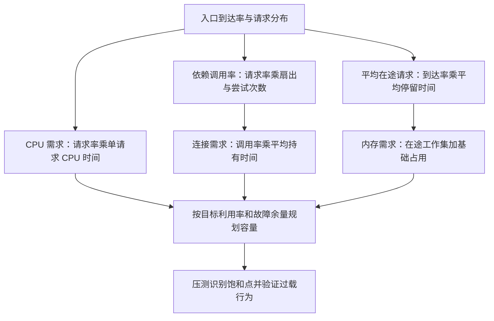

# 039 QPS、并发数与延迟如何做容量估算？

> 难度：高级 · 分类：运行时与性能

## 简短回答

在稳定系统和一致统计边界下，平均在途数量约等于平均到达率乘平均停留时间，即 L = λW。它帮助把吞吐和资源占用联系起来，但不能用 P99 直接替代平均值，也不能凭此推断饱和系统仍能稳定处理所有流量。

## 详细解析

### 图解：按资源边界分别计算

每条边都要统一单位和统计边界。请求在途量、数据库连接数和 CPU 核心需求不是同一个数，不能算出一个并发值后到处复用。

### 先算请求，再算依赖

若系统稳定完成 2000 请求每秒，平均每个请求停留 50 ms，则平均在途请求约为 2000 × 0.05 = 100。每个请求若并行访问两个依赖，不能直接把 100 当成数据库连接数；要单独统计每个依赖的到达率和持有时间。

假设每请求执行两次数据库操作，每次平均占用连接 10 ms，则依赖到达率约为 4000 次每秒，平均繁忙连接约为 40。这个数字是平均占用估计，不是把连接池设成 40 就一定满足尾延迟：突发、事务、慢查询和不均匀分布都需要余量。

| 预算项 | 计算或证据 | 易漏因素 |
| --- | --- | --- |
| CPU | 每请求 CPU 时间 × 吞吐 | GC、序列化、重试 |
| 内存 | 基础占用 + 在途请求工作集 | 大请求、缓存、队列 |
| 下游连接 | 到达率 × 平均占用时间 | 长事务、实例总数 |
| 出站调用 | 请求数 × 扇出 × 尝试次数 | 多层重试放大 |

### 饱和后排队改变一切

到达率长期超过完成率，队列就持续增长，平均停留时间也不再稳定。此时继续增加队列容量只是延迟拒绝并增加超时。应降低准入、提高瓶颈处理能力或减少单位请求成本，而不是继续用稳态公式包装不稳定系统。

容量验证要逐步增加负载，观察吞吐何时不再线性增长、P99 何时陡升，以及哪个资源先饱和。还要测试一个实例或依赖失效后的剩余容量，不能只在全部节点健康时刚好达标。

### 完整算例：健康容量与故障容量

假设稳定请求率为 2000/s，单请求实测平均 CPU 时间为 2 ms，暂不考虑测量之外的额外工作，则需求约为 4 个持续繁忙的 CPU 核心。若目标利用率为 70%，需要约 4/0.7，即 5.72 核的可用能力。这是估算输入，不是本仓库的性能实测。

部署三个各有 2 核的实例，正常时约有 6 核，满足这个平均目标；损失一个实例后只剩 4 核，理论利用率达到 100%，没有突发与额外工作余量。若希望损失一个实例后仍保留约 6 核，就至少要按四个 2 核实例的这个模型重新规划。真实上限还取决于负载分配和共享依赖。

### 连接预算必须看全部实例

假设数据库给这组应用的安全连接预算是 80，而应用有四个实例，那么每实例最大 20 是一个可解释的总额拆分起点。若自动扩到八个实例却保留每实例 20 的配置，理论连接上限就变成 160，应用扩容可能压垮共享数据库。

平均繁忙连接只有 40 不代表峰值上限就应设成 40；也不代表可以无限加大到 400。应结合事务持有时间分布、数据库实际服务能力、其他客户端预算和故障切换时的连接重建。应用侧等待和数据库侧排队需要一起观察。

### 重试怎样放大原有模型

每个入口请求扇出两次调用，平均每次逻辑调用尝试 1.2 次，则依赖请求率约为 2000 × 2 × 1.2 = 4800/s。若依赖变慢又触发更多重试，尝试次数与等待时间可能同时上升，形成正反馈。不能把健康状态下的单次调用成本直接用于故障容量估算。

当到达率为 2500/s、系统持续完成能力只有 2000/s 时，若没有拒绝、取消和丢弃，积压每秒约增加 500 项。五秒就增加约 2500 项。此时系统不满足稳定条件，不能继续用一个固定平均等待时间解释所有请求；应采取准入、削峰或增加瓶颈能力。

### 负载发生器也可能掩盖饱和

若压测工具必须等上一请求返回才发下一请求，服务变慢后施加的请求率也会下降。这种闭环负载能模拟一类客户端，但不能直接证明系统承受固定外部到达率。应记录计划发送率、实际发送率、完成率、拒绝率和客户端自身瓶颈。

尾延迟统计还要明确超时请求如何计入。如果只统计成功响应，系统大量快速拒绝或让最慢请求超时后，成功请求的 P99 可能变好。容量验收应同时包括完成量与失败比例，不能挑一个好看的延迟指标。

### 练习：从三个数字推导下一项证据

给定请求率、平均停留时间和实例数量，先估算每实例平均在途量；再根据扇出和依赖持有时间算连接；最后加入单实例失效后的资源余量。能解释假设失效时如何重新测量，比仅背 L=λW 更有价值。所有模型都应由逐步增压、故障注入和恢复验证闭合，而不是代替这些验证。

## 常见误区 / 面试追问

- **为什么平均延迟很低仍然超时多？** 长尾和突发可能被平均值掩盖，应同时看分布与时间窗口。
- **扩容应用一定增加吞吐吗？** 共享数据库或缓存已经饱和时，更多实例可能只增加连接与竞争。
- **怎样估算重试成本？** 使用真实尝试次数分布，按依赖分开计算，参见 [075](../08-microservices/075-budgets.md)。

## 参考资料

- [Google SRE：处理过载](https://sre.google/sre-book/handling-overload/)
- [Google SRE：分布式系统监控](https://sre.google/sre-book/monitoring-distributed-systems/)

[返回目录](../README.md) · [上一题](038-allocations.md) · [下一题](040-tail-latency.md)
