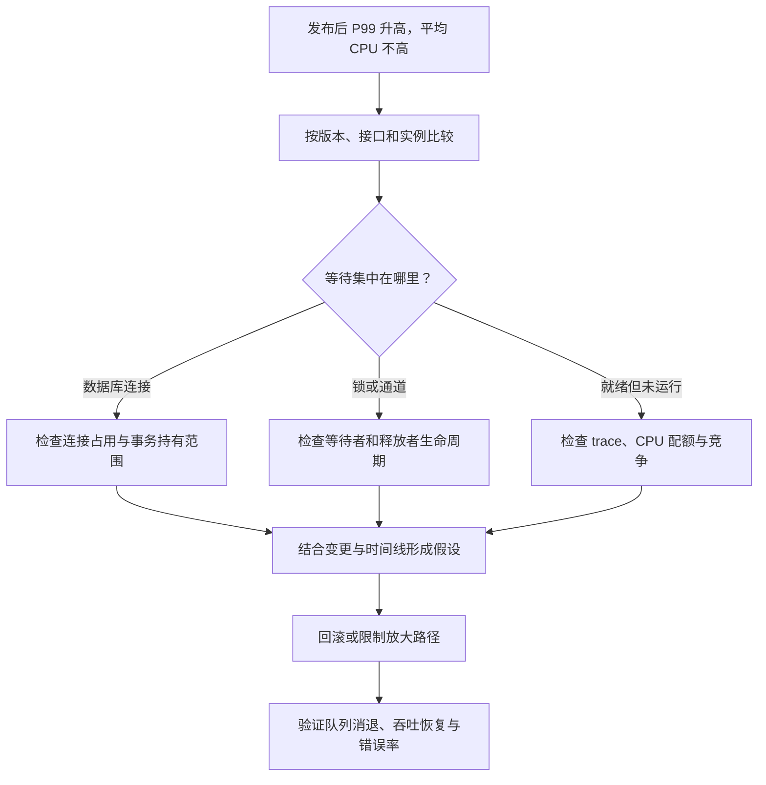

# 040 场景题：CPU 不高但 P99 激增，如何排查？

> 难度：高级 · 分类：运行时与性能

## 简短回答

CPU 不高只能说明没有持续消耗大量计算资源，不能排除排队、连接池、锁、外部依赖或容器节流。先定位延迟发生在哪一段，再用对应指标和堆栈验证假设；止血要控制流量与故障放大，而不是立即增加 goroutine。

## 详细解析

### 图解：沿证据定位等待，再决定止血

每个分支都是需要进一步验证的假设。不能看到 CPU 低就直接扩并发，也不能看到连接等待就立即把连接池调大。

### 场景与第一轮证据

假设发布后 P99 从 80 ms 升到 2 s，平均 CPU 只有 30%，请求量没有明显增长。先比较版本、接口、实例和依赖维度，确认是否只影响新版本或特定路由；同时检查错误率、超时率和重试次数，避免把大量快速失败误认为平均延迟改善。

| 观察 | 要验证的假设 | 下一份证据 |
| --- | --- | --- |
| DB 等待次数明显上升 | 连接池等待 | InUse、WaitDuration、长事务 |
| goroutine 堵在 Lock | 共享锁竞争 | mutex profile、持锁代码 |
| 依赖 span 变长 | 外部服务或网络慢 | 依赖自身指标、超时预算 |
| 可运行任务迟迟不执行 | 配额节流或调度竞争 | trace、容器 throttling |

### 按时间线而不是猜测处理

若堆栈显示请求大多等待连接，而变更引入“事务内调用远程风控”，就有可解释链条：远程变慢 → 事务持有连接更久 → 空闲连接减少 → 新请求排队 → P99 上升。CPU 低与此完全一致，因为线程主要在等待。

止血可回滚相关变更、限制该接口并发、缩短依赖等待并暂停无效重试。增加连接池前必须核对数据库剩余容量；否则把应用排队搬到数据库并可能扩大故障。

修复应缩短事务持有范围，重新设计跨系统一致性需求，不能简单在事务外调用后假装拥有原来的原子性。补充针对慢依赖的验证：在相同负载下观察连接等待、活跃事务、P99 和失败比例是否恢复。

### 结束条件

服务恢复不仅是错误率暂时下降，还包括队列消退、连接回归、后台任务退出，以及恢复正常流量后指标稳定。保留故障窗口证据，记录触发条件和能够提前预警的指标。

### 模拟现场：事务内多了一次远程等待

以下是教学用模拟数据，**不是生产日志，也不是本仓库连接真实数据库的测试结果**。入口约 500 请求每秒，连接池上限 50；旧版本事务平均持有连接 10 ms，新版本在事务内增加风控调用，依赖异常时平均持有时间升到约 500 ms。

| 证据 | 旧版本 | 异常窗口 | 解释方向 |
| --- | --- | --- | --- |
| 事务平均持有时间 | 约 10 ms | 约 500 ms | 单请求占用连接显著变长 |
| DB InUse | 通常远低于上限 | 长期接近 50 | 池内资源被占住 |
| 等待计数与等待时间增量 | 较低 | 持续增加 | 新请求在池外排队 |
| 风控 span | 较短 | 明显变长 | 与事务持有延长时间一致 |
| CPU | 未饱和 | 仍未饱和 | 大量时间在等待而非计算 |

按粗略稳态模型，500/s × 0.5s 需要约 250 个平均繁忙连接，而池中只有 50；在每项平均持有 0.5s 的理想化条件下，池最多支持约 100 项/s。若无限等待，入口与完成能力的差额会不断积压。真实系统还会因超时和拒绝改变这些数值，因此应观察实际完成率。

### 从指标走到源码的证据链

先在异常窗口采集 goroutine 堆栈，确认等待点属于获取数据库连接，而不是 SQL 执行本身。再对照慢请求追踪，看风控 span 是否位于事务开始与提交之间。最后检查发布差异，确认新代码确实扩大了事务持有范围。三层证据相互支持，才足以把根因缩小到具体变更。

DBStats 中 WaitCount、WaitDuration 是累计统计，应看相同时间窗口的增量，而不是把进程启动以来的大数字当作当前故障强度。用增量比值推算等待均值时还要注意跨窗口开始和结束的等待，不能把它当作每个请求的精确时延。

### 为什么几个直觉修复可能更糟

直接扩大连接池可能把排队转移到数据库，让其 CPU、锁和磁盘一起饱和；在入口重试会增加请求量；缩短客户端超时却不取消下游，会让已经没人等待的事务继续占连接。每项止血措施都应说明减少了哪类占用，并监控是否把压力转移到别处。

优先回滚已确认的变更，或限制受影响接口的并发与无效重试。若把风控移到事务外，必须重新审查它与库存、价格状态之间的一致性：事务缩短了，但不能假装跨系统判断仍拥有原来的原子语义。必要时使用版本校验、预留或后续补偿协议。

### 恢复验收与复发防护

在相同到达率下，确认连接占用不再顶满、等待增量回落、完成率恢复、P99 与错误率共同达标；随后逐步恢复限流，观察积压是否重新出现。只看到 CPU 更低或健康检查成功，不足以结束事件。

回归场景应包含风控变慢、超时、取消和恢复，检查事务持有范围及等待任务是否退出。将事务耗时与依赖耗时关联告警，可以比单独监控数据库 CPU 更早发现同类问题。这份题目训练的是证据链与验证设计，不声称仓库已经部署了该故障环境。

## 常见误区 / 面试追问

- **CPU 低就扩并发吗？** 先识别等待资源，更多并发可能增加排队和内存。
- **先优化 JSON 可以吗？** 若证据显示主要等待数据库，优化编码对两秒尾延迟帮助有限。
- **为什么不一开始就全量抓 profile？** 先用指标定位方向，再采集相关证据，减少干扰与无效数据。

## 参考资料

- [Go 诊断指南](https://go.dev/doc/diagnostics)
- [database/sql.DBStats](https://pkg.go.dev/database/sql#DBStats)

[返回目录](../README.md) · [上一题](039-capacity.md) · [下一模块](../05-backend-api/041-http-lifecycle.md)
