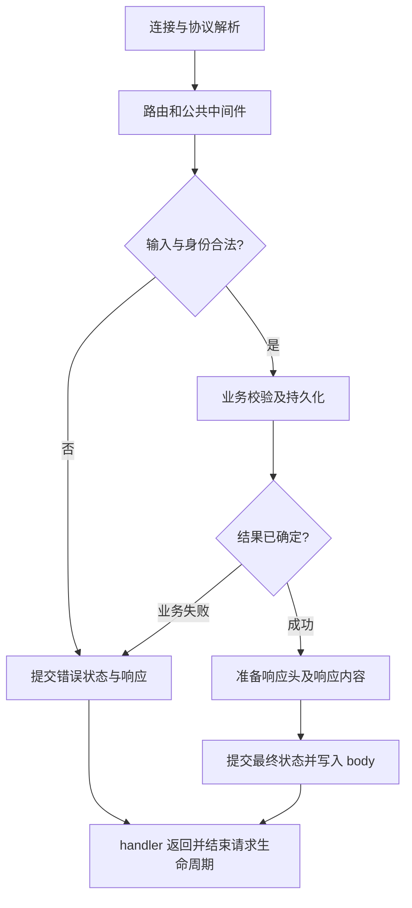

# 041 一次 HTTP 请求在 Go 服务中经历哪些阶段？

> 难度：基础 · 分类：后端接口

## 简短回答

服务接受连接、解析请求、匹配路由并调用 handler，handler 完成校验、业务调用和响应编码。请求处理可以并发发生，共享依赖要保证并发安全；handler 返回后不能继续使用 ResponseWriter 写响应。

## 详细解析

### 路由到响应的最短完整链路

下面使用标准库路由和 httptest 验证一次请求，不启动长期后台进程。方法和路径参数写法要求 Go 1.22 及以上，本课程基线满足要求。

```go
package main

import (
    "fmt"
    "net/http"
    "net/http/httptest"
)

func main() {
    mux := http.NewServeMux()
    mux.HandleFunc("GET /orders/{id}", func(w http.ResponseWriter, r *http.Request) {
        w.Header().Set("Content-Type", "text/plain; charset=utf-8")
        fmt.Fprint(w, r.PathValue("id"))
    })
    recorder := httptest.NewRecorder()
    mux.ServeHTTP(recorder, httptest.NewRequest("GET", "/orders/A1", nil))
    fmt.Println(recorder.Code, recorder.Body.String())
}
```
```output
200 A1
```

这个验证覆盖路由、handler 和响应，不覆盖真实 TCP、TLS 或代理行为。不同层次需要不同证据，不能把 handler 测试通过写成真实网络部署已经验证。

### 响应提交是重要边界

第一次 Write 通常会隐式提交成功状态；如果之后才发现业务错误，不能随意改写为错误状态。因此应在提交前完成必要校验与可能失败的响应准备。对于流式输出，必须接受部分响应已发送的事实，并通过协议定义中途失败如何表达。

请求体的大小、读取耗时和编码格式都要在边界限制，不能让不可信输入无限占用内存。业务函数应使用请求 context，使客户端离开或期限到达后能停止无效工作。

共享 map、缓存和业务服务不是每个请求自动独享。即使路由注册阶段没有并发，运行时 handler 会同时调用这些对象，需要明确同步和只读发布规则。连接复用、HTTP/2 多路复用等也让“一个连接等于一个请求 goroutine”的简单模型不可靠。

### 沿着一个创建订单请求定位责任

假设 `POST /orders` 收到合法身份和一份 JSON。入口先限制 body，再解码和校验；业务层检查商品是否可售，仓储层提交订单；最后协议层把结果转换成响应。这个分层不是要求每一步都建一个包，而是让错误有明确的归属：JSON 语法错误不应进入事务，库存不足也不应伪装成解码失败。



图里的“提交”有两种完全不同的含义：数据库提交决定订单是否存在，HTTP 提交决定客户端能看到什么状态。两者之间可能断网。若订单已经落库而响应丢失，日志中的写失败不能把订单事实改成失败；客户端重试必须依靠 [047 幂等设计](047-idempotency.md) 恢复结果。

| 出错位置 | 还能改变 HTTP 最终状态吗 | 应保留的业务事实 |
| --- | --- | --- |
| 解析请求体时 | 尚未提交时可以 | 未开始创建订单 |
| 事务明确回滚后 | 尚未提交时可以 | 本次事务没有生效 |
| 数据库提交成功、编码前 | 尚未提交时可以 | 订单已经存在 |
| 响应写出一部分后 | 不能重新发送另一个最终状态 | 结果可能已成功，客户端接收不完整 |

普通小型 JSON 响应可以先编码到受限缓冲区，编码成功再设置最终状态，减少“200 已发出但编码失败”的窗口。它增加一次缓冲，适合小响应；大文件和事件流应使用自己的结束标记、校验或恢复协议，不能照搬整包缓冲。写入返回成功也只说明这次写操作成功，不能证明对端业务代码已经处理响应。

### 请求结束时，哪些对象还活着

请求 context 和 ResponseWriter 属于请求生命周期；连接池、只读配置快照等通常属于应用生命周期。把前者保存到后台任务中，会让任务在 handler 返回后拿到已取消的 context，或者非法继续写响应。需要持续执行的任务应先持久化任务身份，再由独立生命周期的执行器处理，并让客户端查询任务状态。

练习时可以为同一 handler 增加三条路径：非法 ID、不存在的订单、成功结果。分别核对状态码、body 和仓储调用次数；非法输入应当零次访问仓储。再用真实监听器测试客户端提前断开，观察下游是否收到取消。前一组证明协议到业务的分支，后一组才涉及网络取消传播，不能互相替代。

## 常见误区 / 面试追问

- **handler 里再开 goroutine 就更快吗？** 只在独立工作确实可并发时考虑，并且返回前管理其生命周期。
- **ResponseWriter 可以长期保存吗？** 不可以在 handler 返回后继续使用，后台任务结果应通过其他持久或异步通道提供。
- **如何避免到处重复协议处理？** 用中间件处理共性边界，把业务规则留在业务层，参见 [043](043-middleware.md)。

## 参考资料

- [net/http.Handler](https://pkg.go.dev/net/http#Handler)
- [net/http.ServeMux](https://pkg.go.dev/net/http#ServeMux)

[返回目录](../README.md) · [下一题](042-http-timeouts.md)
