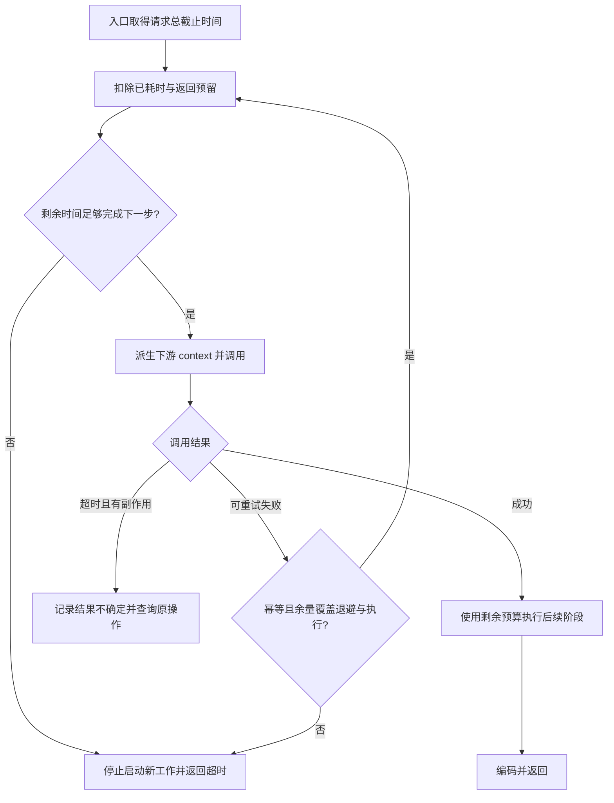

# 042 HTTP 服务端与客户端超时应该如何配置？

> 难度：中级 · 分类：后端接口

## 简短回答

超时要覆盖连接、请求头、请求体、业务执行、下游调用和响应读取等不同阶段。服务端读写超时不等于自动终止业务函数；客户端整体超时与请求 context 应共同受调用链预算约束，不能每层都独立等待同样的长时间。

## 详细解析

### 先画出时间预算

假设接口总预算 800 ms，入口解析和返回预留 100 ms，核心业务可使用 700 ms；其中两个串行依赖应在这 700 ms 内分配，而不是各自再拿 800 ms。重试同样消耗剩余预算，不能把第一次失败后的时间当成重新开始。

| 设置 | 主要约束 | 不代表什么 |
| --- | --- | --- |
| ReadHeaderTimeout | 读取请求头 | 不等于整个业务超时 |
| ReadTimeout | 读取请求含请求体 | 不适合脱离上传场景照抄 |
| WriteTimeout | 响应写入期限 | 不会强杀 handler 中的计算 |
| IdleTimeout | keep-alive 空闲等待 | 不限制活跃请求总时长 |
| Client.Timeout | 整次请求含响应体读取 | 不适合所有长流式响应 |

具体作用阶段还受协议与实现影响，配置后必须用实际网络测试验证慢请求头、慢请求体、慢下游与慢读取客户端，不能只读取结构体字段就宣称生效。

### context 管理业务等待

handler 从请求 context 派生业务期限，并把它传给数据库和出站请求。即使客户端已因超时返回，远端仍可能完成副作用，因此调用方需要幂等和状态查询来处理结果不确定性。

客户端应复用 Client 与 Transport，避免每请求重新建立连接池。Response.Body 需要按约定关闭；为了复用连接而读取响应体时也必须有大小限制，不能对不可信无限响应无界 drain。对于流式接口，采用与业务协议匹配的连接和空闲期限，而不是简单设置一个很短的整体超时。

诊断时区分连接建立慢、等待响应头慢、读取 body 慢和应用排队慢，才能调整正确参数。盲目把所有超时调大，会让故障期间占用更多在途资源。

### 把 800 ms 预算分到真实阶段

下面是教学预算，不是通用推荐参数：入口校验 50 ms，商品查询最多 200 ms，订单事务最多 400 ms，编码与网络返回预留 150 ms。若查询提前结束，余量是否可以交给事务由业务策略决定；无论怎样分配，子调用的截止时间都不能超过父请求。

例如商品查询已经用了 190 ms，入口用了 50 ms，那么总预算还剩 560 ms。保留返回的 150 ms 后，事务可用最多 410 ms；这里按自身上限只给 400 ms。若入口排队意外多花 300 ms，就不应仍机械地给事务完整 400 ms。请求期限只能约束传递了它、且能够响应取消的工作；一段不检查取消的 CPU 循环不会因此被强制中断。

“超时”还包含三个时刻：调用者停止等待、连接读写失败、远端实际停止处理。它们未必同时发生。付款请求在 300 ms 超时，但支付方在 310 ms 提交成功，是完全可能的故障窗口；把客户端错误翻译成“支付失败，可以换键再付”会制造重复扣款。

### 怎样识别设置错了哪一层

| 观察到的现象 | 优先检查 | 不应直接下的结论 |
| --- | --- | --- |
| 很多连接长期没有完整请求头 | 请求头读取期限及入口连接资源 | 业务 SQL 一定慢 |
| 上传途中断开 | 请求体读取预算与上传大小 | 服务端业务函数一定已退出 |
| 下游迟迟不返回响应头 | 拨号、TLS、响应头等待及服务端排队 | 只需调大整体超时 |
| 已收到头但 body 卡住 | body 读取、流式协议和客户端总期限 | Client.Do 返回就表示响应结束 |

具体诊断可以给出站调用接入 `httptrace`，拆开 DNS、建连、连接复用和首字节等待。它回答传输阶段发生了什么，业务排队仍要靠服务端指标或 trace span。记录超时原因时保留 `errors.Is(err, context.DeadlineExceeded)` 等分类信息，不要只输出统一的“请求失败”。

验证方案应人为控制慢点：测试服务收到请求后先发“已进入”信号，再阻塞响应；客户端带期限调用，服务端观察 context 取消并确认任务退出。不要仅用一个随机 sleep 后断言“应该已经停止”，也不要把只测 ResponseRecorder 的结果当成套接字期限生效。本题没有执行这些故障网络实验，给出的数值用于预算推演。

## 常见误区 / 面试追问

- **WriteTimeout 到期后业务一定停止吗？** 不一定，业务必须主动响应取消或依赖自身的中断机制。
- **超时返回可以立即重试写请求吗？** 先确认幂等与结果查询策略，避免第一次已经成功而重复写入。
- **为什么不用零值配置直接上线？** 许多超时零值表示无该项限制，应根据公开入口与业务负载设明确预算。

## 参考资料

- [http.Server 超时字段](https://pkg.go.dev/net/http#Server)
- [http.Client.Timeout](https://pkg.go.dev/net/http#Client)
- [httptrace：HTTP 客户端传输追踪](https://pkg.go.dev/net/http/httptrace)

[返回目录](../README.md) · [上一题](041-http-lifecycle.md) · [下一题](043-middleware.md)
