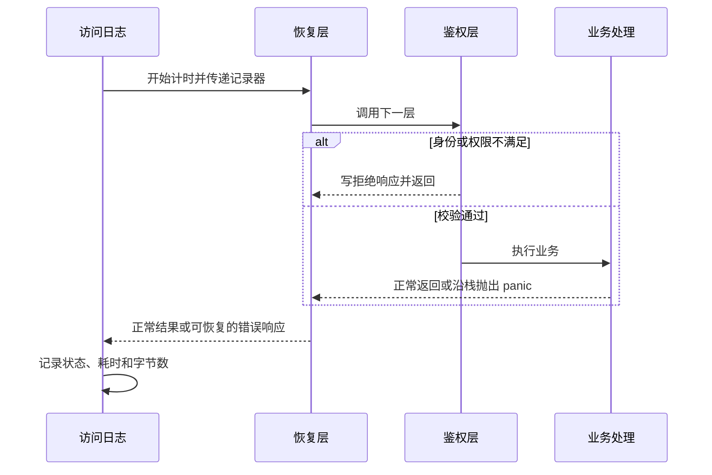

# 043 中间件的执行顺序如何影响日志、鉴权和恢复？

> 难度：基础 · 分类：后端接口

## 简短回答

中间件通常把一个 handler 包成另一个 handler，形成进入时由外到内、返回时由内到外的调用链。顺序决定哪些请求被记录、哪些 panic 能被恢复、拒绝请求是否仍计入指标，必须按实际包裹关系验证。

## 详细解析

### 用可执行输出确认顺序

```go
package main

import (
    "fmt"
    "net/http"
    "net/http/httptest"
)

func wrap(name string, next http.Handler) http.Handler {
    return http.HandlerFunc(func(w http.ResponseWriter, r *http.Request) {
        fmt.Println(name, "enter")
        defer fmt.Println(name, "exit")
        next.ServeHTTP(w, r)
    })
}

func main() {
    endpoint := http.HandlerFunc(func(http.ResponseWriter, *http.Request) {
        fmt.Println("handler")
    })
    h := wrap("outer", wrap("inner", endpoint))
    h.ServeHTTP(httptest.NewRecorder(), httptest.NewRequest("GET", "/", nil))
}
```
```output
outer enter
inner enter
handler
inner exit
outer exit
```

日志与指标放在鉴权外侧，可以记录被拒绝的请求；鉴权必须在执行业务副作用之前。恢复边界能捕获它包裹的调用中、同一 goroutine 的 panic，但捕获不到另外启动的 goroutine，也不能修复已经提交的业务状态。

### 指标记录也有协议细节

想记录真实状态码，需要包装 ResponseWriter，正确处理隐式 200、重复 WriteHeader 与已写入字节数。包装还可能影响 Flusher、Hijacker 等可选接口；流式接口因此需要核对能力传递，不能只写一个嵌入字段就认为所有行为保持不变。

恢复中间件若在响应已经开始后才遇到 panic，无法可靠地把已发送成功响应改成完整错误 JSON。应记录失败并按协议终止或发送流内错误，而不是把错误文本直接拼到正常 JSON 后面。

中间件适合追踪、日志、认证等横切能力，不适合隐藏订单状态机和库存扣减。否则业务规则依赖注册顺序，单元测试也很难表达完整前提。

### 先决定要记录什么，再决定包裹顺序

假设目标是“包括鉴权拒绝和业务 panic 在内，每个进入应用的请求都生成一条完成记录”。一种可分析的链路是 `access(recovery(auth(handler)))`：访问日志先进入，恢复层包住鉴权和业务，最后日志读取恢复层写出的最终状态。这个顺序仍不能覆盖访问日志自身在恢复层之外发生的 panic，因此日志层本身应保持简单，并明确框架的最后一道恢复边界。



如果写成 `recovery(access(auth(handler)))`，业务 panic 展开调用栈时，访问日志的 defer 会先执行，恢复层随后才写 500。日志若在这个 defer 中立即读取状态，可能记录成“尚未写入”或误判为 200。问题不是某个名称必须永远排第一，而是记录时刻和错误转换时刻之间存在依赖。为了解决它可以调整层次，也可以设计显式结果记录，但不能凭一张固定排序表断言所有框架都正确。

### 包装 ResponseWriter 时核对协议能力

状态记录器至少要考虑：第一次普通 Write 触发隐式 200、最终状态只能提交一次、实际写入字节数取返回值而非参数长度。更完整的实现还要区分 1xx 信息响应与最终响应；把所有 WriteHeader 都视为最终提交，会在 103 Early Hints 等场景误记状态。

嵌入一个静态类型为 `http.ResponseWriter` 的字段，只会提升该接口声明的方法，不会自动让包装器拥有底层对象的 Flusher 等全部可选能力。可为 ResponseController 提供 `Unwrap() http.ResponseWriter` 让它向下查找；但其他代码直接做接口断言时，仍需单独核对，不能把 Unwrap 当成所有库通用的能力转发。

测试中除了正常返回，还应覆盖以下输入，逐项说明实际执行了哪些层：

| 分支 | 要核对的证据 |
| --- | --- |
| 鉴权拒绝 | handler 调用次数为零，完成日志仍产生 |
| 写响应前 panic | 恢复结果和访问日志状态一致 |
| 写出部分 body 后 panic | 不拼接第二份 JSON，不伪称完整 500 |
| 流式 handler | Flush 能到达底层，错误能向上传递 |

本题的小程序验证了普通进入和退出的顺序；上表是扩展验证目标，不是已经运行过的完整中间件框架测试。面试时先在纸上写出实际嵌套表达式，再按入栈、出栈推演，比背“日志、鉴权、恢复”的名称顺序更可靠。

## 常见误区 / 面试追问

- **恢复放最外层一定最佳吗？** 要明确它是否需要覆盖其他中间件的 panic，以及日志如何记录恢复后的结果，再验证具体链路。
- **链式配置的书写顺序就是执行顺序吗？** 取决于框架如何折叠调用链，应读源码或用小测试核对。
- **鉴权失败直接 return 就够了吗？** 还要提交明确的错误状态与响应，并确认没有继续调用 next。

## 参考资料

- [http.Handler](https://pkg.go.dev/net/http#Handler)
- [http.ResponseController](https://pkg.go.dev/net/http#ResponseController)

[返回目录](../README.md) · [上一题](042-http-timeouts.md) · [下一题](044-rest.md)
