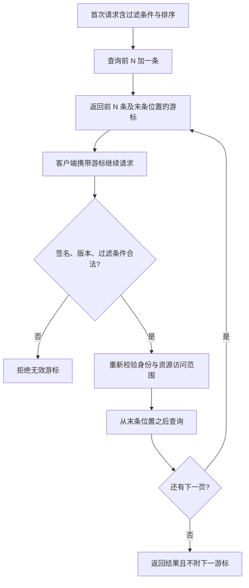

# 044 REST API 如何设计资源、状态码与分页？

> 难度：基础 · 分类：后端接口

## 简短回答

API 应围绕稳定资源和清晰操作语义设计，状态码表达协议级结果，业务错误码补充具体原因。分页必须定义稳定排序、过滤条件与游标含义，不能只加 page 和 size 就认为结果在并发写入时仍稳定。

## 详细解析

### 以订单资源建立契约

| 请求 | 意图 | 一种合理响应 |
| --- | --- | --- |
| POST /orders | 创建订单 | 201 与资源位置 |
| GET /orders/A1 | 查询订单 | 200 或不存在状态 |
| POST /orders/A1/cancel | 发起取消动作 | 同步结果或 202 接受处理 |
| GET /orders?after=游标 | 按约定顺序取下一页 | 列表与下一游标 |

取消涉及状态机和外部副作用，不必为了形式上的“全是 CRUD”把它伪装成任意字段更新。202 只表示已接受，客户端需要状态查询或通知机制确认最终结果；不能把它解释为订单已经取消。

身份无效与权限不足应区分，资源冲突与服务器异常也应区分。不要所有结果都返回 200 再让客户端猜测 body，因为代理、监控和通用客户端也需要正确理解请求结果。

### 游标必须绑定排序和查询条件

按 `(created_at, id)` 降序分页，比只按 created_at 更能处理时间相同的多条记录。游标包含最后一个排序位置，下一页沿同一顺序继续查询；过滤条件改变后不应继续使用旧游标。游标可签名或由服务端管理以防篡改，但仍需重新执行授权检查。

游标分页减少深 offset 扫描，并不天然提供跨多页快照。读分页期间发生插入、删除或排序字段更新，仍需定义用户可接受的一致性；导出账目等要求完整快照的任务，需要数据库快照或专用导出流程。

接口设计还需确定时间格式、金额单位、字段缺省和版本演进策略。先给具体请求与响应示例，再让客户端和服务端实现它，比仅列一套命名规范更能减少歧义。

### 用并发插入推演分页，而不是只看静态列表

假设订单按创建时间和 ID 降序排列为 A、B、C、D，每页两条。第一次返回 A、B 后，新订单 X 插到最前面；第二页若用 `offset=2`，现在跳过的是 X、A，于是 B 再出现一次。游标记住 B 的排序位置，下一页只取严格小于 B 的记录，可以避开这个特定的重复窗口。



对于非空的 `created_at` 和唯一 ID，查询可以表达为下面的参数化 SQL。这里只说明 PostgreSQL 查询形状，没有声称已连接数据库执行；实际计划取决于索引、数据分布和过滤条件。

```sql
SELECT id, created_at, status
FROM orders
WHERE tenant_id = $1
  AND (created_at, id) < ($2, $3)
ORDER BY created_at DESC, id DESC
LIMIT $4;
```

其中 `$4` 可取受上限约束的 `page_size + 1`，多出的一条只用于判断是否有后续数据。若排序字段允许修改，一条已读订单可能移动到游标后面而再次被读到；因此“按位置继续”不能替代快照隔离。分页接口还应规定游标过期后的恢复方式，不能把失效游标静默当成第一页，令调用者误以为自己读完了全部数据。

### 用状态码和版本条件表达冲突

考虑用户打开订单详情后停留一分钟，再点击修改收货地址。如果这期间订单已经发货，服务端必须在业务状态检查后拒绝，而不是因为请求格式正确就返回成功。409 可以表达与当前资源状态冲突；若 API 使用 ETag 和 `If-Match` 做条件更新，前置条件不满足应按协议返回 412。两种响应对应的契约不同，不应随机挑一个错误码。

| 客户端看到的结果 | 应理解成什么 | 后续动作 |
| --- | --- | --- |
| 201 和资源位置 | 新资源已创建 | 保存资源 ID |
| 202 和任务查询地址 | 已接收处理请求 | 继续查询任务状态 |
| 409 业务状态冲突 | 当前状态不支持该操作 | 重新获取状态或改变操作 |
| 412 前置条件失败 | 客户端版本条件已过时 | 重新读取后决定是否提交 |

接口契约的练习可以要求两个人独立实现客户端和服务端，只共享请求响应文档：他们是否对空列表、页尾、无权限、重复取消、时间时区和金额单位得出相同理解？如果还需要口头补充“这里默认是分”，说明协议没有写完整。丰富的 REST 答案应落到这些可互操作行为，而不只是 URL 是否用了名词。

## 常见误区 / 面试追问

- **PUT 与 PATCH 都是更新，能随意互换吗？** 不能，应遵守替换与部分修改的协议契约，并明确字段缺失语义。
- **GET 可以顺手扣一次库存吗？** 不应把有业务副作用的动作放进安全读取语义，缓存和重试可能造成意外执行。
- **总数必须每页返回吗？** 精确 count 可能昂贵，产品不需要时可只给 has_more；不要隐藏其成本。

## 参考资料

- [RFC 9110：HTTP 语义](https://www.rfc-editor.org/rfc/rfc9110.html)
- [Google API 设计：分页](https://google.aip.dev/158)

[返回目录](../README.md) · [上一题](043-middleware.md) · [下一题](045-json.md)
