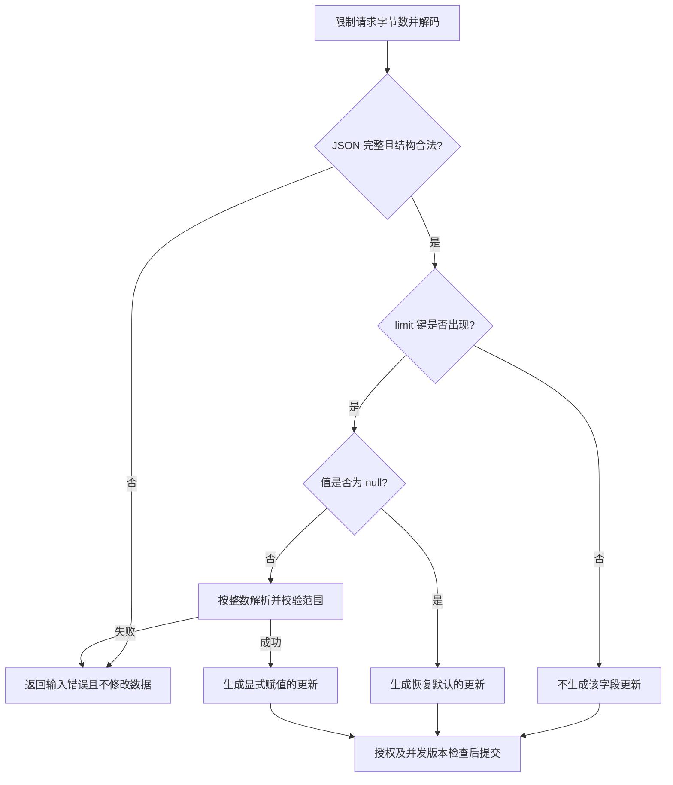

# 045 JSON 的零值、缺省与 null 如何表达？

> 难度：中级 · 分类：后端接口

## 简短回答

普通数值字段无法区分“未提供”与“提供零”；指针可以区分零与 nil，但对新建目标对象，字段缺失与显式 null 都可能得到 nil。若协议需要三态，使用显式存在标记或 RawMessage 检查，避免把更新请求误解为全量覆盖。

## 详细解析

### 先写业务语义，再选 Go 类型

更新限额时，缺失可以表示保持原值，零表示禁止使用，null 可以表示恢复默认。三者含义不同，单个 int 或 *int 都不足以完整表达。下面通过映射检查键是否存在，展示三态信息如何保留。

```go
package main

import (
    "encoding/json"
    "fmt"
)

func main() {
    for _, input := range []string{`{}`, `{"limit":null}`, `{"limit":0}`} {
        var fields map[string]json.RawMessage
        if err := json.Unmarshal([]byte(input), &fields); err != nil { panic(err) }
        raw, exists := fields["limit"]
        fmt.Printf("%t %s\n", exists, raw)
    }
}
```
```output
false 
true null
true 0
```

实际更新入口应进一步验证允许的键、null 是否被协议允许、数值范围和授权，不能因为 RawMessage 可容纳任意内容就把它直接传进数据库。

### 解码严格性也是契约

对请求体先限制大小，再决定是否 DisallowUnknownFields。严格拒绝未知字段能发现拼写错误，但滚动升级与不同版本客户端可能需要兼容策略。Decoder.Decode 成功读取一个值后，还要确认后面没有第二个 JSON 值或额外垃圾，不能把“第一次解码成功”等同于整个请求合法。

动态解码到 any 时，数字默认可能变成 float64，大整数精度可能丢失；可以使用 UseNumber，再按业务类型解析并检查范围。标识符若在多语言客户端间传递，也应明确整数与字符串的协议选择。

omitempty 是编码规则，不是“字段有没有被用户提供”的历史记录。不要复用已有对象反复解码不同更新请求，否则未出现的字段可能保留旧值，引入跨请求污染。

### 从三态输入走到一次确定的更新

假设当前限额为 100，系统默认值为 50。下面是本接口自行约定的更新语义，不是 JSON 标准赋予 null 的通用含义。协议先规定结果，再选择能够保存这些信息的解码结构。

| 请求 | 解码时要保留的信息 | 更新后限额 |
| --- | --- | --- |
| `{}` | limit 不存在 | 100，保持原值 |
| `{"limit":0}` | 存在、非 null、数值为零 | 0，禁止使用 |
| `{"limit":null}` | 存在且为 null | 50，恢复默认 |
| `{"limit":-1}` | 存在但违反取值约束 | 拒绝，仍为 100 |



对多个字段的更新，应先把整份输入解析和验证完，再整体提交。若先把 limit 写入数据库，随后才发现另一字段不合法，接口即使返回 400，也已经产生部分副作用。可以先构建一个业务更新命令，明确哪些字段要改，再交给事务或单条原子更新处理。

RawMessage 保留的是原始 JSON 字节，并不负责解释业务类型。例如 `"0"` 是字符串，不应该在“整数限额”的契约中被悄悄转换成零；`0.5` 也不应通过强制转整型变成零。范围校验还应覆盖业务上限，而不只是 Go 整数是否溢出。

### 严格解码有几层不同的保证

`DisallowUnknownFields` 针对解码到 struct 的未知字段，不会自动替 `map[string]json.RawMessage` 建立键白名单。因此使用本题的 map 方案时，需要显式遍历键并判断允许集合。它也不等于拒绝重复键：若严格契约需要拒绝重复属性，需要在对象 token 层记录已见键，或者使用具备这一能力且经过验证的解析器。

第一次 Decode 后再做一次 Decode，只有得到 `io.EOF` 才表示除了空白没有第二个 JSON 值。若第二次成功，说明有多余值；若出现其他错误，说明尾部有非法内容。这个检查仍受读取期限约束，否则攻击者可以一直不结束 body，让“确认 EOF”变成长期占用。

另一个容易跨语言出错的输入是整数 `9007199254740993`。它大于 JavaScript Number 能连续精确表示整数的范围；Go 服务即使使用 int64 正确接收，也不能保证调用方在序列化前没有把它舍入。需要精确保持的 ID 可采用字符串协议，金额则明确最小单位和范围。`UseNumber` 解决 Go 动态解码时的中间表示问题，不能修复客户端已经丢失的信息。

面试追问可以从“换成指针行不行”递进到“PATCH 多字段如何原子更新”“未知字段怎样兼容旧服务”。合格答案应说明选择的契约及代价：过于宽松容易吞掉拼写错误，过于严格则需要协调客户端发布；没有一种标签能代替这些判断。

## 常见误区 / 面试追问

- **指针能完整解决三态吗？** 对新对象，缺失和 null 常都成为 nil，需要额外存在信息。
- **JSON 能保证金额精确吗？** 编码形式不替代数据模型，建议明确最小货币单位或精确十进制表示。
- **重复字段如何处理？** 标准库行为未必符合严格协议，应在需要防歧义的边界明确拒绝或采用一致解析规则。

## 参考资料

- [encoding/json](https://pkg.go.dev/encoding/json)
- [json.Decoder.UseNumber](https://pkg.go.dev/encoding/json#Decoder.UseNumber)

[返回目录](../README.md) · [上一题](044-rest.md) · [下一题](046-auth.md)
