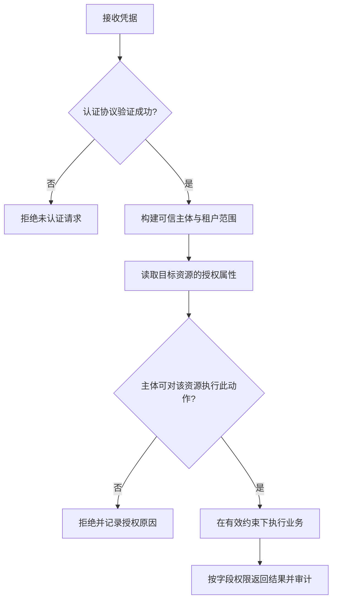

# 046 认证与授权有什么区别？如何防止越权？

> 难度：基础 · 分类：后端接口

## 简短回答

认证回答“调用者是谁”，授权回答“这个调用者能对这个资源做什么”。通过登录或验证令牌，不代表可以访问任意订单。授权应在每次敏感操作上结合身份、租户、资源归属和动作检查，缺少明确允许时拒绝。

## 详细解析

### 从改一个订单号看水平越权

用户 A 已登录，访问 `/orders/B1`。如果服务只验证令牌签名，再按 B1 查询订单返回，就可能泄露用户 B 的数据。正确链路是：验证身份 → 解析资源 → 检查归属或策略 → 执行业务 → 返回经过筛选的字段。

```text
认证通过：subject=A、tenant=T1
目标订单：owner=B、tenant=T2
动作：读取订单
结论：认证成功，但本次资源授权失败。
```

查询可以把租户和归属条件放入数据库过滤，减少漏检机会，但仍要处理管理员、共享资源等策略。不能把客户端传来的 tenant_id 当成可信身份，应从经过认证的上下文推导允许范围。

### 令牌验证是完整协议

对 JWT 等令牌，应按选定库和协议验证签名、允许算法、发行者、受众、有效期及密钥来源。只做 Base64 解码得到用户 ID 不等于验证。不要自己拼一套密码学实现，也不要为了方便接受未验证的转发身份头。

服务间身份也不等于最终用户权限。网关已经认证，不意味着内部服务可以放弃对象级授权；来自队列或定时任务的调用尤其需要明确服务身份与用户委托边界。

权限撤销和缓存存在时间差，应定义撤销生效要求。高风险操作可能需要短令牌寿命、在线策略检查或版本校验。日志记录主体、资源、动作和结果，避免记录完整令牌与敏感凭据。

测试至少覆盖本人资源、他人资源、跨租户、权限撤销、缺失身份和批量接口中的混合资源。只测“登录成功能访问”无法证明授权正确。

### 把授权写成主体、动作、资源、环境四个输入

“用户是管理员”并不完整。租户 T1 的管理员是否能读取 T2 的财务订单？客服能查看订单状态，是否也能看到完整手机号？授权判断需要知道主体所在范围、具体动作和目标资源属性，必要时还要考虑二次验证或审批状态。



例如删除订单时，仓储可以用 `(tenant_id, owner_id, order_id)` 共同限定目标，而不是先按 order_id 取出对象后在每个 handler 中手写一段可能遗漏的判断。管理员访问走显式策略分支，不能靠“owner_id 为空就不加条件”这种隐式约定。更新时还要保持条件有效，避免检查完成后资源被转移、实际执行时却只按 ID 更新的检查与使用时间差。

这不代表所有权限都适合塞进 SQL。共享关系、审批规则和组织层级可能需要独立策略计算。关键是写清负责决策的位置，并把足够的约束带到最终操作中；认证中间件负责可靠身份，业务用例负责结合对象判断动作，数据访问层帮助维持租户边界。

### 列表、批量和异步路径最容易遗漏

| 接口形态 | 常见漏检 | 验证输入 |
| --- | --- | --- |
| 单条查询 | 已登录即可按任意 ID 读取 | 本人与他人两个订单 ID |
| 列表搜索 | 查询未包含可信租户范围 | 相同关键词、不同租户 |
| 批量删除 | 只检查第一条，随后全部删除 | 允许与禁止对象混合 |
| 异步导出 | 提交时有权，执行或下载时已撤权 | 撤权后执行与下载 |
| 更新接口 | 普通用户可提交管理员专用字段 | 修改价格、归属、审批状态 |

批量接口需规定是整体拒绝还是逐项返回结果，不能在前端隐藏失败项却让后台照常执行。导出文件即使保存为静态对象，也有下载权限和有效期；不能因为生成任务曾经过鉴权，就把长期公开链接视作同等安全。

凭据失效和资源不存在如何对外区分，是防止信息泄露与客户端体验之间的契约选择。可以对无权查看的资源统一返回不可见结果，但内部审计仍保留拒绝原因，不能为了隐藏信息而失去排障能力。日志中的资源 ID 与主体应按数据敏感性处理，凭据本身不进入日志。

本题描述的是授权设计与测试矩阵，没有提供或声称部署了完整身份系统。更深入的回答应能讲清：权限服务暂不可用时哪些操作必须拒绝，缓存撤权延迟最大能接受多久，服务身份代表机器本身还是受委托的最终用户。把这些前提说出来，才能判断一个“鉴权已完成”的结论覆盖了什么。

## 常见误区 / 面试追问

- **隐藏资源 ID 能防越权吗？** 不可以，难猜 ID 只能降低发现概率，不能替代授权。
- **前端不显示按钮就安全吗？** 不安全，攻击者可以直接调用接口，检查必须在服务端执行。
- **鉴权放中间件就够了吗？** 中间件适合通用身份校验，资源级判断需要结合实际业务对象。

## 参考资料

- [OWASP 授权检查指南](https://cheatsheetseries.owasp.org/cheatsheets/Authorization_Cheat_Sheet.html)
- [OWASP JWT 指南](https://cheatsheetseries.owasp.org/cheatsheets/JSON_Web_Token_Cheat_Sheet.html)

[返回目录](../README.md) · [下一题](047-idempotency.md)
