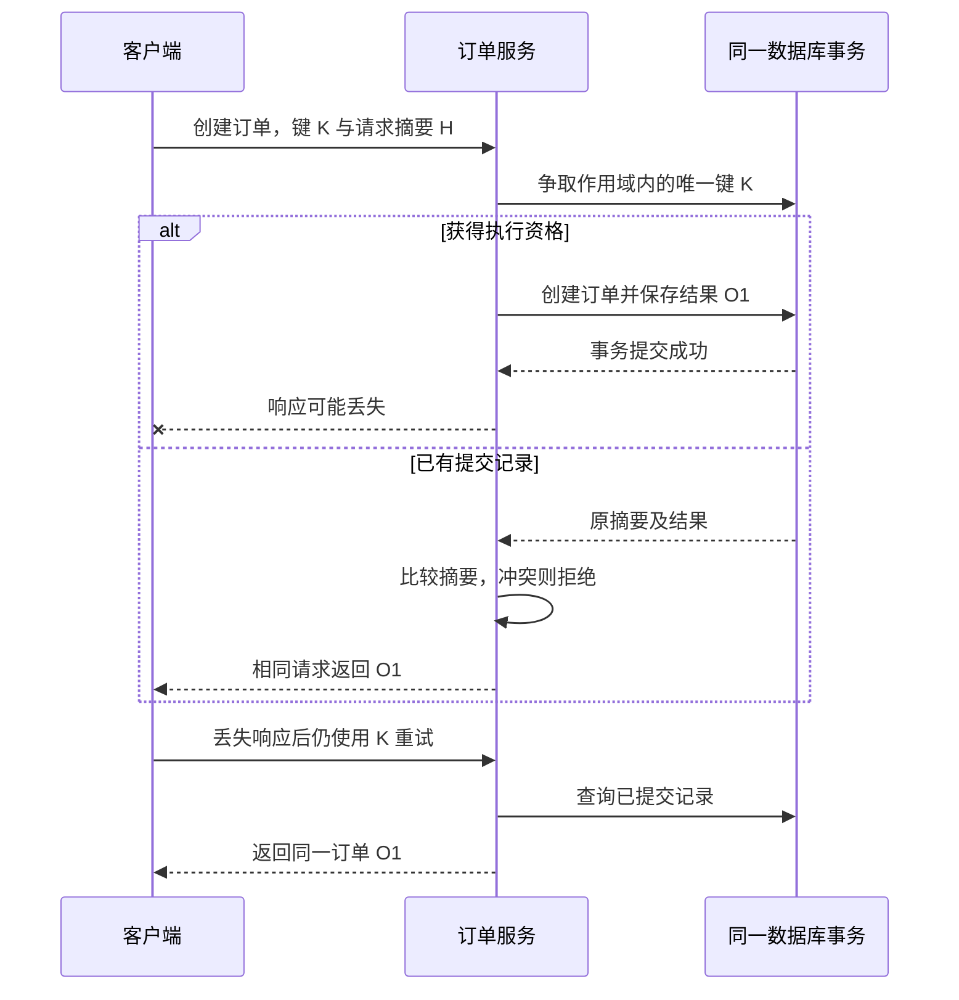

# 047 如何实现可靠的接口幂等，而不是简单防重复？

> 难度：中级 · 分类：后端接口

## 简短回答

幂等要求相同业务操作重复执行时，不产生额外业务效果。可靠实现需要定义操作身份、请求一致性、并发竞争和结果保存，并把幂等记录与业务变更放入同一可靠提交边界。单独设置一个缓存键通常不足以覆盖崩溃窗口。

## 详细解析

### 先定义“同一次操作”

客户端提交订单时携带幂等键，服务端以 `(租户, 操作类型, 幂等键)` 建立唯一约束，并保存规范化请求摘要。相同键且请求相同，可以返回已保存结果；相同键却金额或商品不同，应拒绝冲突，不能误复用旧结果。

```text
首次请求 → 事务内争取唯一幂等记录 → 创建订单 → 保存结果 → 提交
并发重复 → 唯一约束竞争 → 读取已提交状态 → 返回同一订单
提交后响应丢失 → 客户端重试 → 命中已提交记录 → 返回原结果
```

若记录和订单在同一数据库，可放在同一事务中，避免“记录成功但订单没写”或相反的半完成状态。不同数据库或外部支付不共享事务时，需要下游幂等键、状态机和对账机制，不能仅把本地事务包装得更大。

### 为什么缓存防重复会失效

先在 Redis 设置成功标记，再写数据库：中途崩溃可能永远跳过未完成订单。先写数据库再设置标记：中途崩溃后重试可能再次写入。缓存过期、淘汰或故障切换还可能让标记消失，因此核心约束应由业务事实的持久唯一性支持。

处理中状态必须有明确协议。可以让重复请求有限等待、返回可查询的处理中响应，或由调用者稍后查询；不能把“正在执行”直接回答成“已经成功”。如果使用租约接管，需要防止旧执行者恢复后再次提交。

幂等记录保留时间由业务可重试窗口决定。删除记录后仍需要业务唯一键阻止危险重复，或者明确窗口过后不再承诺幂等。持久化结果也要考虑敏感信息与响应版本变化。

### 沿着三个崩溃窗口检查方案

假设订单和幂等记录位于同一 PostgreSQL 数据库，业务不调用外部支付。幂等记录至少包含作用域、键、规范化请求摘要、结果资源 ID；作用域与键构成唯一约束。请求摘要应来自已校验的业务字段，例如商品、数量、币种，不能仅比较 JSON 原始字节，因为属性顺序和空白不应改变操作含义。



| 进程停止的位置 | 数据库应留下什么 | 重试应做什么 |
| --- | --- | --- |
| 事务提交之前 | 原子回滚，订单和记录都未提交 | 重新争取唯一键并执行 |
| 提交成功之后、响应之前 | 订单与结果记录都存在 | 返回原订单，不再创建 |
| 返回成功之后 | 同一份已提交事实 | 重复请求继续得到原结果 |

并发请求争取同一唯一键时，可能等待前一个事务结束；等待必须受期限约束。PostgreSQL 中普通唯一约束错误会使当前事务进入失败状态，不能捕获错误后就继续在同一个失败事务内查询。可选择合适的 `ON CONFLICT` 语句设计，或者回滚后另开读取路径，并按隔离级别核对可见性。这里给的是事务设计，未执行数据库故障注入。

### “处理中”为什么不是一个万能状态

若整个工作都在短事务内完成，可以让未提交记录只作为事务竞争的一部分；不一定要先单独提交一个“处理中”标记。只有跨长任务或外部系统时，才更可能需要持久状态机。这时必须回答：执行者崩溃后谁接管，接管凭据如何排斥旧执行者，结果未知时是否允许再次发起外部动作。

支付场景里，本地订单事务无法与支付方提交原子合并。应把同一业务操作身份传给支付方，并使用其结果查询和幂等契约；回调也要幂等处理。单纯用 Redis 锁包住“请求支付”既不能撤销已经发出的付款，也不能消除锁过期后的重入。

保留期同样是业务承诺。假设允许客户端在 24 小时内重试，记录至少要覆盖这一窗口和相关恢复需求；超过窗口后不能静默把旧键当新付款，除非协议明确接受这种风险并有业务唯一约束兜住。具体保留时长是设计假设，不应把某家支付平台的清理策略照搬成所有接口的标准。

面试中可以让候选人给上图分别加上“提交前断电”“提交后断网”“同键不同金额”。能指出每种情况下唯一事实在哪里、返回何种结果，才算解释了可靠幂等，而不只是记住 SETNX 这个命令。

## 常见误区 / 面试追问

- **幂等等于响应每次完全一样吗？** 核心是效果不重复，响应可以按契约表达当前状态；创建接口通常返回稳定资源身份。
- **GET 天然没有副作用吗？** 协议要求安全语义，实际实现仍可能违反它，需要审查。
- **超时后为什么不能判断失败？** 提交可能已完成，只是响应丢失，应查询原操作状态。

## 参考资料

- [Stripe 官方幂等请求设计](https://docs.stripe.com/api/idempotent_requests)
- [PostgreSQL 唯一约束](https://www.postgresql.org/docs/16/ddl-constraints.html#DDL-CONSTRAINTS-UNIQUE-CONSTRAINTS)

[返回目录](../README.md) · [上一题](046-auth.md) · [下一题](048-rate-limits.md)
