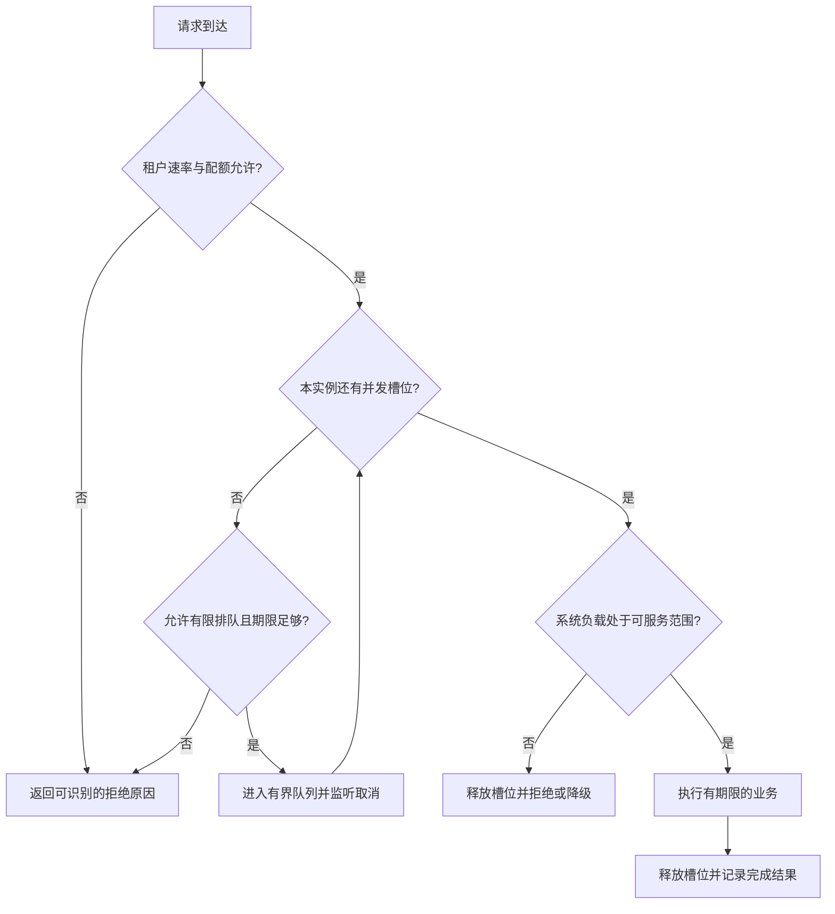

# 048 限流、并发限制和负载保护如何配合？

> 难度：中级 · 分类：后端接口

## 简短回答

限流控制单位时间准入数量，并发限制控制同时占用资源的任务数，负载保护根据实际饱和情况拒绝或降级。三者分别约束到达速率、在途规模和系统状态，需要按瓶颈组合，不能只装一个 QPS 计数器。

## 详细解析

### 慢依赖会绕过单纯 QPS 限制

每秒放行 100 个请求，正常耗时 20 ms 时平均在途约为 2；依赖变慢到 5 s 时，在相同到达率下可能累积约 500 个在途请求。QPS 没变，内存和连接压力却大幅增加，所以还需要并发上限及等待期限。

```go
package main

import "fmt"

func main() {
    slots := make(chan struct{}, 1)
    slots <- struct{}{}
    select {
    case slots <- struct{}{}:
        fmt.Println("accepted")
    default:
        fmt.Println("busy")
    }
    <-slots
    fmt.Println("released")
}
```
```output
busy
released
```

示例验证立即拒绝的准入语义，真实 handler 在成功获取后 defer 释放，并确保每条返回路径释放一次。若允许等待，要同时监听请求取消，不要在已超时的请求上继续排队。

### 算法与分布范围

令牌桶允许配置速率与突发容量，适合有短时突发的入口；固定窗口实现简单但边界附近可能形成双倍突发。选择算法时应先定义业务接受的突发行为，再考虑实现成本。

每实例限流不是全局精确限流：扩容会改变总额度，负载不均也会导致部分实例先拒绝。按租户计费的全局配额需要集中或分片协调，并说明精确度与可用性取舍；保护本地 CPU 的并发限制则应在实例上执行。

拒绝要尽早发生并返回可识别状态，避免已完成昂贵数据库操作后才决定限流。客户端应尊重重试指示并加入退避，否则重试流量会抵消保护作用。监控需要同时记录准入、拒绝、排队和完成数量。

### 把流量指标换算成资源预算

继续假设服务允许每秒 100 个请求，单次依赖最坏占用 5 秒。如果只有 50 个可用依赖槽位，稳态处理上限粗略为 `50 / 5 = 10` 次每秒；放行 100 次每秒只会持续积压。这是理想化估算，不包含调度、重试和耗时波动，已经足够说明限流阈值必须服从瓶颈容量。



图中的队列不是无限重试循环：请求只占一个有界等待位置，等待超时或取消就移除，获得槽位后立即退出排队阶段。已经取得令牌却没有取得并发槽位时，令牌是否退还取决于所选限流器和计费语义；不能把一次被拒绝的昂贵准入尝试误当成免费无限重试的机会。

令牌桶的“桶容量 200、每秒补充 100”表示空闲积累后允许一个最多约 200 的即时突发，并不表示每个一秒窗口都严格最多 100。固定窗口还会遇到窗口末尾与下一窗口开头集中放行的问题。面试时应让候选人画出具体到达时间，再判断算法是否符合产品所说的“每秒不能超过”含义。

### 公平性、拒绝与扩容的关系

如果实例容量是 100 个并发，大租户一次占满它，即使其他租户的 QPS 很低也会受影响。可为关键业务留出独立并发预算，再给租户设置合理份额；份额过细则会产生闲置资源和管理成本。应先用实际瓶颈和业务优先级决定隔离粒度，不必给每条 URL 都建立独立资源池。

| 控制目标 | 适合观测的指标 | 常见误判 |
| --- | --- | --- |
| 限制调用速率 | 准入与拒绝速率、突发分布 | 总 QPS 下降就以为负载下降 |
| 控制资源占用 | 当前在途、排队长度、等待时间 | 只看完成数，忽略挂起请求 |
| 保护下游 | 依赖并发、超时、连接池等待 | 扩入口实例便可无限扩吞吐 |
| 保证用户公平性 | 按受控维度统计的拒绝与延迟 | 只看全站平均值 |

限额拒绝可以使用 429；暂时无服务能力可以使用 503，按 API 契约解释是否允许重试。即使携带 Retry-After，调用方也需要总重试预算和随机退避，避免所有客户端在同一个时间点回流。拒绝指标不能混入业务成功率而被“成功响应都很快”掩盖。

练习可以固定一个慢依赖，将耗时从 20 ms 提升到 5 秒，比较只有 QPS 限制和同时有并发限制时的在途数、内存和有效完成数。本题的 channel 程序只验证立即准入或拒绝；上述压力曲线需要独立负载实验，不能由这个小程序推断性能数值。

## 常见误区 / 面试追问

- **拒绝请求是不是降低可用性？** 在过载时，有控制地拒绝部分请求可以保住其余请求，比全部排队超时更可控。
- **加大队列能解决过载吗？** 只能吸收有限突发，长期到达率超出处理率必须减少工作或增加能力。
- **如何保护重要业务？** 隔离资源并按业务优先级准入，避免低价值流量占满共享池。

## 参考资料

- [golang.org/x/time/rate](https://pkg.go.dev/golang.org/x/time/rate)
- [Google SRE：过载处理](https://sre.google/sre-book/handling-overload/)

[返回目录](../README.md) · [上一题](047-idempotency.md) · [下一题](049-streaming.md)
