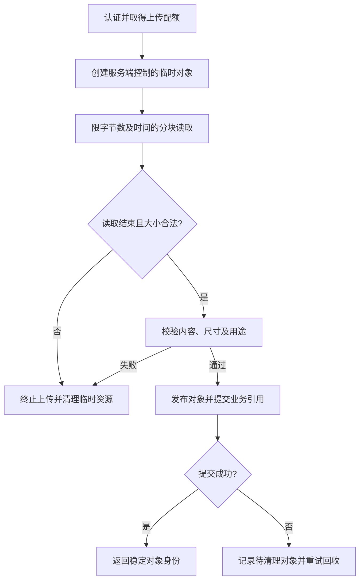

# 049 如何安全处理文件上传和流式响应？

> 难度：中级 · 分类：后端接口

## 简短回答

流式处理可以限制峰值内存，但仍需限制总大小、持续时间和并发数。上传文件名与媒体类型都不可信，保存位置由服务端决定；响应一旦开始发送，就不能像普通 JSON 接口那样随意重写状态和 body。

## 详细解析

### 上传链路的四个边界

在读取前限制请求体大小，按流处理数据，限制磁盘或对象存储配额，最后验证内容后再发布可访问结果。Content-Length 只能作为提示，不能代替实际读取限制，因为请求可能分块传输或声明不可信长度。

| 边界 | 具体控制 | 漏掉后的后果 |
| --- | --- | --- |
| 网络输入 | MaxBytesReader、读取期限 | 内存或连接耗尽 |
| 文件身份 | 服务端生成对象键 | 路径穿越、覆盖文件 |
| 内容 | 格式、大小、用途校验 | 上传内容被错误执行或解释 |
| 生命周期 | 临时对象清理、提交状态 | 失败请求留下大量垃圾 |

multipart 解析中的内存阈值不等于整个上传大小上限，多余内容可能转存临时文件。应区分总字节限制与内存使用限制，并清理临时产物。压缩输入还要控制解压后大小，避免小请求展开成巨大内容。

### 流式返回怎样表达失败

SSE、下载或长响应开始写入后，状态通常已提交。中途依赖失败应按协议发错误事件或关闭流，并让客户端识别未完成；不能再写一段普通错误 JSON 冒充独立响应。需要 Flush 时，可通过 ResponseController 调用并处理不支持或写失败。

客户端慢读会把服务器拖入持续占用连接与缓冲区的状态。应使用合适的写期限和取消检查，并限制同时流式传输的数量。代理缓冲、超时和压缩也会影响实际可见延迟，必须通过真实链路验证，httptest 不能覆盖这些因素。

流式不是“永不缓冲”，而是将缓冲和工作集约束在可解释的范围内。仍需定义断点续传、重复上传、校验和以及部分结果是否可见等业务规则。

### 上传完成与对象可见应是两件事

以头像上传为例，服务端生成临时对象键，限量读取并计算校验信息，验证实际图像格式和尺寸，再将验证通过的对象标记为可用，最后更新用户资料中的引用。图像解码也可能消耗大量 CPU 和内存，所以除压缩文件大小外，还应限制像素尺寸和解码并发。

文件系统重命名、对象存储完成分段上传、数据库更新引用通常不是同一个事务。发布对象后数据库提交失败，可能留下孤儿对象；数据库先引用一个尚未完成的对象，则用户可能下载到不存在的内容。需要选择“先完成对象、后提交引用”等明确顺序，配合可重试清理和状态查询，不能用一句“最后提交”假装跨系统原子性。

删除临时资源应由服务端保存的对象身份决定，不使用上传文件名拼接路径。文件名既可能含路径片段，也可能包含控制字符；它可以作为经处理后的展示信息，不能成为可信存储位置。对外下载还要设置正确的媒体类型和使用方式，避免把不可信内容放到拥有业务 Cookie 权限的可执行页面环境中。

### 流式内存为何仍然会增长

假设每个传输只用 64 KiB 应用缓冲，1,000 个并发也需要约 62.5 MiB，仅此一项还未计算 TLS、协议栈、解析器和业务对象。这是容量推演，并非测量结果。若每次从下游收到数据都追加到一个无界 channel，网络读取虽然分块，应用仍然在完整积累数据。

真正的背压链路是：客户端写不动，服务端停止继续拉取，或在有界缓冲满后取消生产者。只有接收端超时而生产端持续生成，仍会泄漏 goroutine 和队列内存。`io.Copy` 的取消能力取决于底层读写器如何被关闭或设置期限；普通 context 对任意 Reader 不会自动生效。

对于事件流，可为事件附顺序号，让客户端知道最后消费的位置；但“支持重连”还需要服务端保留可重放事件和定义保留期。对于文件下载，可用预期长度、校验和或范围请求表达完成与恢复。HTTP 状态 200 只能说明已开始的协议结果，不能单独证明整个业务流成功结束。

| 注入故障 | 应检查的结果 |
| --- | --- |
| 超过上传字节上限 | 停止读取，不发布对象，清理临时产物 |
| 内容校验失败 | 不产生可访问业务引用 |
| 下载客户端极慢或中途断开 | 写操作结束后生产任务也退出 |
| 对象已完成、数据库提交失败 | 能发现并回收孤儿对象 |

这些是落地时的验证路径；本题没有运行真实对象存储或代理环境。回答时应区分本地读写器的行为和经过 CDN、反向代理后的实际可见性，后者可能受到缓冲与期限设置影响。

## 常见误区 / 面试追问

- **io.Copy 就保证内存和时间都有界吗？** 不保证总大小和持续时间，需要外层限制与取消机制。
- **只检查扩展名够吗？** 不够，文件名由客户端控制，内容和使用方式都要验证。
- **为什么不把文件先全部读到内存？** 并发大文件会放大峰值占用，除非大小已严格限制且预算允许。

## 参考资料

- [http.MaxBytesReader](https://pkg.go.dev/net/http#MaxBytesReader)
- [http.ResponseController](https://pkg.go.dev/net/http#ResponseController)
- [OWASP 文件上传指南](https://cheatsheetseries.owasp.org/cheatsheets/File_Upload_Cheat_Sheet.html)

[返回目录](../README.md) · [上一题](048-rate-limits.md) · [下一题](050-shutdown.md)
