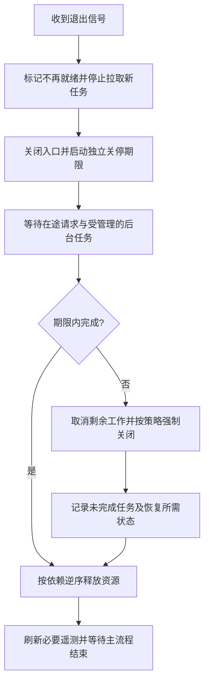

# 050 优雅关闭如何处理在途请求与后台任务？

> 难度：中级 · 分类：后端接口

## 简短回答

优雅关闭先停止接收新工作，再给在途工作有限时间完成，最后关闭依赖。HTTP Shutdown 会关闭监听器并等待适用的活跃连接收尾，但不自动管理所有后台任务和 hijacked 连接；主流程必须等待关停结束后再退出。

## 详细解析

### 顺序决定是否丢请求

先关闭数据库再等待 handler，会让仍在处理的请求突然失去依赖。合理顺序是让实例不再被分配新流量，停止入口，等待请求与后台任务，最后释放连接、刷出必要遥测。流量摘除有传播时间，应与部署平台的终止宽限期协调。

下面在本地真实监听一个空闲 HTTP 服务，执行关闭并确认 Serve 正常以 ErrServerClosed 结束。它验证空闲关停路径，带在途请求的验证还需控制请求阻塞与完成信号。

```go
package main

import (
    "context"
    "errors"
    "fmt"
    "net"
    "net/http"
    "time"
)

func main() {
    listener, err := net.Listen("tcp", "127.0.0.1:0")
    if err != nil { panic(err) }
    server := &http.Server{Handler: http.NewServeMux(), ReadHeaderTimeout: time.Second}
    done := make(chan error, 1)
    go func() { done <- server.Serve(listener) }()
    ctx, cancel := context.WithTimeout(context.Background(), time.Second)
    defer cancel()
    if err := server.Shutdown(ctx); err != nil { panic(err) }
    fmt.Println(errors.Is(<-done, http.ErrServerClosed))
}
```
```output
true
```

### 关停超时不是自动完成

调用 Shutdown 时应使用独立且有期限的 context；若直接使用已因退出信号取消的 context，会立即失去等待机会。期限耗尽后如何处理剩余连接和任务，要有明确策略，并记录未完成工作。即使强制关闭，也不能假设已经撤销外部副作用。

WebSocket 等被劫持连接需要自行通知和等待，队列消费者要停止拉取并处理未确认消息，周期任务要取消并等待结束。注册关闭回调不一定等于所有回调都已完成，应核对框架实际等待语义。

测试应覆盖空闲、正常在途、超时请求、长期连接和后台任务。每次部署都出现少量错误，可能是退出顺序有问题，不应自然归因于“发布总有抖动”。

### 用状态机理解一次退出

进程退出可以分为运行、停止准入、排空、释放依赖、退出五个阶段。停止准入之后不再接受新的业务任务，但允许已经开始的任务在预算内收尾；排空完成之后，数据库连接池和消息客户端才不再有使用者。只等待 HTTP listener 退出不足以证明 handler 已完成，因为 Serve 会在 Shutdown 开始关闭监听器后返回。



就绪状态变化与流量停止到达之间存在传播时间；在这段时间内，服务需要继续按约定处理或明确拒绝到来的请求。不能把设置 readiness=false 理解成所有负载均衡节点立即同步。平台宽限期覆盖的是整个退出过程，通常还要给流量传播、依赖关闭和遥测刷新留出时间。

例如教学场景给进程 30 秒宽限期，可以预留 5 秒传播、20 秒排空、5 秒收尾；这些数字需要根据实际平台和请求分布调整。如果允许一个导出请求执行五分钟，那么它无法依靠这份 30 秒预算完成，应改用可恢复异步任务、主动断流协议或更合适的部署策略。调整参数不能消除契约本身的矛盾。

### 取消与等待要由不同阶段负责

应用根 context 可以通知周期任务停止，但若所有 HTTP 请求都直接继承一个已被退出信号取消的根 context，在开始排空时就会立即终止业务工作。这可能正是所需策略，也可能违背“允许在途完成”的目标。应分别定义“不再开始新任务”和“取消剩余任务”的时机。

后台 goroutine 必须有可等待的完成信号，不能在取消后直接假设退出。消息消费者应停止领取新消息，等待当前处理；只有业务提交成功后才确认消息，未完成任务让消息系统按协议重新投递。对于 WebSocket 等长期连接，通知客户端重连和等待连接关闭由应用管理，HTTP Shutdown 不会代办。

| 关闭对象 | 关闭前提 | 关闭过早的后果 |
| --- | --- | --- |
| HTTP 入口 | 已进入停止准入阶段 | 若未经协调，代理继续分配流量 |
| 业务任务管理器 | 不再产生新任务 | 已接受的任务没有执行者 |
| 数据库连接池 | 使用它的请求和任务已收尾 | 在途事务失败 |
| 遥测输出器 | 关键结束事件已产生 | 看不到关停失败原因 |

测试在途路径时，让 handler 进入后发出信号并等待释放；收到进入信号后发起 Shutdown，随后释放 handler，再断言响应完成、Shutdown 返回、Serve 返回 ErrServerClosed。另设一条不释放的路径检查关停期限，而不是靠睡一秒碰运气。上面的可运行程序只覆盖空闲关闭；这些控制点说明如何扩展验证，不声称它已经覆盖所有分支。

## 常见误区 / 面试追问

- **收到信号直接 os.Exit 可以吗？** 会绕过正常清理，主流程应协调退出。
- **Shutdown 会取消所有 handler 吗？** 不应这样理解，它等待适用请求收尾，业务取消需要自己的生命周期设计。
- **宽限期越长越好吗？** 太长拖慢故障替换，太短打断正常请求，应结合请求期限和任务恢复能力选择。

## 参考资料

- [http.Server.Shutdown](https://pkg.go.dev/net/http#Server.Shutdown)
- [signal.NotifyContext](https://pkg.go.dev/os/signal#NotifyContext)

[返回目录](../README.md) · [上一题](049-streaming.md) · [下一模块](../06-database/051-connection-pool.md)
